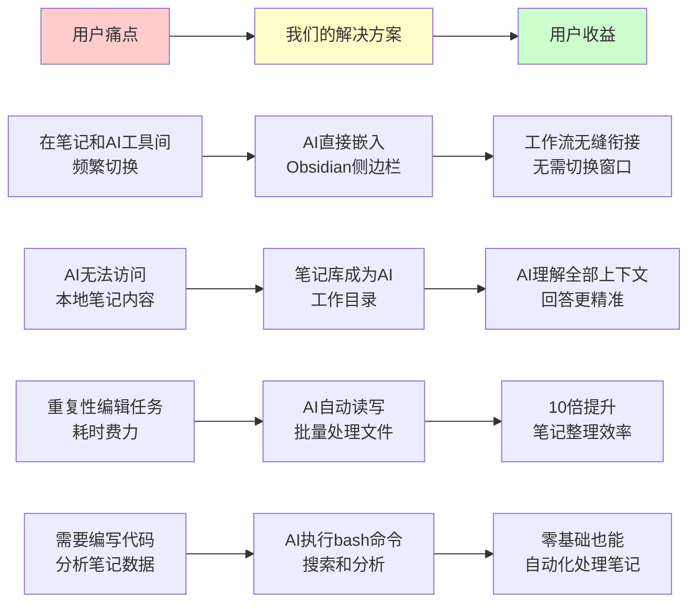
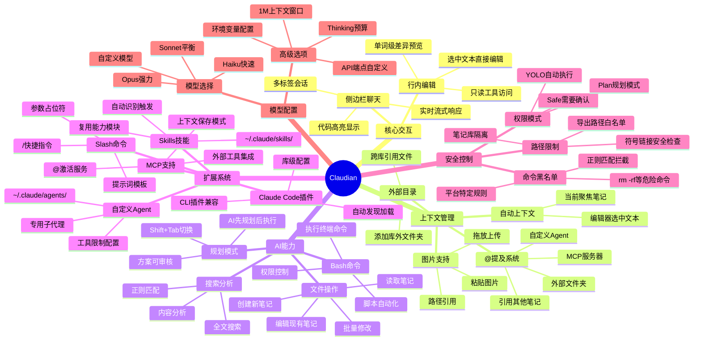
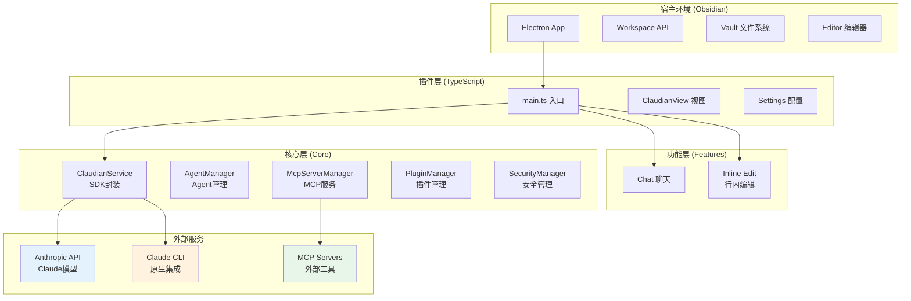
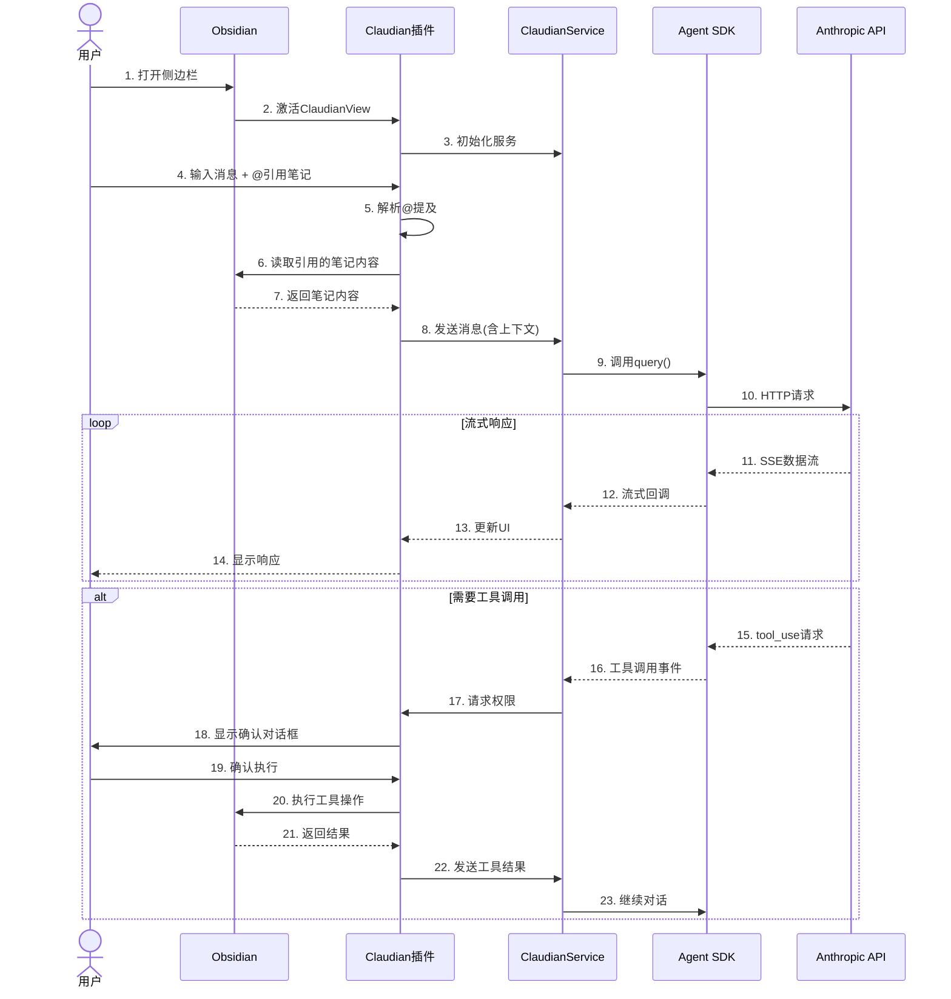

# 项目全景鸟瞰

## 一句话介绍

**Claudian** 是一款将 Claude Code AI 助手深度集成到 Obsidian 笔记软件中的插件，让用户可以在笔记工作流中直接调用 AI 进行文件读写、代码编辑、搜索分析和多步骤自动化任务。

---

## 核心价值主张

> **图注**：上图展示了知识工作者的核心痛点如何通过 Claudian 得到解决。核心价值在于打破笔记软件与 AI 工具之间的壁垒，让 AI 真正成为笔记工作流的一部分。

---

## 产品功能全景图

> **图注**：思维导图展示了 Claudian 的六大功能模块：核心交互、上下文管理、AI能力、扩展系统、安全控制和模型配置。每个模块下又细分具体功能点，构成完整的 AI 辅助笔记工作流。

---

## 适合人群与使用场景

### 目标用户画像

| 用户类型 | 特征 | 使用场景 | 核心价值 |
|---------|------|---------|---------|
| **知识管理专家** | 重度 Obsidian 用户，笔记量大 | 用 AI 整理标签、生成目录、批量格式化 | 自动化繁琐的笔记维护工作 |
| **程序员/开发者** | 使用 Obsidian 记录代码笔记 | 让 AI 分析代码片段、生成文档、重构笔记 | 在笔记中直接获得 AI 编程辅助 |
| **学术研究者** | 管理大量文献笔记 | AI 总结论文、提取关键信息、关联相关笔记 | 加速文献综述和知识整合 |
| **内容创作者** | 用 Obsidian 管理创作素材 | AI 根据笔记生成文章大纲、扩展思路 | 从碎片笔记到完整内容 |
| **项目经理** | 用 Obsidian 管理项目文档 | AI 生成会议纪要、追踪任务状态、更新进度 | 自动化项目文档维护 |

### 典型使用场景

**场景一：批量整理笔记标签**

> 小王是一个使用 Obsidian 3 年的知识管理爱好者，积累了 500+ 篇笔记。他打开 Claudian 侧边栏，输入："帮我把所有没有标签的笔记加上合适的标签，根据内容分类为'#学习'、'#工作'、'#灵感'三类"。AI 开始逐个读取笔记内容，分析主题，自动添加标签。10分钟后，所有笔记都被正确分类。小王感叹："以前要花一整天的工作，现在喝杯咖啡就完成了。"

**场景二：基于笔记生成周报**

> 李经理每天在项目会议后都会用 Obsidian 记录要点。周五下午，他选中本周的所有会议笔记，使用行内编辑功能，输入："根据这些笔记生成一份周报，包含：1）本周完成的工作 2）遇到的问题 3）下周计划"。AI 分析所有笔记内容，生成了一份结构清晰的周报。李经理微调后直接发送给上级，节省了 1 小时的整理时间。

**场景三：跨笔记知识问答**

> 张博士正在写论文综述，需要回顾之前读过的几十篇文献笔记。他在 Claudian 中输入："我在笔记中记录了哪些关于'深度学习在医疗影像中的应用'的研究？请总结主要方法和发展趋势"。AI 自动搜索整个笔记库，找到相关笔记，提取关键信息，生成了一份详细的综述摘要。张博士发现了一篇之前忽略的重要论文，完善了文献回顾。

---

## 技术栈概览

> **图注**：架构图展示了四层结构。Claudian 作为 Obsidian 插件运行在 Electron 环境中，通过 Obsidian API 与编辑器、文件系统交互。核心层封装了 Claude Agent SDK，负责与 Anthropic API 通信。功能层提供聊天和行内编辑两种交互方式。

---

## 核心数据流转

> **图注**：时序图展示了从用户输入到 AI 响应的完整数据流。核心特点是支持流式响应和工具调用。当 AI 需要操作文件或执行命令时，会暂停响应请求用户确认（Safe 模式下），确保安全性。

---

## 产品差异化优势

与传统 AI 助手或 Obsidian 插件相比，Claudian 的独特价值：

| 维度 | 传统AI助手 | 其他Obsidian AI插件 | Claudian |
|------|-----------|-------------------|---------|
| **集成深度** | 独立应用，需要复制粘贴 | 仅能读取当前笔记 | 完整 Agent 能力，可读写所有笔记 |
| **上下文理解** | 需要手动提供上下文 | 仅当前笔记内容 | 自动关联@提及笔记+选中文本 |
| **文件操作** | 不能直接操作本地文件 | 只读，无法编辑 | 完整的读写编辑能力 |
| **扩展性** | 固定功能 | 有限扩展 | Skills + Agent + MCP + 插件 |
| **命令执行** | 无法执行 | 不支持 | 可控的 Bash 命令执行 |
| **规划能力** | 直接执行 | 无 | Plan 模式：先规划后执行 |

---

## 下一步阅读建议

- 📖 **[01-用户旅程地图](01-user-journey.md)** — 了解用户如何一步步使用产品
- 📖 **[02-核心功能详解](02-core-features.md)** — 深入了解每个功能的运作机制
- 📖 **[03-数据关系图](03-data-model.md)** — 查看系统如何组织和存储数据
- 📖 **[04-模块架构图](04-module-architecture.md)** — 了解系统技术架构
- 📖 **[05-API交互与集成](05-api-interactions.md)** — 查看接口设计和外部集成
