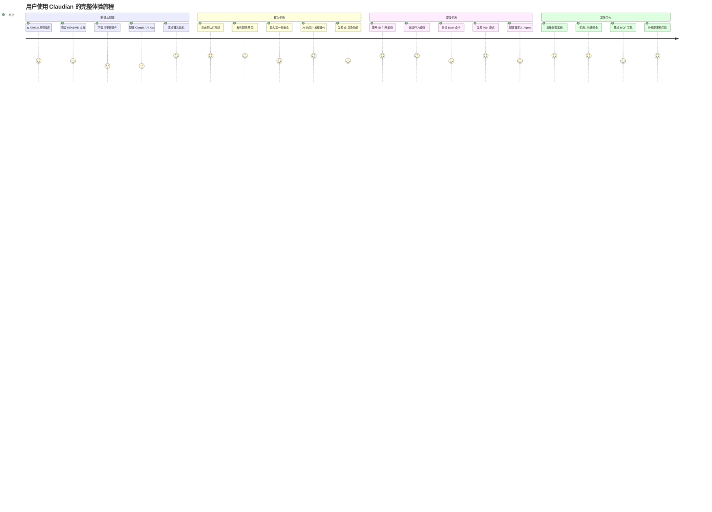
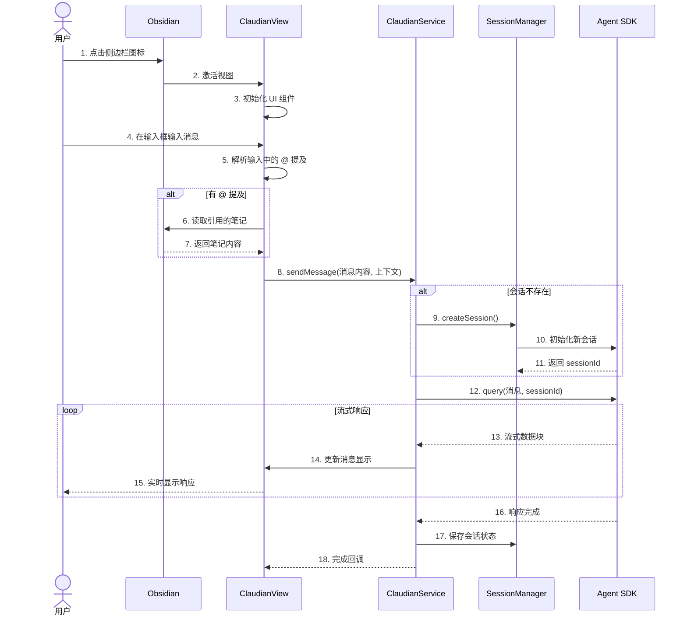
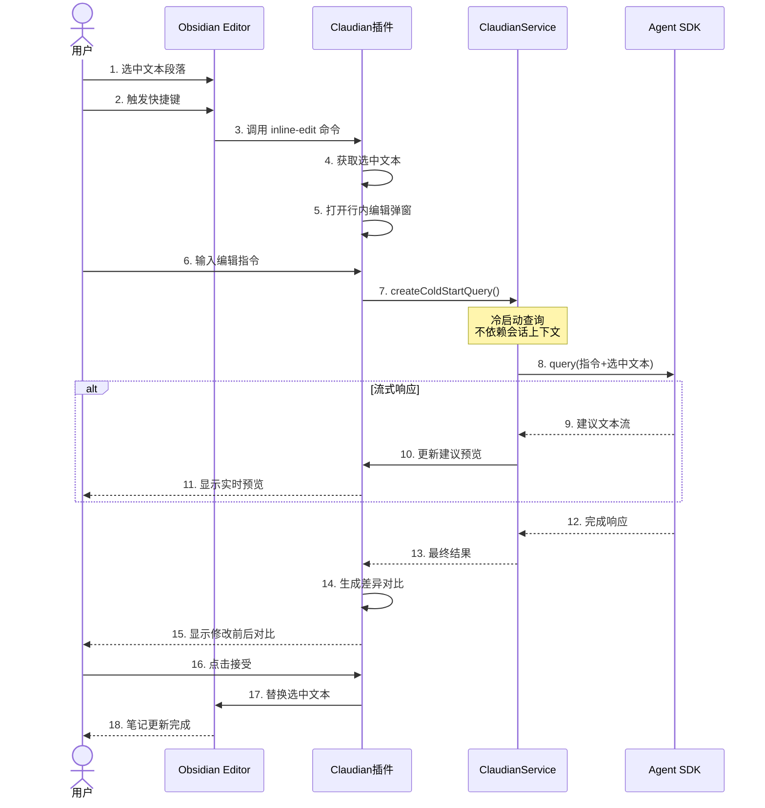
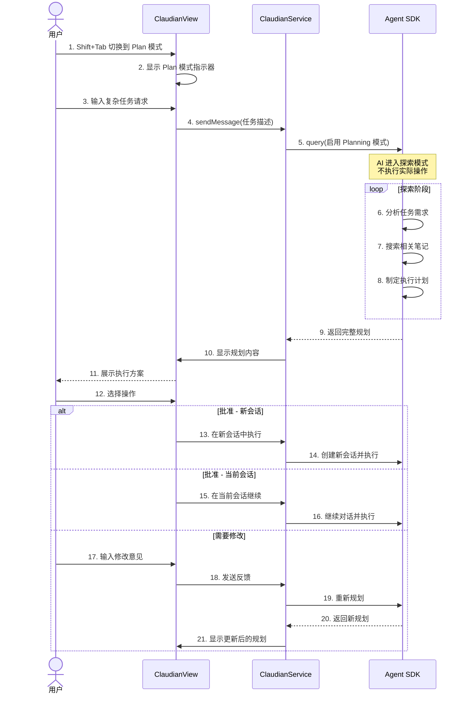

# 用户旅程地图

## 主用户角色：Obsidian 知识工作者



> **图注**：用户旅程图展示了从发现插件到成为高级用户的完整体验。评分显示用户在安装配置阶段有一定门槛（需要 API Key），但一旦配置完成，使用体验非常流畅（高分段集中在使用阶段）。

---

## 用户决策流程

```mermaid
flowchart TD
    A[用户打开 Obsidian] --> B{Claudian 已安装?}
    B -->|否| C[去 GitHub 下载]
    C --> D[安装插件]
    D --> E[启用插件]
    B -->|是| F{已配置 API?}
    
    F -->|否| G[打开设置]
    G --> H[配置 API Key]
    H --> I[保存设置]
    F -->|是| J[正常使用]
    I --> J
    
    J --> K{使用场景?}
    K -->|日常问答| L[打开侧边栏]
    K -->|编辑笔记| M[选中文本]
    K -->|复杂任务| N[启用 Plan 模式]
    
    L --> O[输入问题]
    M --> P[触发行内编辑]
    N --> Q[AI 先规划]
    
    O --> R{需要上下文?}
    R -->|是| S[使用 @ 引用]
    R -->|否| T[直接发送]
    
    S --> U[AI 读取引用的笔记]
    T --> V[AI 处理请求]
    U --> V
    
    P --> W[AI 生成编辑建议]
    Q --> X[用户审核规划]
    
    X -->{是否执行?}
    X -->|批准| Y[AI 执行]
    X -->|修改| Z[用户调整规划]
    X -->|取消| AA[结束]
    
    Z --> X
    Y --> V
    
    V --> AB{需要工具?}
    AB -->|是| AC[请求权限]
    AB -->|否| AD[返回结果]
    
    AC --> AE{权限模式?}
    AE -->|YOLO| AF[自动执行]
    AE -->|Safe| AG[用户确认]
    AE -->|Plan| AH[已批准]
    
    AG -->|允许| AF
    AG -->|拒绝| AI[跳过该工具]
    
    AF --> AJ[执行工具]
    AI --> V
    AJ --> V
    
    W --> AK[显示差异预览]
    AK --> AL{是否应用?}
    AL -->|是| AM[应用到笔记]
    AL -->|否| AN[取消]
    
    style J fill:#c8e6c9
    style V fill:#c8e6c9
    style AD fill:#c8e6c9
    style AM fill:#c8e6c9
    style AA fill:#ffcdd2
    style AN fill:#ffcdd2
```

> **图注**：决策树展示了用户在 Claudian 中的所有可能操作路径。核心分支在使用场景选择（日常问答、编辑笔记、复杂任务）和权限模式选择（YOLO、Safe、Plan）。Plan 模式增加了规划审核环节，适合复杂任务。

---

## 关键操作的前后端交互

### 1. 打开侧边栏并发送第一条消息



> **图注**：首次使用时会话管理器会创建新会话，后续对话复用同一会话保持上下文。支持 @ 提及自动解析，AI 能够读取引用的笔记内容作为上下文。流式响应让用户实时看到 AI 的思考过程。

### 2. 行内编辑流程



> **图注**：行内编辑使用冷启动查询，不依赖之前的会话上下文，确保每次编辑都是独立的。支持实时预览和差异对比，用户可以清楚看到 AI 建议的修改内容，确认后才应用到笔记。

### 3. Plan 模式完整流程



> **图注**：Plan 模式是 Claudian 的特色功能。AI 先进入"只读探索"模式分析任务并制定规划，用户审核批准后才执行实际操作。这避免了 AI 在执行过程中走偏，特别适合复杂的多步骤任务。

---

## 用户情绪曲线

```mermaid
xychart-beta
    title "用户情绪值变化曲线"
    x-axis [发现插件, 安装配置, 首次打开, 首次对话, 发现@功能, 使用行内编辑, 配置Agent, 批量处理笔记]
    y-axis "情绪值" 0 --> 10
    line [7, 5, 8, 7, 9, 9, 7, 10]
```

**情绪节点解读：**

| 阶段 | 情绪值 | 原因 | 优化方向 |
|------|--------|------|---------|
| 发现插件 | 7 | 好奇和期待 | - |
| 安装配置 | 5 | 需要配置 API Key，有一定门槛 | 提供更详细的配置向导 |
| 首次打开 | 8 | 界面简洁，符合 Obsidian 风格 | - |
| 首次对话 | 7 | 响应正常，但功能还没完全展现 | 首次使用引导提示 |
| 发现@功能 | 9 | 惊喜，发现可以引用其他笔记 | - |
| 使用行内编辑 | 9 | 编辑体验流畅，差异预览清晰 | - |
| 配置 Agent | 7 | 有一定学习成本 | 提供更多预设 Agent |
| 批量处理笔记 | 10 | 效率大幅提升，核心价值体现 | - |

---

## 用户触点清单

```mermaid
flowchart LR
    subgraph Obsidian界面["Obsidian 界面触点"]
        A1[左侧边栏图标]
        A2[命令面板命令]
        A3[编辑器右键菜单]
        A4[设置面板]
    end
    
    subgraph Claudian界面["Claudian 界面触点"]
        B1[聊天输入框]
        B2[消息列表]
        B3[标签栏]
        B4[@提及下拉]
        B5[/斜杠命令下拉]
        B6[#指令模式]
        B7[工具权限弹窗]
        B8[行内编辑弹窗]
        B9[设置标签页]
    end
    
    subgraph 文件系统["文件系统触点"]
        C1[~/.claude/settings.json]
        C2[~/.claude/skills/]
        C3[~/.claude/agents/]
        C4[~/.claude/plugins/]
        C5[vault/.claude/]
    end
    
    A1 --> B1
    A2 --> B1
    A3 --> B8
    
    B1 --> B4
    B1 --> B5
    B1 --> B6
    B1 --> B7
    
    B9 --> C1
    B9 --> C2
    B9 --> C3
    B9 --> C4
```

> **图注**：触点地图展示了用户与 Claudian 交互的所有界面和文件。Obsidian 层面有 4 个入口，Claudian 内部有 9 个核心交互点，文件系统有 5 个配置位置。整体触点丰富但不冗余，每个触点都有明确用途。

---

## 典型用户故事

### 故事一：研究员小张的文献整理

**背景**：小张是计算机科学博士生，用 Obsidian 管理 200+ 篇论文笔记，每篇笔记包含论文摘要、关键点、自己的想法。

**周一** - *发现 Claudian*

小张在 GitHub  trending 上看到 Claudian，被"AI 助手直接嵌入 Obsidian"吸引。他按照 README 安装了插件，配置了 Anthropic API Key。

**周二** - *初次尝试*

小张打开侧边栏，输入："帮我找到所有关于'transformer'的论文笔记"。AI 秒级返回了 15 篇相关笔记的列表。小张点击其中一篇，AI 自动显示了该论文的核心贡献和方法总结。小张惊喜地发现 AI 理解了他的笔记结构。

**周三** - *批量整理*

小张发现之前记的很多笔记没有统一格式。他输入："帮我把所有论文笔记按统一格式整理：1）论文标题 2）作者 3）发表年份 4）核心贡献 5）我的思考"。AI 开始逐个读取笔记，识别已有信息，补充缺失字段，重新格式化。30分钟后，所有 200+ 篇笔记都统一了格式。

**周四** - *知识问答*

导师问小张："你在看的这几篇关于大语言模型的论文，它们的技术路线有什么异同？"小张在 Claudian 中输入："对比我笔记中关于 GPT、BERT、T5 这三篇论文的技术架构差异"。AI 分析了这三篇笔记，生成了一份详细的对比表。小张稍作修改后发给了导师。

---

### 故事二：程序员小李的代码笔记管理

**背景**：小李是前端工程师，用 Obsidian 记录技术学习笔记、项目文档、代码片段。

**场景一：重构笔记代码**

小李发现之前记的 React 代码还是用 class 组件写的，想全部改成函数组件。他选中一段代码，触发行内编辑，输入："把这段代码改成 React 函数组件，使用 hooks"。AI 生成了新代码，并高亮显示了修改的部分。小李确认后，笔记中的代码就被更新了。

**场景二：生成项目文档**

新项目启动，小李需要写一份技术方案文档。他新建了一个空白笔记，在 Claudian 中输入："基于我的技术笔记，帮我写一份前端项目技术选型方案，包含：框架选择、状态管理、构建工具、UI库"。AI 读取了他之前记录的技术笔记，生成了详细的方案。小李根据项目需求调整后，直接提交给了 CTO。

**场景三：使用 Plan 模式*

小李需要整理过去一年的学习笔记，生成一份技术成长总结。这是一个复杂任务，他切换到 Plan 模式，输入需求。AI 先分析了所有笔记的时间分布、技术领域、学习深度，制定了详细的总结大纲。小李审核大纲后批准执行，AI 自动生成了完整的年度技术总结报告。
