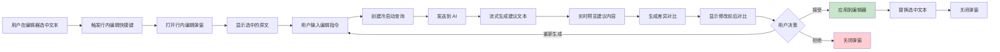
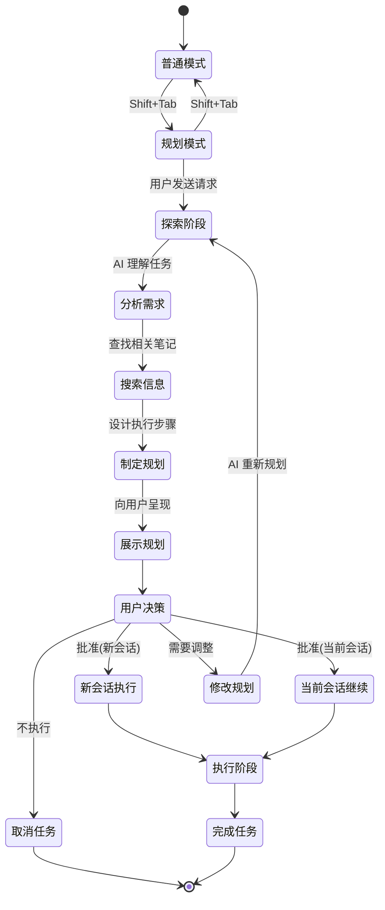
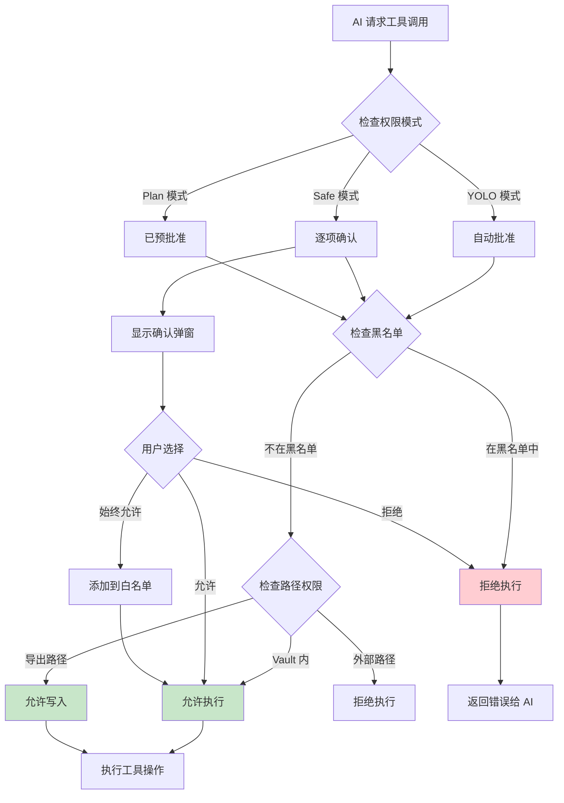

# 核心功能详解

## 功能一：侧边栏聊天

### 功能概述

侧边栏聊天是 Claudian 的核心交互界面，以 Obsidian 侧边栏视图的形式呈现，提供多标签会话管理、实时流式响应、代码高亮显示等功能。用户可以随时打开侧边栏与 AI 对话，AI 可以访问整个笔记库的内容。

### 工作流程

```mermaid
flowchart TD
    A[用户点击侧边栏图标] --> B[激活 ClaudianView]
    B --> C[初始化 UI 组件]
    C --> D{是否存在已有会话?}
    
    D -->|是| E[加载上次会话]
    D -->|否| F[创建新会话]
    
    E --> G[显示消息历史]
    F --> H[显示欢迎界面]
    
    G --> I[用户输入消息]
    H --> I
    
    I --> J[解析输入内容]
    J --> K{包含特殊语法?}
    
    K -->|@提及| L[提取@引用]
    K -->|/命令| M[匹配斜杠命令]
    K -->|#指令| N[进入指令模式]
    K -->|普通文本| O[直接发送]
    
    L --> P[读取引用的笔记]
    M --> Q[展开命令模板]
    N --> R[添加到系统提示词]
    
    P --> S[构建完整上下文]
    Q --> S
    O --> S
    R --> T[保存自定义指令]
    
    S --> U[发送到 AI]
    T --> U
    
    U --> V[流式接收响应]
    V --> W{响应类型?}
    
    W -->|普通文本| X[显示在聊天界面]
    W -->|工具调用| Y[触发权限检查]
    W -->|代码块| Z[语法高亮显示]
    
    Y --> AA{权限模式?}
    AA -->|YOLO| AB[自动执行]
    AA -->|Safe| AC[显示确认弹窗]
    AA -->|Plan| AD[仅显示计划]
    
    AC --> AE{用户选择?}
    AE -->|允许| AB
    AE -->|拒绝| AF[跳过工具调用]
    AE -->|始终允许| AG[添加到白名单]
    
    AB --> AH[执行工具操作]
    AH --> AI[返回工具结果]
    AI --> V
    AF --> V
    
    AG --> AB
```

> **图注**：流程图展示了侧边栏聊天的完整工作流程。核心特点包括多标签支持、特殊语法解析（@、/、#）、流式响应、工具调用权限控制。权限模式决定了工具调用的自动化程度。

### 技术实现要点

| 组件 | 实现方式 | 说明 |
|------|---------|------|
| **视图管理** | Obsidian ItemView | 继承 Obsidian 的 ItemView 类，注册为侧边栏视图 |
| **状态管理** | 内置 TabManager | 管理多标签会话状态和切换 |
| **消息渲染** | 虚拟滚动 + 增量更新 | 大量消息时保持流畅 |
| **语法解析** | 正则表达式 | 解析 @、/、# 特殊语法 |
| **流式响应** | SSE (Server-Sent Events) | Agent SDK 原生支持流式传输 |
| **代码高亮** | Prism.js | 支持多种编程语言高亮 |

### 举例说明

**场景一：引用笔记问答**

> 小李在写一篇关于 React 的教程，想参考之前记的设计模式笔记。他在侧边栏输入："@设计模式笔记 请总结一下 React 中常用的设计模式有哪些？"AI 自动读取了"设计模式笔记"的内容，结合笔记中的内容回答了："根据你的笔记，React 中常用的设计模式包括：1）容器/展示组件模式..."并且引用了笔记中的具体段落。

**场景二：使用斜杠命令**

> 小王经常需要让 AI 帮忙检查代码。他创建了 `/review` 命令，内容是"请检查以下代码是否有问题：[选中的代码]"。在编辑代码时，他选中一段代码，在侧边栏输入 `/review`，AI 自动展开为完整的提示词并分析代码。

---

## 功能二：行内编辑

### 功能概述

行内编辑允许用户直接在编辑器中选中文本，通过快捷键触发 AI 编辑，AI 生成的修改建议会以差异对比的形式展示，用户确认后才应用到笔记。

### 工作流程



> **图注**：行内编辑采用"冷启动查询"模式，不依赖之前的会话历史，确保每次编辑都是独立的。差异预览使用单词级对比，精确显示修改了哪些词。

### 技术实现要点

| 组件 | 实现方式 | 说明 |
|------|---------|------|
| **触发方式** | Obsidian 命令 | 注册为 Obsidian 命令，可绑定快捷键 |
| **选中文本** | Editor API | 使用 Obsidian Editor API 获取选区 |
| **差异算法** | 自定义单词级 diff | 对比原文和建议文本，高亮差异 |
| **应用修改** | Editor.replaceSelection | 原子性替换选中文本 |

### 差异预览示例

```
原文：
React is a JavaScript library for building user interfaces.

建议修改：
React is a declarative, efficient, and flexible JavaScript 
library for building user interfaces.

差异显示：
React is a [+declarative, efficient, and flexible ]JavaScript 
library for building user interfaces.
          ^^^ 绿色表示新增内容
```

### 举例说明

**场景：优化段落表达**

> 小张写了一篇技术博客，但觉得某段表达不够清晰。他选中那段文字，按下快捷键，输入："让这段表达更专业、简洁，适合技术博客"。AI 生成了修改建议，差异预览显示删除了 3 个冗余词汇，调整了句子结构。小张觉得建议不错，点击接受，原文立即被更新。

---

## 功能三：@ 提及系统

### 功能概述

@ 提及系统允许用户在输入时通过 `@` 符号引用各种资源，包括笔记文件、自定义 Agent、MCP 服务器、外部文件夹等。被引用的资源会自动作为上下文发送给 AI。

### 工作流程

```mermaid
flowchart TD
    A[用户在输入框输入@] --> B[触发提及下拉菜单]
    B --> C{显示什么内容?}
    
    C -->|@ + 字符| D[搜索匹配的笔记]
    C -->|@Agents/| E[显示自定义 Agent 列表]
    C -->|@ + MCP名称| F[显示 MCP 服务器]
    C -->|@ + 外部文件夹| G[显示外部上下文]
    
    D --> H[用户选择笔记]
    E --> I[用户选择 Agent]
    F --> J[用户选择 MCP]
    G --> K[用户选择文件夹]
    
    H --> L[读取笔记内容]
    I --> M[加载 Agent 配置]
    J --> N[激活 MCP 工具]
    K --> O[扫描文件夹文件]
    
    L --> P[添加到消息上下文]
    M --> P
    N --> Q[MCP 工具可用]
    O --> P
    
    P --> R[发送消息时包含引用]
    Q --> S[AI 可调用 MCP 工具]
    
    style P fill:#c8e6c9
    style Q fill:#c8e6c9
```

> **图注**：@ 提及系统是一个统一的上下文引用机制。不同类型的资源（笔记、Agent、MCP、外部文件夹）通过不同的前缀区分，但引用后的处理方式类似：读取内容并添加到 AI 上下文中。

### 支持的 @ 提及类型

| 类型 | 前缀 | 说明 | 示例 |
|------|------|------|------|
| **笔记文件** | 直接输入文件名 | 引用笔记库中的文件 | `@项目计划` |
| **自定义 Agent** | `@Agents/` | 调用预设的子代理 | `@Agents/CodeReviewer` |
| **MCP 服务器** | `@mcp-server` | 激活外部工具服务 | `@mcp-github` |
| **外部文件夹** | `@文件夹名/` | 引用库外目录 | `@workspace/` |

### 举例说明

**场景一：多笔记综合问答**

> 小张正在准备周会汇报，需要综合多个项目的进展。他输入："@项目A @项目B @项目C 帮我总结一下这三个项目的整体进展情况，列出关键里程碑和存在的风险"。AI 同时读取了三篇项目笔记，生成了一份综合汇报，包含了各项目的完成度、关键节点对比和风险提示。

**场景二：调用代码审查 Agent**

> 小李写完一段代码，想找人 review。他输入："@Agents/CodeReviewer 请检查这段代码：```...```"。CodeReviewer Agent 被激活，它专门配置了代码审查相关的系统提示词和工具限制，给出了专业的代码质量评估和改进建议。

---

## 功能四：Plan 模式（规划模式）

### 功能概述

Plan 模式是 Claudian 的特色功能。用户 Shift+Tab 切换到 Plan 模式后，AI 会先进入"只读探索"阶段，分析任务需求、搜索相关信息、制定执行计划，然后向用户展示完整规划，用户审核批准后才执行实际操作。

### 工作流程



> **图注**：状态机展示了 Plan 模式的生命周期。关键创新点是"先规划后执行"，AI 在探索阶段只能读取信息不能修改，确保规划的客观性。用户有三种选择：在新会话执行（干净上下文）、在当前会话继续（保留历史）、修改规划（迭代优化）。

### 举例说明

**场景：整理年度笔记**

> 小张用 Obsidian 记录了一整年的学习和工作笔记，共有 300+ 篇。他想整理成一份年度总结。切换到 Plan 模式后，他输入："帮我整理今年的笔记，生成一份年度学习和工作总结"。

> AI 进入探索阶段：
> 1. 扫描笔记库，按月份统计笔记数量
> 2. 识别笔记标签，发现主要集中在"技术学习"、"项目记录"、"会议纪要"三类
> 3. 读取几篇代表性笔记，了解记录风格和内容深度
> 4. 制定规划：
>    - 第一步：按时间线整理学习笔记，提取关键技术点
>    - 第二步：汇总项目笔记，列出参与的项目和贡献
>    - 第三步：总结会议纪要中的关键决策
>    - 第四步：生成年度总结文档

> 小张审核规划后觉得合理，点击"在新会话中执行"。AI 开始按步骤执行，最终生成了一份完整的年度总结 Markdown 文档。

---

## 功能五：权限与安全管理

### 功能概述

Claudian 提供三层安全防护：权限模式控制工具调用的自动化程度，命令黑名单拦截危险操作，路径限制确保文件操作在可控范围内。

### 工作流程



> **图注**：安全流程采用"分层检查"策略。首先权限模式决定是否需要用户确认，然后黑名单拦截危险命令，最后路径限制确保文件操作在允许范围内。Safe 模式提供最细粒度的控制，每个工具调用都需要确认。

### 权限模式对比

| 模式 | 说明 | 适用场景 |
|------|------|---------|
| **YOLO** | 自动执行所有工具调用 | 信任 AI，追求效率 |
| **Safe** | 每个工具调用都需确认 | 谨慎操作，安全第一 |
| **Plan** | 规划阶段不执行，执行阶段预批准 | 复杂任务，需要审核 |

### 命令黑名单示例

```typescript
// Unix 平台拦截的命令
const UNIX_BLOCKED_COMMANDS = [
  'rm -rf',           // 强制删除
  'chmod 777',        // 不安全权限
  'chmod -R 777',
];

// Windows 平台拦截的命令
const WINDOWS_BLOCKED_COMMANDS = [
  'del /s /q',        // 静默删除
  'rd /s /q',         // 删除目录树
  'format',           // 格式化磁盘
  'diskpart',         // 磁盘分区
  'Remove-Item -Recurse -Force',  // PowerShell 强制删除
];
```

---

## 功能六：扩展系统（Skills、Agent、MCP）

### 功能概述

Claudian 提供三层扩展机制：Skills 是可复用的能力模块，Agent 是专用的子代理，MCP 是外部工具集成。三者结合，用户可以无限扩展 Claudian 的功能。

### 扩展系统架构

```mermaid
flowchart TB
    subgraph Skills["Skills 技能"]
        S1[~/.claude/skills/]
        S2[自动触发]
        S3[复用能力]
    end
    
    subgraph Agents["自定义 Agent"]
        A1[~/.claude/agents/]
        A2[专用子代理]
        A3[工具限制]
    end
    
    subgraph MCP["MCP 服务器"]
        M1[外部服务]
        M2[工具集成]
        M3[上下文保存]
    end
    
    subgraph Plugins["Claude Code 插件"]
        P1[~/.claude/plugins/]
        P2[CLI 插件兼容]
        P3[自动发现]
    end
    
    subgraph 触发方式["触发方式"]
        T1[自动触发<br/>Skills]
        T2[@Agent 引用<br/>Agents]
        T3[@MCP 激活<br/>MCP]
        T4[设置启用<br/>Plugins]
    end
    
    S1 --> S2
    A1 --> A2
    M1 --> M2
    P1 --> P3
    
    S2 --> T1
    A2 --> T2
    M2 --> T3
    P3 --> T4
```

> **图注**：四种扩展机制各有侧重。Skills 适合封装可复用的提示词和能力，Agent 适合创建专用的子代理角色，MCP 适合连接外部 API 和工具，Plugins 兼容 Claude Code CLI 生态。用户可以根据需求选择合适的扩展方式。

### 举例说明

**场景一：使用 Skills**

> 小李经常需要让 AI 帮忙写代码注释。他在 `~/.claude/skills/code-comment/SKILL.md` 中定义了一个 skill，包含提示词模板和触发条件。之后在侧边栏输入代码时，AI 会自动检测代码内容，主动提供添加注释的建议。

**场景二：创建自定义 Agent**

> 小王是技术写作专家，他创建了一个 `TechWriter` Agent，配置了专门的技术写作系统提示词，限制了可用的工具（只能读写文件，不能执行 Bash）。之后在写作时，他输入 `@Agents/TechWriter 请帮我润色这段技术说明`，TechWriter 会以专业的技术写作风格提供建议。

**场景三：集成 MCP 服务器**

> 小张在开发中需要经常查询 GitHub Issues。他在设置中配置了 GitHub MCP 服务器。之后在 Claudian 中输入 `@mcp-github 查询 obsidian 仓库的 open issues`，AI 会调用 GitHub API 获取数据并整理回答。
