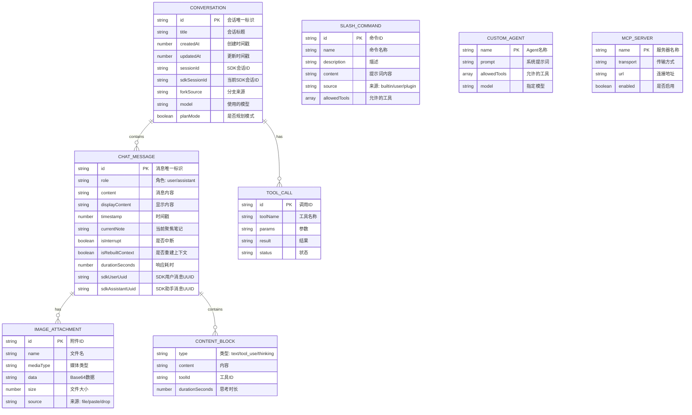
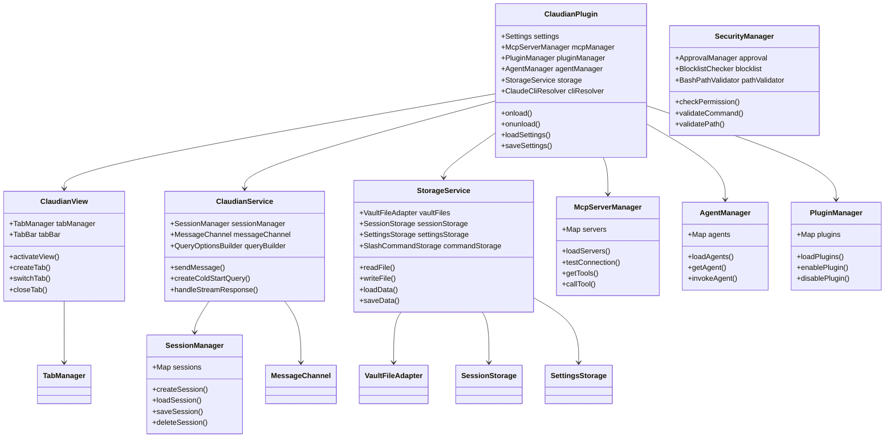
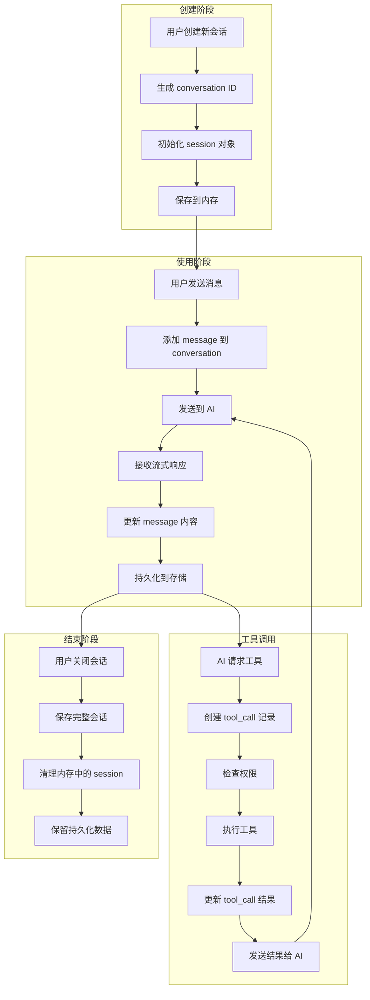
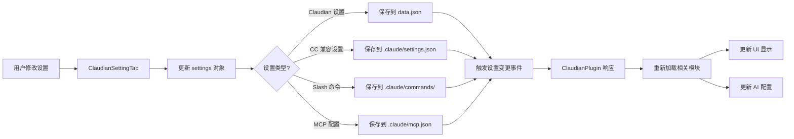
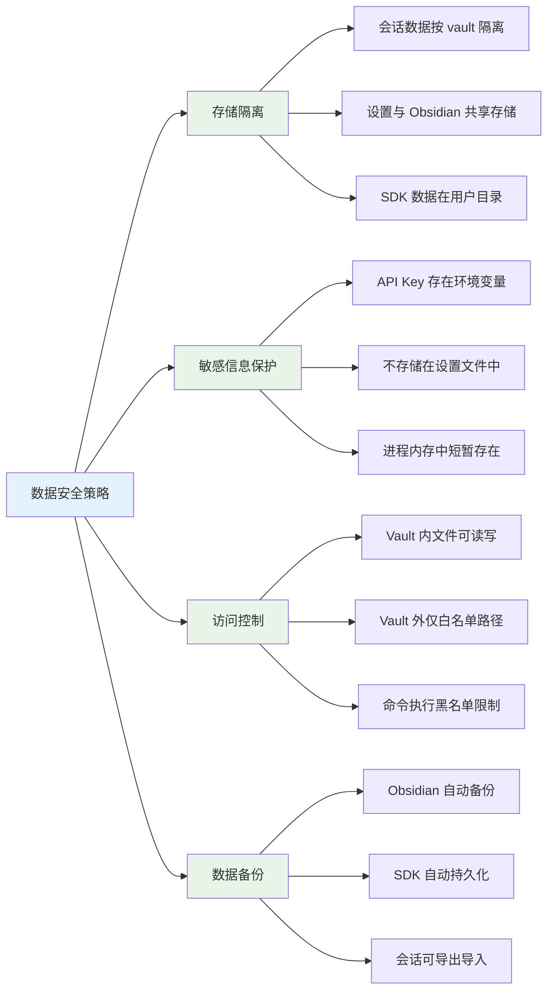

# 数据关系图

## 实体关系图（ER图）



> **图注**：ER图展示了 Claudian 的核心数据实体。Conversation（会话）是顶层容器，包含多个 ChatMessage（消息）。消息可以包含图片附件和内容块。ToolCall 记录 AI 的工具调用历史。SlashCommand、CustomAgent、MCPServer 是配置实体，存储用户自定义的命令、代理和外部服务。

---

## 类图设计



> **图注**：类图展示了 Claudian 的核心类结构。ClaudianPlugin 是主插件类，管理所有子系统。ClaudianView 负责 UI，ClaudianService 负责 AI 通信，StorageService 负责数据持久化。各种 Manager 类分别管理特定的功能模块（MCP、Agent、Plugin、Security）。

---

## 数据流向图

### 会话数据生命周期



> **图注**：会话数据经历创建、使用、结束三个阶段。使用阶段的消息是增量更新的，每次收到流式数据块都会更新消息内容并触发持久化。工具调用会在会话中创建独立的记录，方便后续审计和回放。

### 设置数据流



> **图注**：设置数据根据类型保存到不同位置，确保与 Claude Code CLI 的兼容性。Claudian 专有设置保存在 Obsidian 的 data.json 中，CC 兼容设置保存在 .claude/settings.json 中，实现跨工具配置共享。

---

## 数据存储详情

### 1. 会话存储（Obsidian 原生）

```typescript
// 存储位置: {vault}/.claude/sessions/{conversationId}.json
interface Conversation {
  id: string;           // "conv_xxxxxxxx"
  title: string;        // "React 学习讨论"
  createdAt: number;    // 时间戳
  updatedAt: number;
  sessionId: string | null;
  sdkSessionId: string | null;
  messages: ChatMessage[];
  model: string;
  planMode: boolean;
}

interface ChatMessage {
  id: string;
  role: 'user' | 'assistant';
  content: string;
  timestamp: number;
  toolCalls?: ToolCallInfo[];
  images?: ImageAttachment[];
  contentBlocks?: ContentBlock[];
}
```

### 2. SDK 会话存储（Agent SDK 原生）

```typescript
// 存储位置: ~/.claude/projects/{projectName}/
// SDK 自动管理，包含完整的消息历史
// 用于 rewind、fork 等高级功能
```

### 3. 设置存储

```typescript
// Claudian 专有设置: {vault}/.obsidian/plugins/claudian/data.json
interface ClaudianSettings {
  userName: string;
  permissionMode: 'yolo' | 'safe' | 'plan';
  model: ClaudeModel;
  thinkingBudget: ThinkingBudget;
  enableBlocklist: boolean;
  blockedCommands: PlatformBlockedCommands;
  // ... 其他设置
}

// CC 兼容设置: {vault}/.claude/settings.json
interface CCSettings {
  $schema: string;
  permissions: {
    allow: string[];
    deny: string[];
    ask: string[];
  };
  model?: string;
  env?: Record<string, string>;
}
```

### 4. 斜杠命令存储

```typescript
// 用户命令: {vault}/.claude/commands/{commandName}.md
// 每个命令一个 markdown 文件
interface SlashCommand {
  id: string;
  name: string;        // 文件名
  description?: string;
  content: string;     // 文件内容
  allowedTools?: string[];
  model?: ClaudeModel;
}
```

### 5. Agent 定义存储

```typescript
// Agent 定义: ~/.claude/agents/{agentName}/agent.md
// 或: {vault}/.claude/agents/{agentName}/agent.md
interface CustomAgent {
  name: string;        // 目录名
  prompt: string;      // agent.md 内容
  allowedTools: string[];
  model?: string;
}
```

### 6. MCP 配置存储

```typescript
// MCP 配置: {vault}/.claude/mcp.json
interface MCPConfig {
  mcpServers: {
    [serverName]: {
      command?: string;
      args?: string[];
      url?: string;
      transport: 'stdio' | 'sse' | 'http';
      enabled: boolean;
    }
  };
}
```

---

## 数据索引与查询

```mermaid
flowchart TB
    subgraph 内存索引["内存索引"]
        A1[会话列表<br/>Map<string, Conversation>]
        A2[MCP 服务器<br/>Map<string, MCPServer>]
        A3[自定义 Agent<br/>Map<string, Agent>]
        A4[插件列表<br/>Map<string, Plugin>]
    end
    
    subgraph 文件扫描["文件扫描"]
        B1[启动时扫描<br/>~/.claude/]
        B2[扫描 skills/]
        B3[扫描 agents/]
        B4[扫描 plugins/]
        B5[扫描 {vault}/.claude/]
    end
    
    subgraph 查询优化["查询优化"]
        C1[@提及搜索<br/>文件名索引]
        C2[笔记内容搜索<br/>Obsidian 搜索 API]
        C3[历史会话加载<br/>懒加载]
    end
    
    B1 --> B2
    B1 --> B3
    B1 --> B4
    B1 --> B5
    
    B2 --> A1
    B3 --> A3
    B4 --> A4
    B5 --> A2
    
    A1 --> C3
    A3 --> C1
```

> **图注**：Claudian 在启动时会扫描各种配置目录，将配置加载到内存中的 Map 结构，提供快速访问。@ 提及功能使用文件名索引实现快速搜索，笔记内容搜索复用 Obsidian 原生的搜索 API。

---

## 数据安全设计



> **图注**：数据安全从四个维度保障。存储隔离确保不同 vault 的数据不会混淆；敏感信息（API Key）只存在于环境变量中，不在任何配置文件里保存；访问控制通过路径限制和命令黑名单实现；数据备份依赖 Obsidian 和 SDK 的自动持久化机制。
