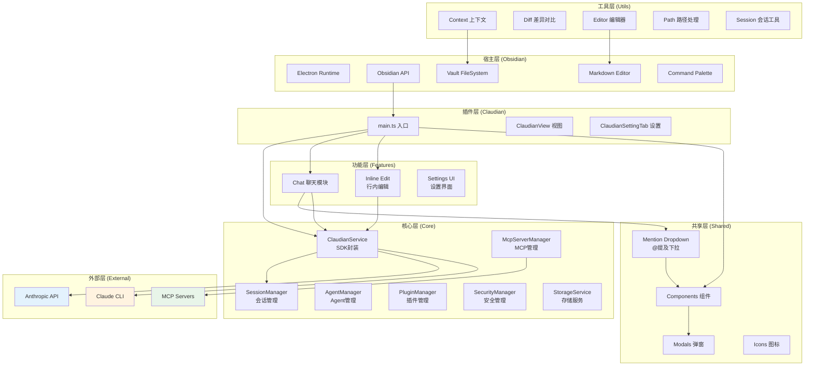
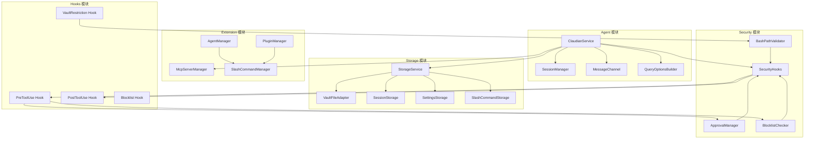
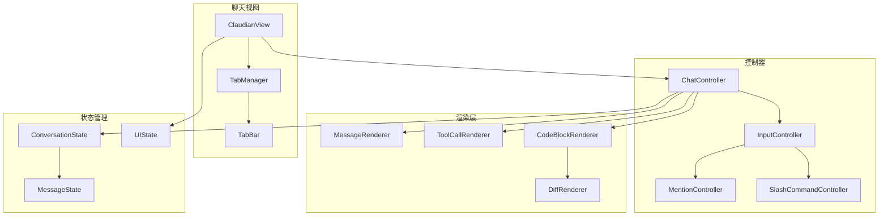
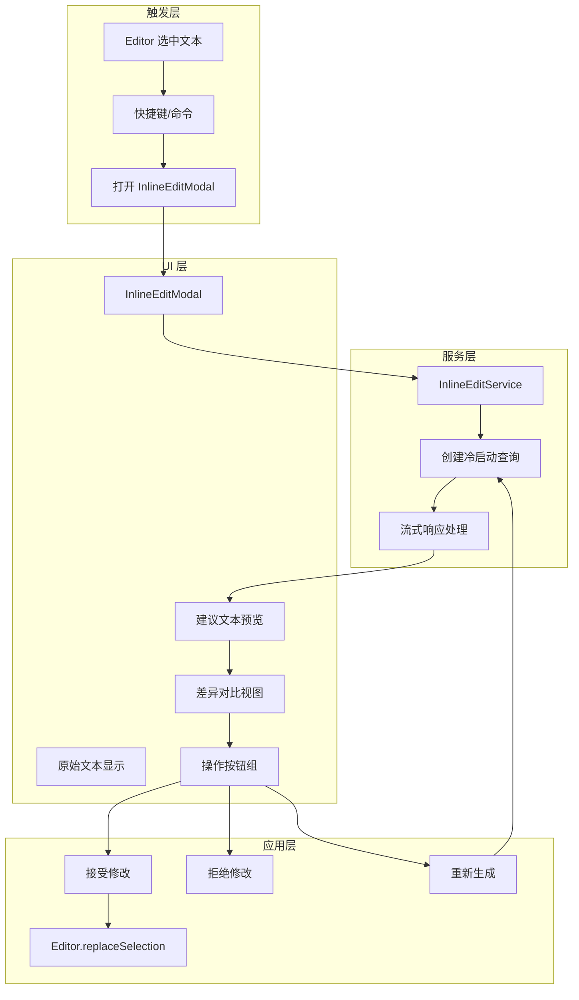
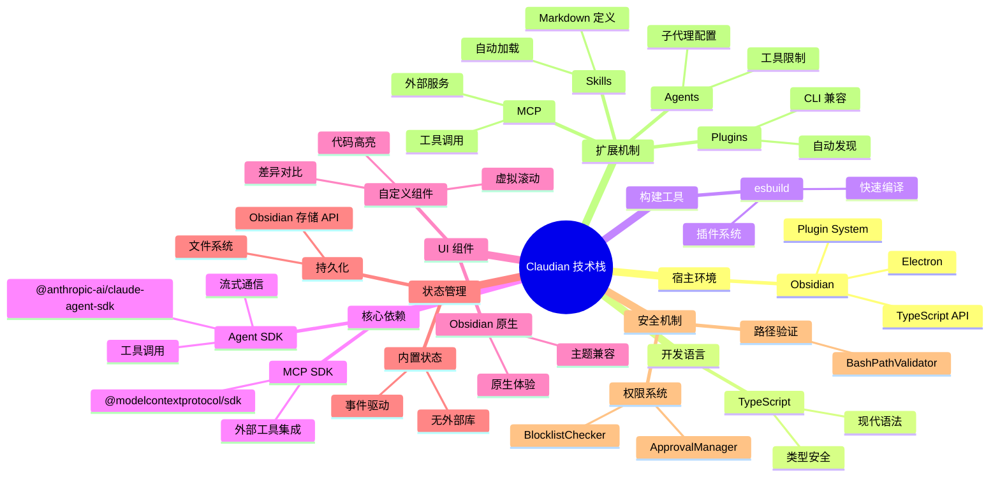
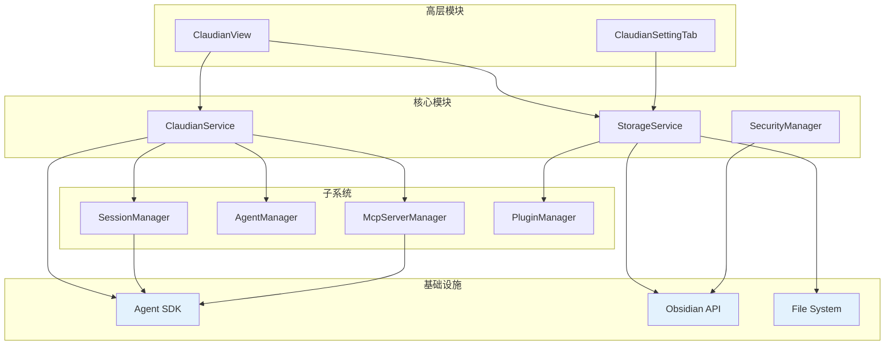
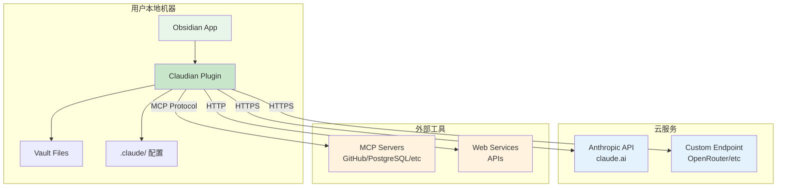

# 模块架构图

## 系统整体架构



> **图注**：架构图展示了五层结构。宿主层是 Obsidian 提供的运行环境，插件层是 Claudian 的入口和视图，核心层封装了所有业务逻辑，功能层提供具体功能实现，共享层提供可复用的 UI 组件，工具层提供各种辅助函数，外部层是与第三方服务的集成。

---

## 核心模块架构



> **图注**：核心层分为五个模块。Agent 模块负责与 AI 通信，Storage 模块负责数据持久化，Security 模块负责安全检查，Extension 模块管理各种扩展，Hooks 模块提供工具调用的拦截点。模块之间通过依赖注入和事件机制协作。

---

## 功能模块架构

### 聊天模块 (Chat)



> **图注**：聊天模块采用 MVC 架构。ClaudianView 是视图层，各种 Controller 处理用户交互，Rendering 层负责消息内容的渲染，State 管理对话状态。这种分层让代码更易维护和测试。

### 行内编辑模块 (Inline Edit)



> **图注**：行内编辑模块的核心是冷启动查询（不依赖会话历史）和差异对比。服务层负责与 AI 通信，UI 层提供实时预览和差异显示，应用层处理用户的接受/拒绝/重试操作。

---

## 请求处理链路

```mermaid
flowchart TD
    A[用户输入] --> B[输入解析]
    
    B --> C{特殊语法?}
    C -->|@提及| D[解析引用]
    C -->|/命令| E[展开命令]
    C -->|#指令| F[更新系统提示]
    C -->|普通文本| G[直接使用]
    
    D --> H[读取引用内容]
    E --> I[加载命令模板]
    F --> J[保存自定义指令]
    
    H --> K[构建上下文]
    I --> K
    G --> K
    
    K --> L{查询类型?}
    L -->|普通查询| M[Persistent Query]
    L -->|行内编辑| N[Cold Start Query]
    L -->|标题生成| O[Cold Start Query]
    
    M --> P[复用现有会话]
    N --> Q[创建临时会话]
    
    P --> R[QueryOptionsBuilder]
    Q --> R
    
    R --> S[构建 QueryOptions]
    S --> T[调用 Agent SDK]
    
    T --> U[Anthropic API]
    
    U --> V{响应类型?}
    V -->|文本流| W[流式更新 UI]
    V -->|工具调用| X[权限检查]
    V -->|完成| Y[保存会话]
    
    X --> Z{检查通过?}
    Z -->|是| AA[执行工具]
    Z -->|否| AB[返回错误]
    
    AA --> AC[返回结果]
    AB --> AD[提示用户]
    AC --> T
    
    W --> V
    Y --> AE[结束]
    AD --> AE
```

> **图注**：请求处理链路展示了从用户输入到 AI 响应的完整流程。关键点包括特殊语法解析、上下文构建、两种查询模式（持久查询和冷启动）、流式响应处理、工具调用权限检查。

---

## 技术栈全景



> **图注**：技术栈选择遵循"与 Obsidian 深度集成"原则。使用 TypeScript 保证类型安全，esbuild 保证构建速度，Agent SDK 提供 AI 能力，MCP SDK 提供扩展能力。UI 层复用 Obsidian 原生组件保持体验一致。

---

## 模块依赖关系



> **图注**：依赖关系遵循"依赖倒置"原则。高层模块（视图、设置）依赖核心模块（服务、存储、安全），核心模块依赖子系统和基础设施。基础设施（SDK、API、文件系统）在最底层，被上层模块依赖。

---

## 部署架构



> **图注**：Claudian 是纯客户端插件，所有代码在用户本地运行。只与外部的 AI API（Anthropic 或自定义端点）和 MCP 服务器通信。用户数据（笔记、配置）全部保存在本地，符合隐私优先的设计原则。
