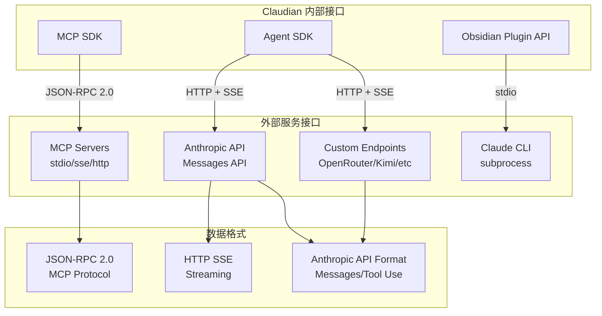
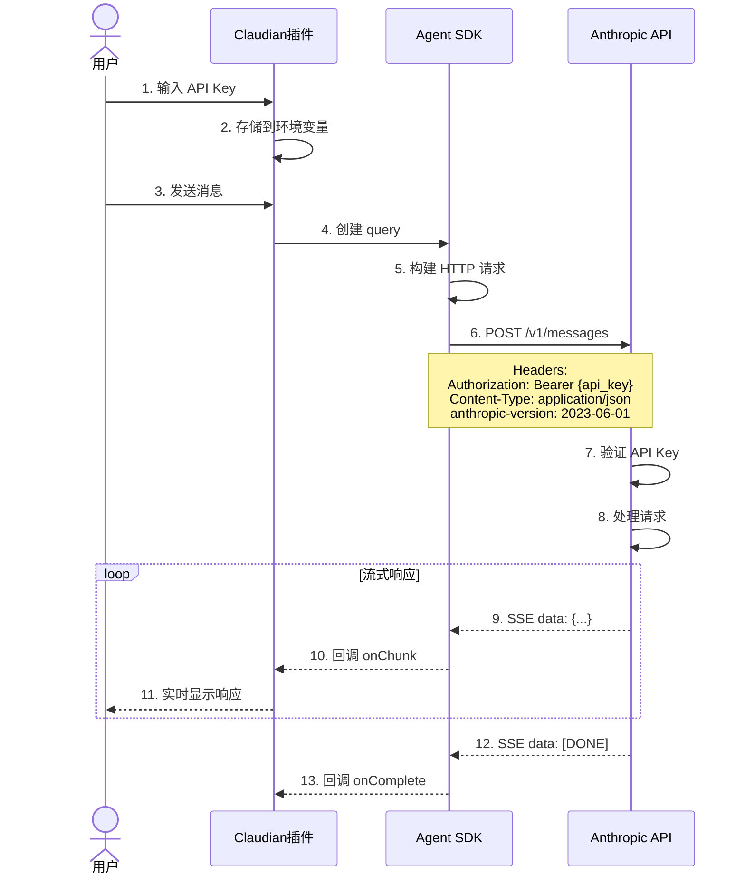
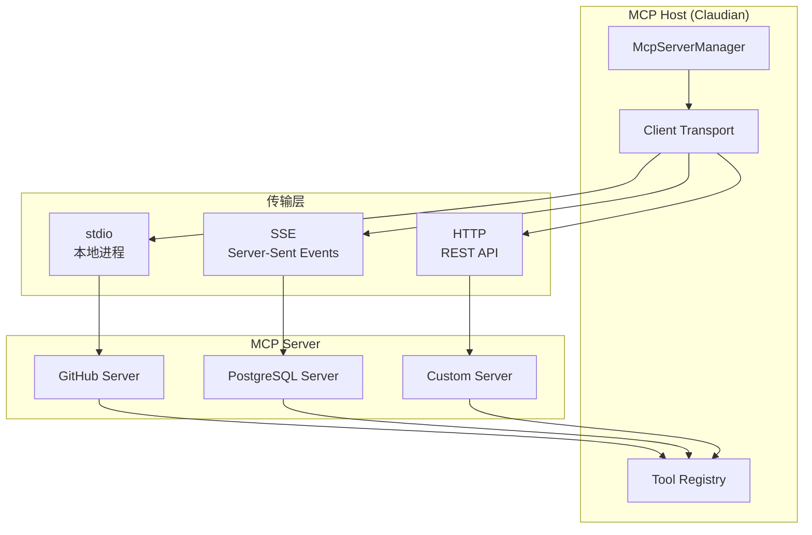
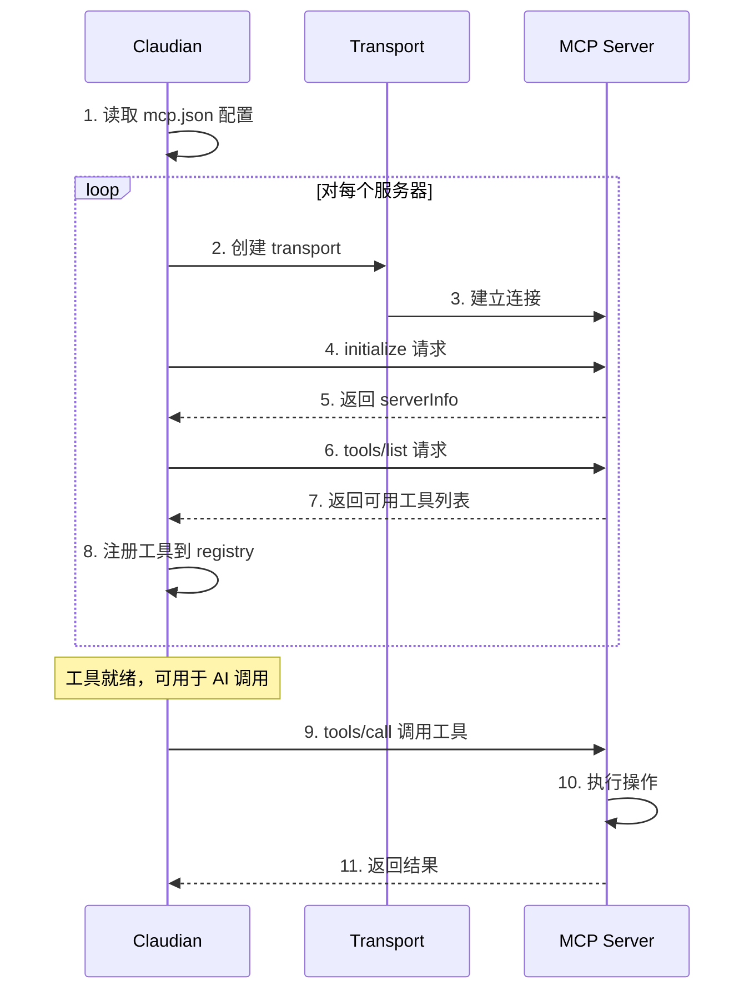
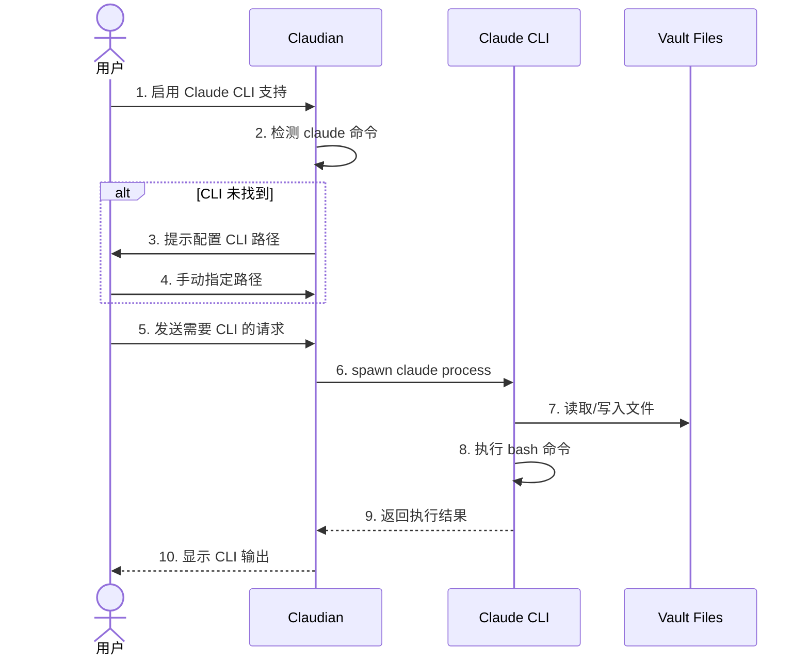
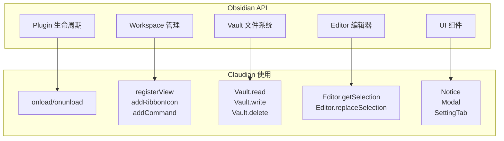
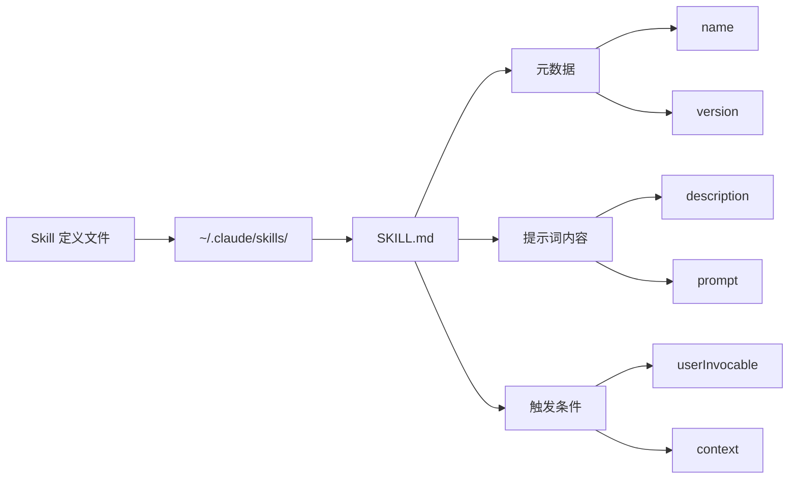
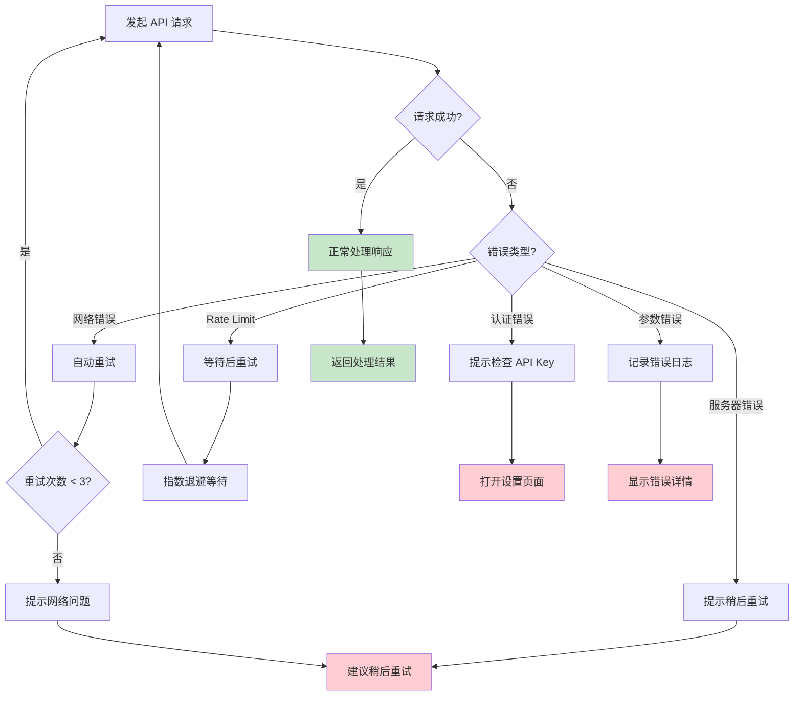

# 接口与集成图

## 外部接口总览



> **图注**：Claudian 通过三类 SDK 与外部服务通信。Agent SDK 负责与 AI 模型通信，使用 HTTP SSE 流式传输。MCP SDK 负责与外部工具通信，使用 JSON-RPC 2.0 协议。Obsidian Plugin API 可以启动子进程与 Claude CLI 集成。

---

## Anthropic API 集成

### 认证与请求流程



> **图注**：Anthropic API 集成采用标准的 REST + SSE 模式。API Key 通过 Authorization Header 传递，请求体包含消息历史和工具定义。响应使用 Server-Sent Events 格式实现流式传输，让用户实时看到 AI 的回复过程。

### 请求体格式示例

```json
{
  "model": "claude-3-sonnet-20240229",
  "max_tokens": 4096,
  "messages": [
    {
      "role": "user",
      "content": "帮我整理这篇笔记"
    }
  ],
  "system": "你是一个 Obsidian 助手...",
  "tools": [
    {
      "name": "Read",
      "description": "读取文件内容",
      "input_schema": {
        "type": "object",
        "properties": {
          "file_path": {"type": "string"}
        },
        "required": ["file_path"]
      }
    },
    {
      "name": "Write",
      "description": "写入文件",
      "input_schema": {
        "type": "object",
        "properties": {
          "file_path": {"type": "string"},
          "content": {"type": "string"}
        },
        "required": ["file_path", "content"]
      }
    }
  ],
  "stream": true
}
```

### 工具调用响应示例

```json
{
  "type": "content_block_delta",
  "index": 0,
  "delta": {
    "type": "tool_use",
    "id": "toolu_01T1x1fJ34qAmk2t",
    "name": "Read",
    "input": {"file_path": "笔记.md"}
  }
}
```

---

## MCP (Model Context Protocol) 集成

### MCP 架构



> **图注**：MCP 是 Anthropic 推出的开放协议，用于连接 AI 助手与外部工具。Claudian 作为 MCP Host，通过不同的传输层（stdio、SSE、HTTP）与各种 MCP Server 通信。工具注册表统一管理所有可用的外部工具。

### MCP 连接流程



### MCP 配置示例

```json
{
  "mcpServers": {
    "github": {
      "command": "npx",
      "args": ["-y", "@modelcontextprotocol/server-github"],
      "env": {
        "GITHUB_PERSONAL_ACCESS_TOKEN": "ghp_xxx"
      },
      "transport": "stdio",
      "enabled": true
    },
    "postgres": {
      "url": "http://localhost:3001/sse",
      "transport": "sse",
      "enabled": true
    }
  }
}
```

---

## Claude CLI 集成

### CLI 调用流程



> **图注**：Claude CLI 集成通过子进程方式实现。Claudian 启动 claude 进程，传递工作目录（Vault 路径），CLI 可以直接操作 Vault 中的文件。这种方式复用了 CLI 的所有功能，包括文件操作、bash 执行等。

### CLI 配置示例

```typescript
// 设置中配置 CLI 路径
interface Settings {
  claudeCliPathsByHost: {
    [hostname]: string;  // 每个设备单独配置
  };
}

// 示例
{
  "claudeCliPathsByHost": {
    "MacBook-Pro": "/Users/xxx/.volta/bin/claude",
    "Work-Desktop": "C:\\Users\\xxx\\AppData\\Local\\Claude\\claude.exe"
  }
}
```

---

## Obsidian API 集成

### 核心 API 使用



### Vault 文件操作

```typescript
// 读取文件
const content = await this.app.vault.read(file);

// 写入文件
await this.app.vault.write(file, newContent);

// 创建新文件
const newFile = await this.app.vault.create(
  '新笔记.md',
  '# 标题\n\n内容'
);

// 删除文件
await this.app.vault.delete(file);

// 列出所有文件
const files = this.app.vault.getMarkdownFiles();
```

### Editor 操作

```typescript
// 获取编辑器实例
const view = this.app.workspace.getActiveViewOfType(MarkdownView);
const editor = view.editor;

// 获取选中文本
const selection = editor.getSelection();

// 替换选中文本
editor.replaceSelection(newText);

// 获取光标位置
const cursor = editor.getCursor();

// 插入文本到光标位置
editor.replaceRange(text, cursor);
```

---

## 自定义扩展接口

### Skills 接口



**Skill 文件示例：**

```markdown
---
name: code-review
version: 1.0.0
userInvocable: true
context: fork
---

# Code Review Skill

你是一个专业的代码审查员。请审查用户提供的代码，关注：
1. 代码风格和可读性
2. 潜在的错误和边界情况
3. 性能优化建议
4. 安全漏洞

输出格式：
- 🟢 优点
- 🟡 建议改进
- 🔴 严重问题
```

### Agent 接口

```mermaid
flowchart LR
    A[Agent 定义] --> B[~/.claude/agents/]
    B --> C[{agentName}/]
    C --> D[agent.md]
    
    D --> E[名称]
    D --> F[系统提示词]
    D --> G[工具限制]
    D --> H[模型配置]
```

**Agent 文件示例：**

```markdown
---
name: TechWriter
description: 专业技术写作助手
model: claude-3-haiku-20240307
allowedTools:
  - Read
  - Write
  - Edit
---

你是一个专业的技术写作专家。你的任务是：
1. 将复杂的技术概念转化为易懂的说明
2. 优化文章结构和逻辑
3. 检查技术术语的准确性
4. 提升文章的可读性

你擅长写的技术主题：软件架构、API 设计、开发最佳实践
```

### Slash Command 接口

```typescript
interface SlashCommand {
  id: string;
  name: string;
  description?: string;
  content: string;      // 提示词模板
  allowedTools?: string[];
  model?: string;
  argumentHint?: string;
}

// 示例
{
  id: "summarize",
  name: "summarize",
  description: "总结当前笔记",
  content: "请总结以下笔记的核心内容，用 3-5 个要点列出：\n\n@{currentNote}",
  allowedTools: ["Read"]
}
```

---

## 错误处理与重试机制



> **图注**：错误处理采用分级策略。网络错误自动重试（最多3次），Rate Limit 使用指数退避等待，认证错误引导用户检查配置，其他错误提供清晰的错误信息。
