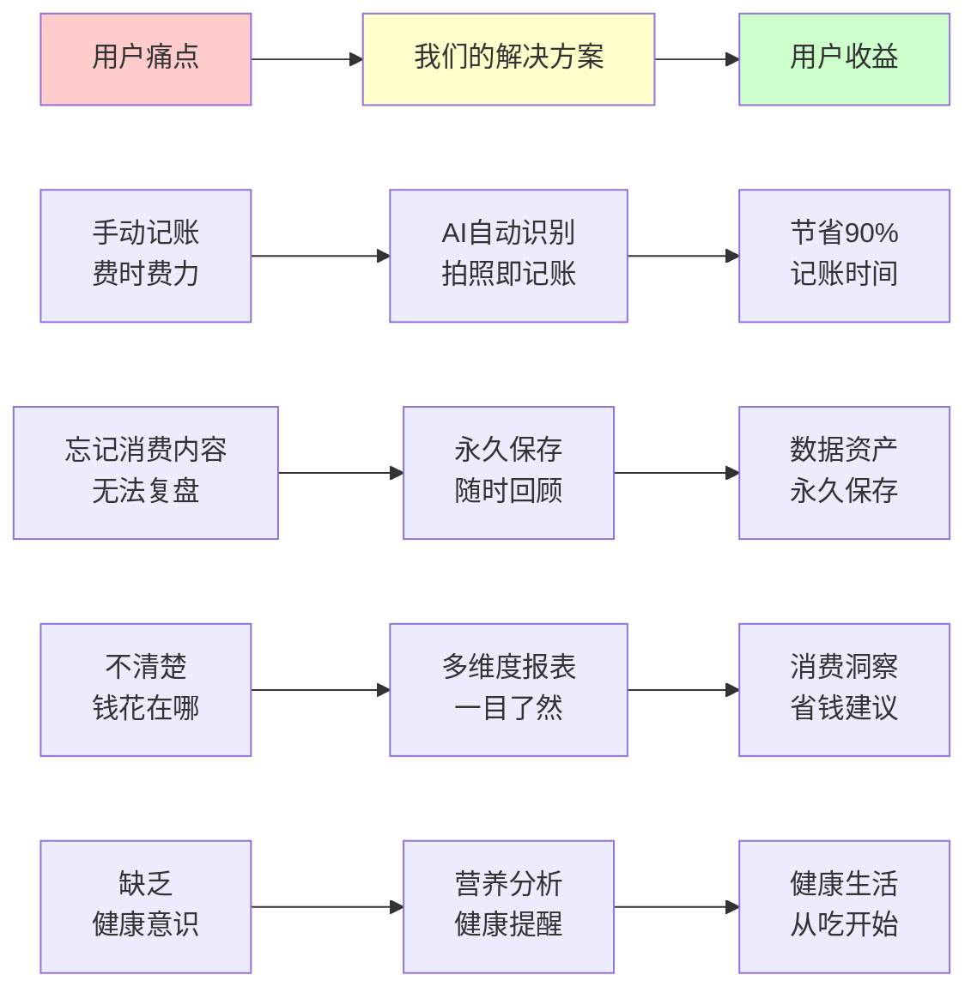
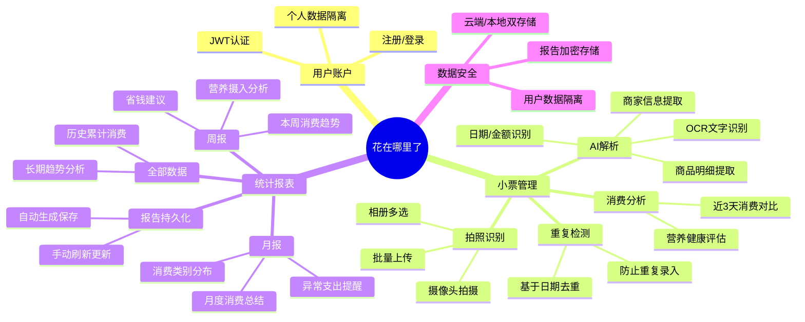
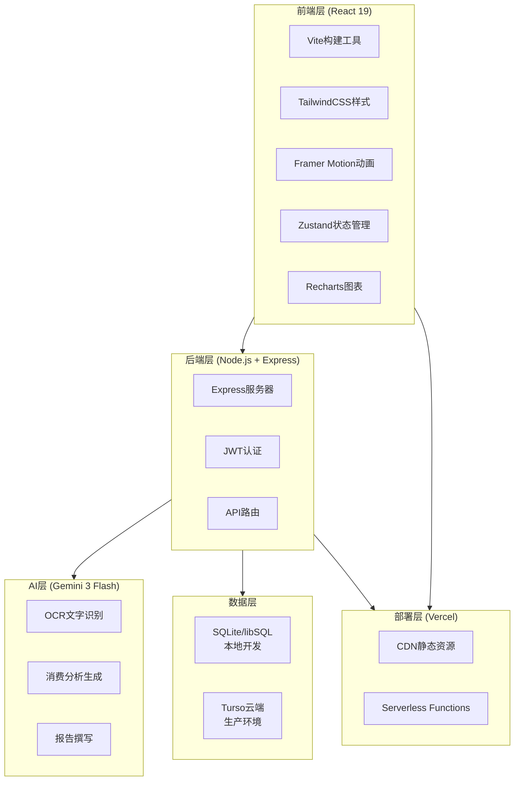
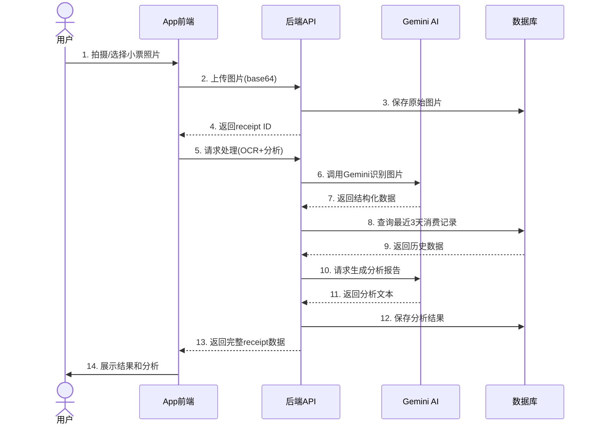

# 项目全景鸟瞰

## 一句话介绍

**「花在哪里了」** 是一款 AI 驱动的智能记账与消费健康助手。用户只需拍照上传购物小票，AI 就能自动识别消费信息，提供营养评估、消费对比和个性化财务建议。

---

## 核心价值主张

> **图注**：上图展示了用户的核心痛点如何通过「花在哪里了」得到解决，并最终获得实际收益。核心价值在于用 AI 自动化替代繁琐的手动记账过程。

---

## 产品功能全景图

> **图注**：思维导图展示了产品的四大核心模块：账户系统、小票管理、统计报表和数据安全。每个模块下又细分具体功能点。

---

## 适合人群与使用场景

### 目标用户画像

| 用户类型 | 特征 | 使用场景 | 核心价值 |
|---------|------|---------|---------|
| **年轻上班族** | 忙碌、注重效率 | 午休后拍一张午餐小票，AI自动生成消费记录和健康分析 | 3秒记账，了解每顿饭的营养摄入 |
| **家庭主妇/主夫** | 管理家庭开支 | 周末采购后批量上传多张超市小票 | 自动生成周报，清楚家庭食品开销和健康饮食情况 |
| **健康意识人群** | 关注饮食健康 | 记录每餐消费，追踪营养成分 | 获得个性化的营养分析和健康建议 |
| **理财新手** | 想控制开支但不善记账 | 定期查看月报，了解消费趋势 | 用数据驱动消费决策，找到省钱空间 |

### 典型使用场景

**场景一：午餐记账**（单张小票）

> 小李中午在便利店买了一份便当，吃完后打开 App，点击拍照按钮，对着小票拍了一张照。2秒后，App 显示识别结果：7-Eleven、¥28.5、购买内容包含照烧鸡肉饭、绿茶。同时还显示了一条分析："这顿饭热量适中，蛋白质摄入良好，但蔬菜比例偏低。与最近3天午餐相比，今天的花费低15%。"

**场景二：周末采购**（批量上传）

> 王女士周六去超市大采购，买了满满一车东西。回家后她打开 App，从相册选择了6张小票照片，App 开始批量处理。5分钟后，所有小票都识别完成，系统自动去重（有一张和上周重复），生成了一份周报："本周食品支出 ¥486，比上周增加12%，主要增加了生鲜采购。营养分析显示本周蔬菜摄入充足，建议继续保持。"

**场景三：月底复盘**（查看报表）

> 月底小张想复盘这个月的开销，切换到"统计"标签，选择"月报"，系统显示："本月共消费 ¥3,240，其中餐饮占比45%、日用品30%、零食15%。发现你有3天晚餐花费超过¥80，建议控制在¥50以内可以每月节省¥300+。"

---

## 技术栈概览

> **图注**：架构图展示了系统的五层结构。前端采用现代化的 React 技术栈，后端使用轻量级 Express，AI 能力由 Google Gemini 提供，数据存储根据环境自动切换，部署在 Vercel 平台。

---

## 核心数据流转

> **图注**：时序图展示了单张小票从上传到展示结果的完整数据流转过程。涉及4个系统组件，14个步骤，整个过程通常在3-5秒内完成。

---

## 产品差异化优势

与传统记账 App 相比，「花在哪里了」的独特价值：

| 维度 | 传统记账App | 花在哪里了 |
|------|------------|-----------|
| **记账方式** | 手动输入商家、金额、分类 | 拍照即可，AI自动识别 |
| **消费分析** | 仅展示金额统计 | 营养健康+消费趋势双维度 |
| **数据颗粒度** | 只记总金额 | 记录每个商品明细 |
| **健康关联** | 无 | AI营养评估，关注饮食健康 |
| **使用门槛** | 需要坚持和自律 | 几乎零门槛，拍照就完成 |

---

## 下一步阅读建议

- 📖 **[01-用户旅程地图](01-user-journey.md)** — 了解用户如何一步步使用产品
- 📖 **[02-核心功能详解](02-core-features.md)** — 深入了解每个功能的运作机制
- 📖 **[03-数据关系图](03-data-model.md)** — 查看系统如何组织和存储数据
