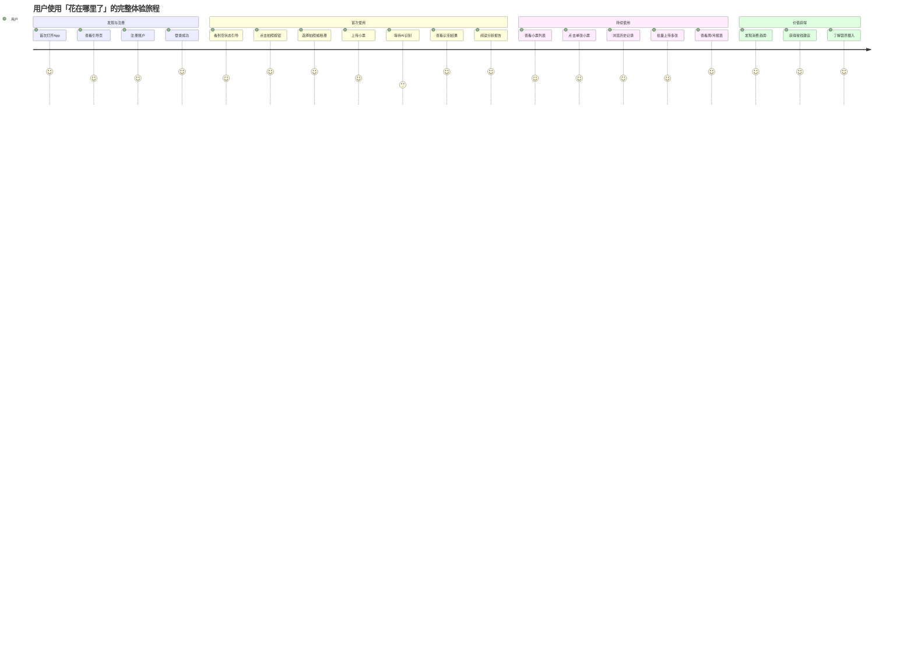
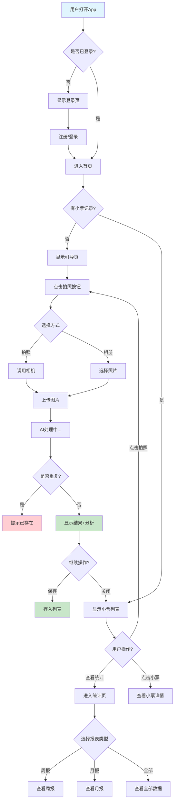
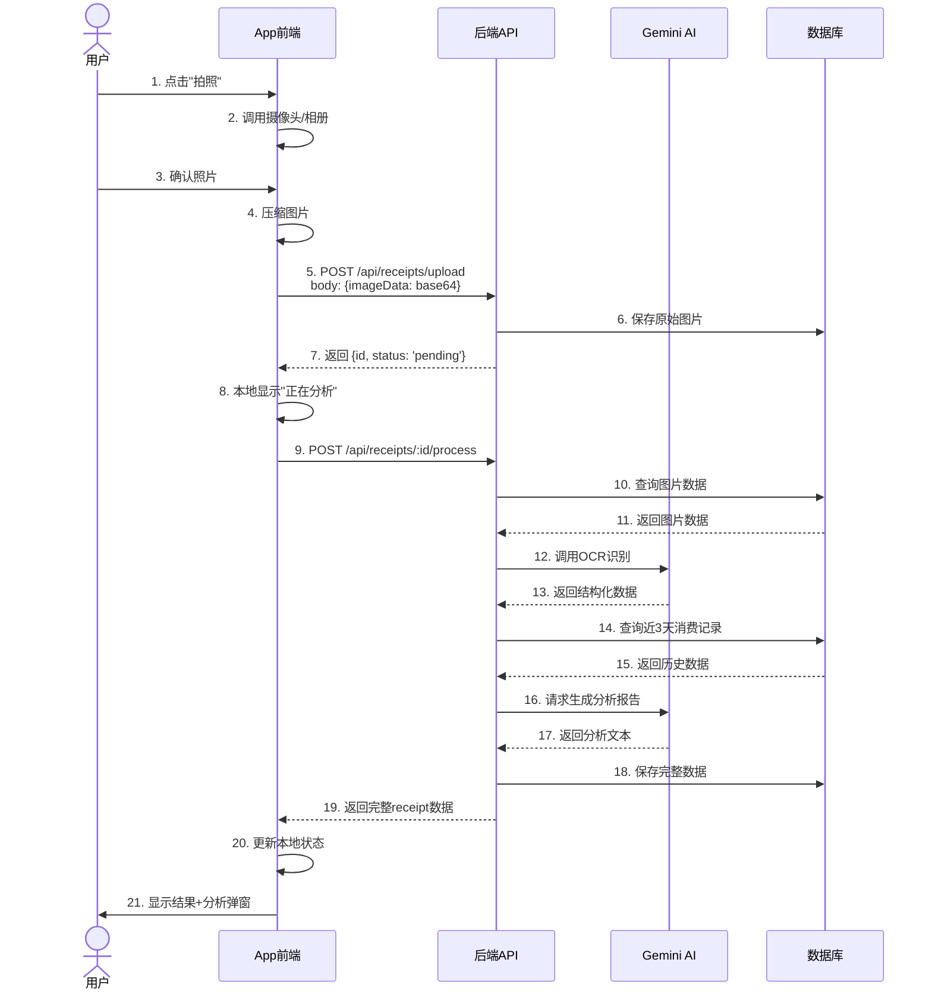
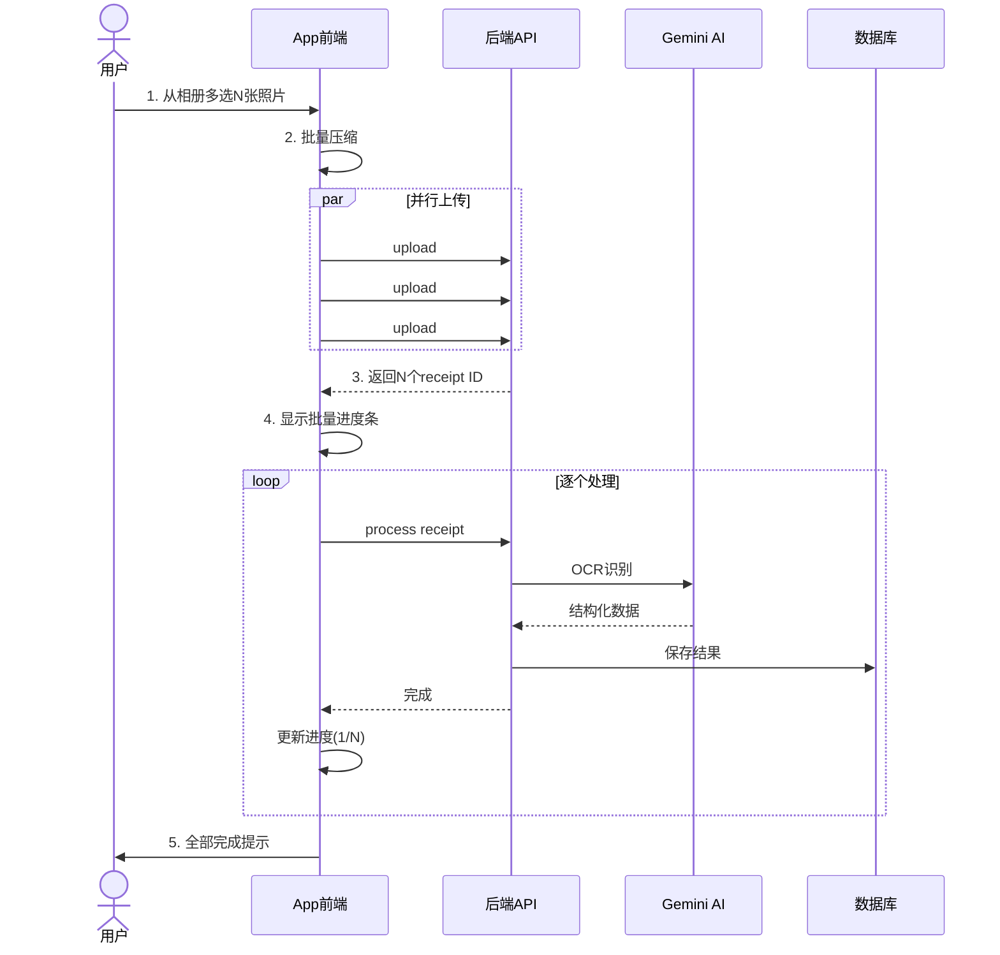
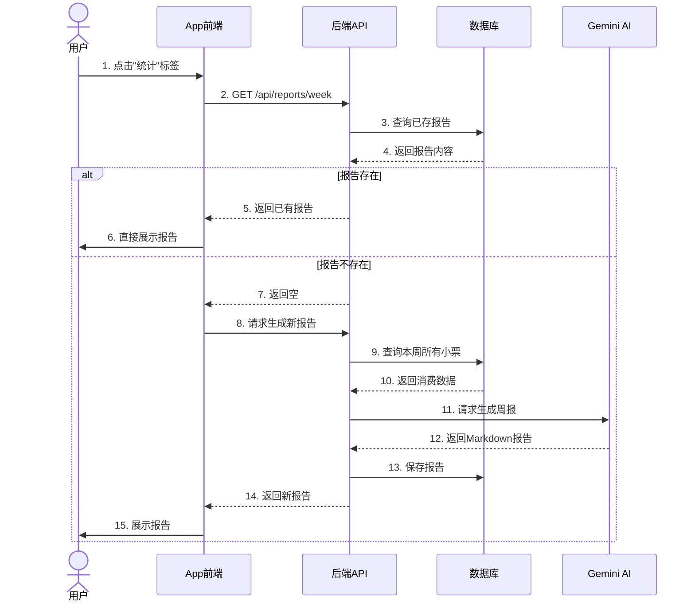
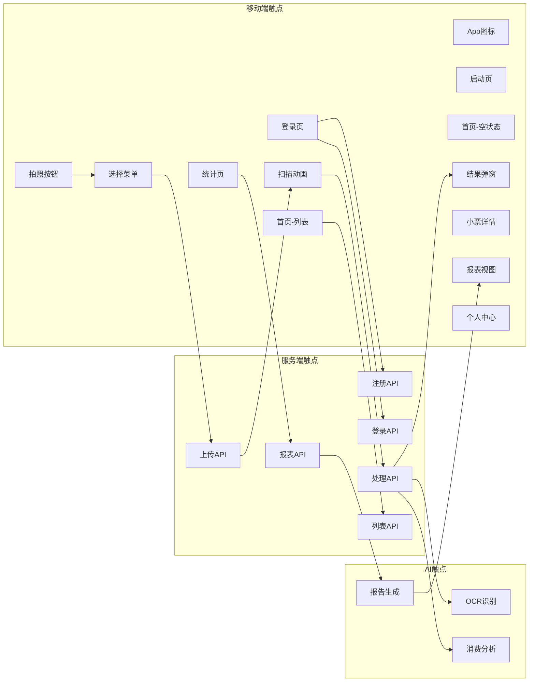

# 用户旅程地图

## 主用户角色：日常消费者



> **图注**：用户旅程图展示了从发现产品到获得价值的主要阶段和关键触点。每个步骤的评分(1-5)反映了该环节的用户体验满意度。整体旅程流畅，核心痛点仅在"等待AI识别"环节略有等待。

---

## 用户决策流程



> **图注**：决策树展示了用户在 App 中的所有可能操作路径。从打开 App 到完成一次记账，用户可能经历 4-8 个步骤，流程简洁清晰。核心分支在首页根据"是否有记录"展示不同内容。

---

## 关键操作的前后端交互

### 1. 单张小票识别流程



> **图注**：单张小票从拍照到展示结果涉及 21 个步骤，前后端 5 次通信，AI 2 次调用。整个过程约需 3-5 秒，用户体验流畅。关键优化点包括图片压缩减少传输时间、服务端OCR减轻客户端负担。

### 2. 批量处理流程



> **图注**：批量处理采用"并行上传 + 串行处理"策略。上传阶段并行可以充分利用带宽，处理阶段串行可以避免 AI API 限流。用户通过进度条实时了解处理状态。

### 3. 查看报表流程



> **图注**：报表采用"缓存优先"策略。首次生成后保存到数据库，下次直接读取，避免重复调用 AI。用户可以手动刷新重新生成，适合查看实时数据。

---

## 用户情绪曲线

```mermaid
xychart-beta
    title "用户情绪值变化曲线"
    x-axis [打开App, 登录, 首次拍照, 等待识别, 看到结果, 阅读分析, 查看报表]
    y-axis "情绪值" 0 --> 10
    line [7, 6, 8, 5, 9, 9, 8]
```

**情绪节点解读：**

| 阶段 | 情绪值 | 原因 | 优化方向 |
|------|--------|------|---------|
| 打开App | 7 | 好奇心驱动，期待新体验 | - |
| 登录 | 6 | 注册/登录有一定门槛 | 支持游客模式 |
| 首次拍照 | 8 | 操作简单，符合直觉 | - |
| 等待识别 | 5 | 等待期间略焦虑 | 添加趣味动画 |
| 看到结果 | 9 | 识别准确，惊喜感 | - |
| 阅读分析 | 9 | 分析有价值，超出预期 | - |
| 查看报表 | 8 | 数据可视化，清晰易懂 | 增加更多图表 |

---

## 用户触点清单



> **图注**：触点地图展示了用户在使用产品过程中接触到的所有界面和功能点。移动端13个触点，服务端6个API，AI层3个能力。整体触点精简，没有冗余功能。

---

## 典型用户故事

### 故事一：上班族小张的一周记账

**周一** - *首次使用*

小张午休时在便利店买了便当，同事推荐了这个 App。他下载后打开，看到简洁的登录页，用邮箱快速注册。首页提示"还没有小票，拍一张吧"，他点击中间的拍照按钮，选择"拍照"，对准小票拍了一张。

App 显示扫描动画，3秒后弹出结果：识别出7-Eleven、¥32、照烧鸡肉饭+可乐。分析说"这顿热量偏高，建议搭配蔬菜"。小张觉得很有趣，点击保存。

**周三** - *持续使用*

小张已经养成了习惯，每天吃完午饭就拍一张。今天他看到小票列表里已经有3条记录了。点击周二那张，能看到详细的营养分析和省钱建议。

**周日** - *查看周报*

小张切换到统计页，点击查看周报。系统显示："本周午餐共花费¥186，平均¥37/餐。与上周相比增加12%，主要原因是周三那顿商务餐较贵。营养方面，本周蛋白质摄入充足，但膳食纤维偏低，建议多吃蔬菜。"

小张觉得很有价值，决定下周开始控制午餐预算在¥30以内。

---

### 故事二：宝妈王女士的批量记账

**周六早上** - *超市大采购*

王女士带孩子在超市采购，买了生鲜、日用品、零食，一共6张小票。以前她都是随手丢掉小票，现在有了这款 App，决定试试。

回家后，她打开 App，点击拍照按钮选择"从相册选择"，一次性选中了6张小票照片。App 显示批量进度条，开始逐个处理。

**处理过程**

第一张生鲜小票识别完成，显示"永辉超市、¥156、蔬菜肉类等"。分析说"本周生鲜采购充足，建议3天内吃完保持新鲜"。

第二张日用品小票识别完成...（过程类似）

**结果汇总**

6张小票全部处理完成（其中1张被标记为重复，因为上周同样日期也来买过）。App 自动生成了周报："本周超市采购¥486，其中食品占比65%、日用品25%、零食10%。发现零食开销比上月增加¥50，建议适当控制。"

王女士很满意，终于清楚家庭开支花在哪儿了。
