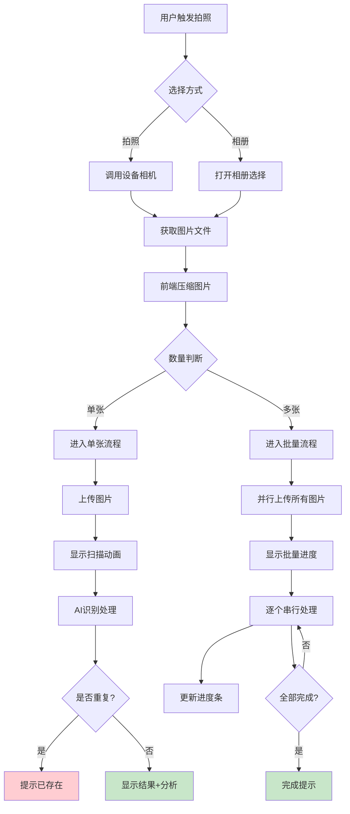
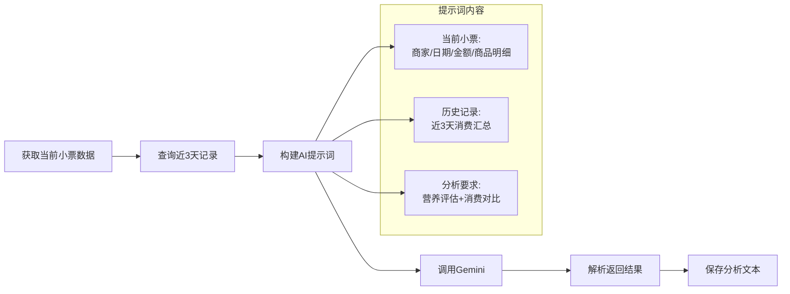
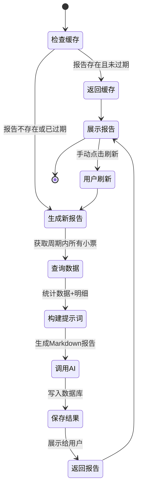
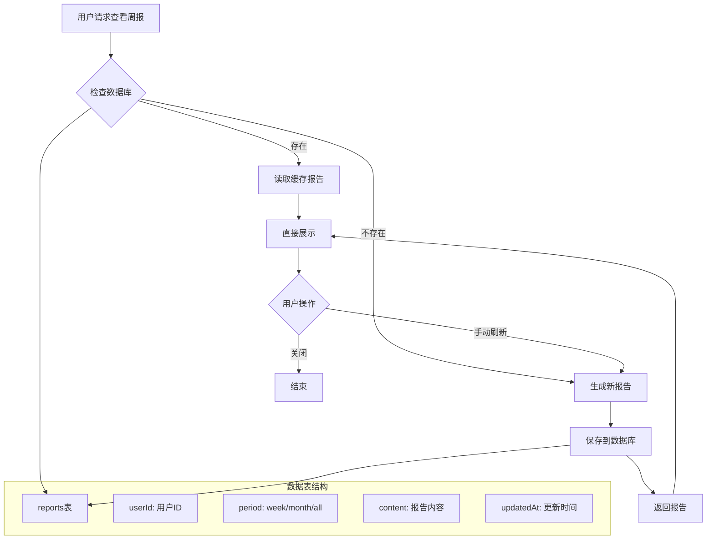
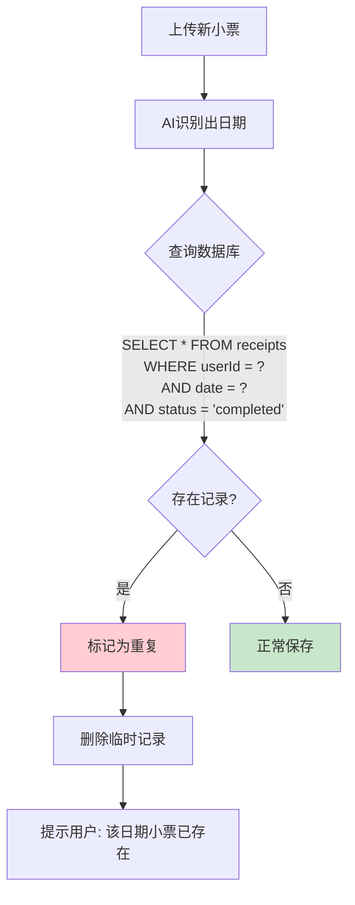
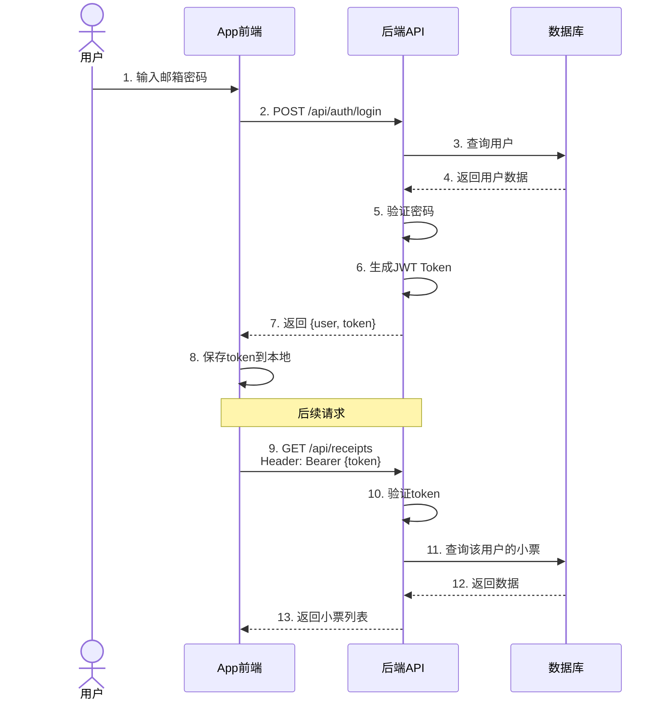

# 核心功能详解

## 功能一：拍照识别（小票录入）

### 功能概述

拍照识别是产品的核心入口，用户通过摄像头拍摄或从相册选择小票照片，系统自动识别其中的商家名称、消费日期、总金额和商品明细。

### 工作流程



> **图注**：流程图展示了拍照识别的完整路径。单张处理追求快速响应（3-5秒），批量处理追求稳定性（逐个串行避免AI限流）。关键分支在于图片数量判断和重复检测。

### 技术实现要点

| 环节 | 实现方式 | 优化策略 |
|------|---------|---------|
| **图片压缩** | 前端Canvas压缩 | 限制最大宽度1200px，减少传输时间和AI处理时间 |
| **格式转换** | 统一转为WebP | 更好的压缩率，减少存储空间 |
| **传输优化** | Base64编码 | 兼容性好，无需额外文件上传逻辑 |
| **重复检测** | 基于消费日期去重 | 同日期的小票视为重复，防止同一笔消费录入多次 |
| **状态管理** | pending → processing → completed/error | 清晰的状态流转，支持断点续传和重试 |

### 举例说明

**单张处理场景**

> 小明在星巴克买了一杯咖啡，小票显示：Starbucks、¥32、拿铁中杯。他打开 App 拍照，系统识别过程如下：
> 
> 1. 前端压缩图片从 3MB → 150KB
> 2. 上传到服务端，保存到数据库
> 3. 调用 Gemini AI 进行 OCR：
>    - 识别商家：Starbucks（置信度98%）
>    - 识别日期：2024-01-15（置信度99%）
>    - 识别金额：¥32.00（置信度100%）
>    - 识别商品：拿铁中杯（置信度95%）
> 4. 检查重复：该用户今天已有1条记录，日期不同，通过
> 5. 生成分析："与最近3天咖啡消费相比，今天便宜了¥5，继续保持！"
> 6. 总耗时：2.8秒

---

## 功能二：AI消费分析

### 功能概述

每次小票识别完成后，AI 会自动生成一份消费分析报告，包含两个维度：
1. **营养健康评估** - 分析购买食品的营养成分，给出健康建议
2. **消费对比分析** - 与近3天同类消费对比，发现消费趋势

### 分析生成流程



> **图注**：分析生成依赖两类数据：当前小票的详细信息和近3天的消费历史。AI 根据提示词模板生成结构化分析，前端直接渲染 Markdown 格式的分析结果。

### 分析内容示例

```markdown
## 消费分析

### 营养健康评估
🥗 **这顿饭整体评价：良好**
- 蛋白质摄入充足（鸡肉、鸡蛋）
- 碳水化合物适中（米饭）
- ⚠️ 蔬菜比例偏低，建议增加绿叶菜
- 热量约 650 大卡，符合午餐标准

### 消费对比（近3天）
📊 **趋势分析**
- 今日消费：¥28.5
- 近3天平均：¥34.2
- 对比结果：比平均低 **16.7%** 👍
- 省钱小技巧：选择套餐比单点便宜约¥5
```

### 技术要点

| 组件 | 说明 |
|------|------|
| **AI模型** | Google Gemini 3 Flash Preview |
| **提示词工程** | 结构化 Prompt，要求返回 Markdown 格式 |
| **数据准备** | 查询近3天小票及商品明细，拼接成文本 |
| **结果处理** | 直接存储 AI 返回的文本，前端用 react-markdown 渲染 |
| **容错处理** | AI 调用失败时显示"分析生成失败"，不影响主流程 |

---

## 功能三：统计报表（周报/月报/全部）

### 功能概述

系统根据用户积累的小票数据，自动生成三种维度的统计报告：
- **周报** - 最近7天的消费趋势和营养分析
- **月报** - 当月消费总结和类别分布
- **全部数据** - 历史累计消费和长期趋势

### 报表生成流程



> **图注**：状态机展示了报表的生命周期。采用缓存策略避免频繁调用 AI，但用户可以随时手动刷新获取最新数据。报告生成涉及数据查询、AI调用、结果保存三个主要步骤。

### 报表内容结构

```markdown
# 本周消费报告

## 📊 消费概览
- 总消费：¥486
- 交易笔数：12笔
- 日均消费：¥69.4
- 较上周：+12% ⬆️

## 🍽️ 饮食分析
- 外出就餐：8次（67%）
- 超市采购：4次（33%）
- 营养评分：B+
- 建议：增加早餐摄入，减少夜宵

## 💡 省钱建议
1. 发现你有3天午餐超过¥50，建议控制在¥35以内
2. 咖啡消费¥126/周，自制可节省¥80
3. 周二在7-Eleven买了高价进口零食，类似商品在超市便宜30%

## 📈 消费趋势
[趋势图表：每日消费金额折线图]
```

### 持久化策略



> **图注**：报表持久化使用独立的 reports 表，以 userId + period 作为主键。这样可以为每个用户的每种报表类型保存一份报告，下次直接读取，大幅提升加载速度。

---

## 功能四：重复检测

### 功能概述

防止用户重复录入同一张小票，系统基于**消费日期**进行去重。如果同一日期已有完成状态的小票，新上传的同日期小票会被视为重复。

### 重复检测逻辑



> **图注**：重复检测发生在 AI 识别完成后、正式保存前。通过查询数据库检查同一用户在同一日期是否已有完成状态的小票。这种策略简单有效，避免了基于图片特征（如哈希值）的复杂计算。

### 为什么选择日期去重？

| 方案 | 优点 | 缺点 |
|------|------|------|
| **日期去重**（当前采用） | 简单、查询快、符合业务逻辑 | 同一日期多次消费可能被误判 |
| **图片哈希去重** | 精确识别同一张小票 | 计算复杂、拍照角度不同哈希不同 |
| **金额+商家去重** | 辅助判断 | 同一天同商家可能多次消费 |

**业务解释**：对于个人消费记账场景，同一天的购物小票通常代表一笔消费记录。如果用户确实在同一天有多次消费（如午餐和晚餐），系统允许用户手动修改日期来区分。

---

## 功能五：用户认证与数据隔离

### 功能概述

系统支持用户注册、登录，基于 JWT（JSON Web Token）进行身份认证，确保每个用户只能访问自己的小票数据。

### 认证流程



> **图注**：认证采用标准的 JWT 方案。登录成功后服务端返回 Token，前端保存并在后续请求的 Header 中携带。服务端验证 Token 后提取 userId，确保数据隔离。

### 数据隔离实现

```sql
-- 所有查询都带上 userId 条件
SELECT * FROM receipts WHERE userId = ? AND date = ?
INSERT INTO receipts (id, userId, storeName, ...) VALUES (?, ?, ?, ...)
DELETE FROM receipts WHERE id = ? AND userId = ?
```

**关键原则**：
1. 每张小票都关联 userId
2. 所有查询都带上 userId 过滤条件
3. 更新/删除操作前验证所有权

---

## 功能六：数据存储适配

### 功能概述

系统支持两种存储模式，根据运行环境自动切换：
- **本地开发**：SQLite 文件存储 (`data/receipts.db`)
- **生产环境**：Turso 云端数据库 (Serverless SQLite)

### 存储适配架构

```mermaid
flowchart TD
    A[后端启动] --> B{检查环境变量}
    B -->|TURSO_DATABASE_URL 存在| C[连接 Turso 云数据库]
    B -->|不存在| D[使用本地 SQLite 文件]
    
    C --> E[创建 libSQL 客户端]
    D --> E
    
    E --> F[初始化数据表]
    F --> G[应用启动完成]
    
    subgraph 统一API
        H[db.execute\(\) 查询]
        I[db.executeMultiple\(\) 批量]
        J[db.batch\(\) 事务]
    end
    
    E --> H
    E --> I
    E --> J
    
    style C fill:#c8e6c9
    style D fill:#fff9c4
```

> **图注**：数据层通过环境变量自动判断使用哪种存储后端。`@libsql/client` 提供统一 API，业务代码无需关心底层是本地文件还是云端数据库，实现无缝切换。

### 存储策略对比

| 维度 | 本地开发 | 生产环境 |
|------|---------|---------|
| **存储介质** | SQLite 文件 | Turso 云端 SQLite |
| **图片存储** | 文件系统 (`uploads/`) | Base64 存入数据库 |
| **访问延迟** | <1ms | 20-50ms |
| **成本** | 免费 | 免费额度充足 |
| **适用场景** | 开发调试 | Vercel Serverless |

**为什么生产环境图片要存数据库？**

Vercel 是 Serverless 架构，每次冷启动 `/tmp` 目录会被清空。如果将图片存到文件系统，下次请求就访问不到了。因此生产环境采用 Base64 直接存入数据库的方案。
