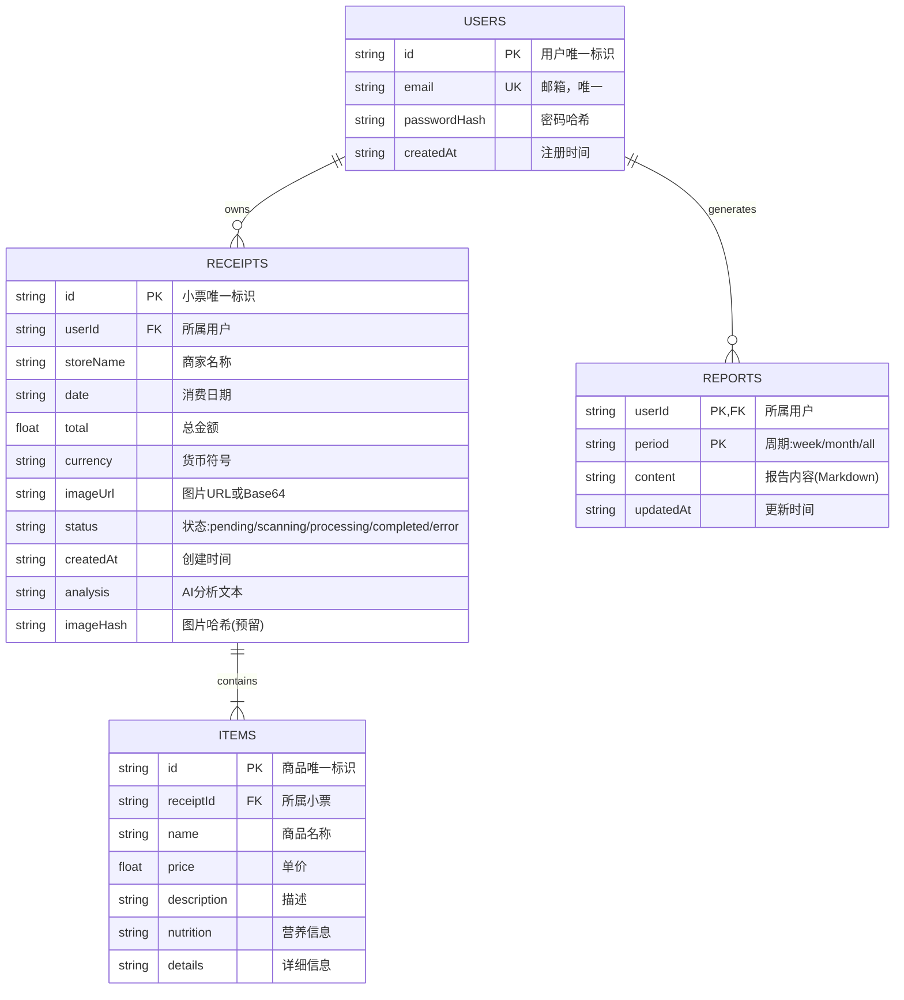
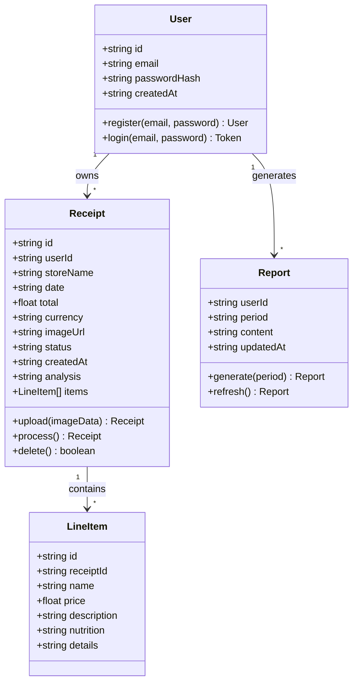
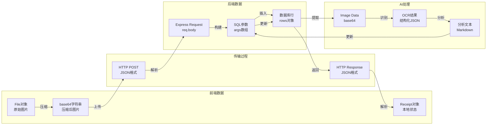
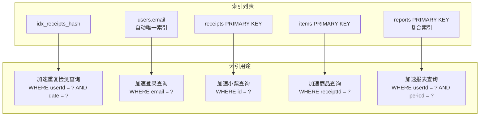
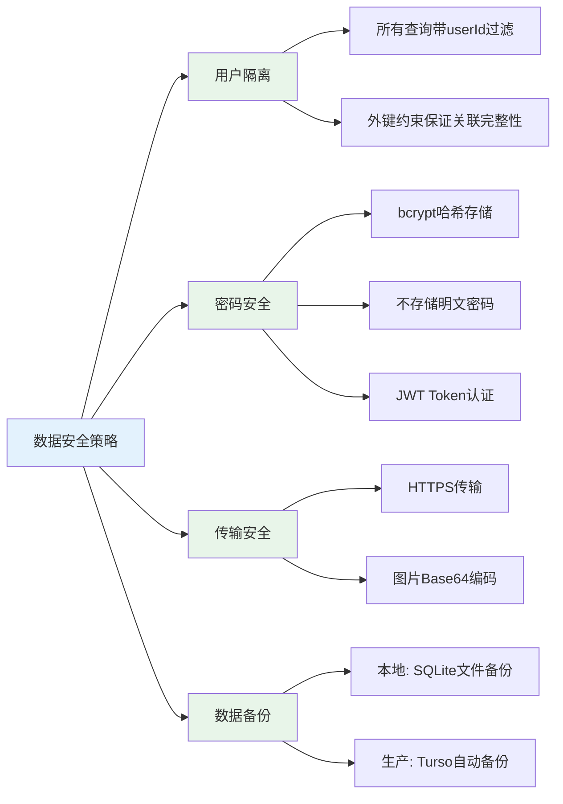

# 数据关系图

## 实体关系图（ER图）



> **图注**：ER图展示了系统的4个核心实体及其关系。用户(Users)拥有多条小票(Receipts)和多个报表(Reports)，每张小票包含多个商品(Items)。关系型数据库设计保证了数据的一致性和完整性。

---

## 类图设计



> **图注**：类图展示了前端 TypeScript 的类型定义结构。Receipt 类是核心，关联 User（通过 userId）和 LineItem（商品明细）。Report 与 User 是多对一关系，通过复合主键(userId, period)唯一标识。

---

## 数据流向图

### 单张小票的数据生命周期



> **图注**：数据在整个系统中经历了多次格式转换。前端从 File 对象压缩为 base64，通过 HTTP 传输到后端，存入数据库。AI 处理时从数据库提取图片数据，返回结构化结果再写回数据库，最后返回给前端。

### 数据表关联查询

```mermaid
flowchart TB
    A[查询用户小票列表] --> B[执行SQL]
    B --> C[主查询: receipts表]
    C --> D[获取 receiptIds]
    D --> E[子查询: items表]
    E --> F[IN操作符<br/>WHERE receiptId IN (...)])
    F --> G[内存组装<br/>关联 items 到 receipt]
    G --> H[返回完整数据]
    
    subgraph SQL示例
        I["""
        SELECT r.* FROM receipts 
        WHERE userId = ?
        
        SELECT * FROM items 
        WHERE receiptId IN (?, ?, ?)
        """]
    end
    
    B --> I
```

> **图注**：由于 SQLite/libSQL 不支持复杂的 JOIN 查询，系统采用"先查主表，再批量查子表，最后内存组装"的策略。这种两次查询+内存关联的方式在小数据量下性能良好。

---

## 数据库表结构详情

### 1. users 表

存储用户账户信息

```sql
CREATE TABLE users (
    id TEXT PRIMARY KEY,           -- 用户唯一标识 (UUID)
    email TEXT UNIQUE NOT NULL,    -- 邮箱，用于登录
    passwordHash TEXT NOT NULL,    -- bcrypt 加密后的密码
    createdAt TEXT NOT NULL        -- ISO8601 格式时间
);
```

**示例数据：**

| id | email | passwordHash | createdAt |
|----|-------|--------------|-----------|
| usr_abc123 | user@example.com | $2a$10$... | 2024-01-15T08:30:00Z |

---

### 2. receipts 表

存储小票主信息

```sql
CREATE TABLE receipts (
    id TEXT PRIMARY KEY,           -- 小票唯一标识
    userId TEXT,                   -- 外键，关联 users.id
    storeName TEXT,                -- 商家名称
    date TEXT,                     -- 消费日期 (YYYY-MM-DD)
    total REAL,                    -- 总金额
    currency TEXT,                 -- 货币符号 (¥/$/€)
    imageUrl TEXT,                 -- 图片URL或Base64
    status TEXT,                   -- pending/scanning/processing/completed/error
    createdAt TEXT,                -- 创建时间
    analysis TEXT,                 -- AI分析文本 (Markdown)
    imageHash TEXT,                -- 图片哈希 (预留去重用)
    FOREIGN KEY(userId) REFERENCES users(id)
);
```

**示例数据：**

| id | userId | storeName | date | total | currency | status | analysis |
|----|--------|-----------|------|-------|----------|--------|----------|
| rcp_001 | usr_abc123 | 7-Eleven | 2024-01-15 | 28.5 | ¥ | completed | "## 营养分析..." |

---

### 3. items 表

存储小票商品明细

```sql
CREATE TABLE items (
    id TEXT PRIMARY KEY,           -- 商品唯一标识
    receiptId TEXT,                -- 外键，关联 receipts.id
    name TEXT,                     -- 商品名称
    price REAL,                    -- 单价
    description TEXT,              -- 描述
    nutrition TEXT,                -- 营养信息
    details TEXT,                  -- 详细信息
    FOREIGN KEY(receiptId) REFERENCES receipts(id)
);
```

**示例数据：**

| id | receiptId | name | price | nutrition |
|----|-----------|------|-------|-----------|
| itm_001 | rcp_001 | 照烧鸡肉饭 | 25.0 | 热量: 650kcal |
| itm_002 | rcp_001 | 绿茶 | 3.5 | 热量: 0kcal |

---

### 4. reports 表

存储生成的报表

```sql
CREATE TABLE reports (
    userId TEXT NOT NULL,          -- 外键，关联 users.id
    period TEXT NOT NULL,          -- week/month/all
    content TEXT,                  -- 报告内容 (Markdown)
    updatedAt TEXT,                -- 更新时间
    PRIMARY KEY(userId, period)    -- 复合主键
);
```

**示例数据：**

| userId | period | content | updatedAt |
|--------|--------|---------|-----------|
| usr_abc123 | week | "# 本周报告..." | 2024-01-21T18:00:00Z |
| usr_abc123 | month | "# 本月报告..." | 2024-01-31T20:00:00Z |

---

## 数据索引设计



> **图注**：系统设计了针对性的索引来优化高频查询。主键自动创建索引，email 有唯一约束索引，reports 使用复合主键优化报表查询。另外为 receipts 表的 (userId, imageHash) 创建了索引（虽然当前版本使用日期去重而非哈希去重，这是预留扩展）。

---

## 数据安全设计



> **图注**：数据安全从四个维度保障：用户隔离通过 SQL 查询条件实现；密码安全使用 bcrypt 加密；传输过程使用 HTTPS；数据备份依赖底层存储机制（SQLite文件复制或Turso云端备份）。
