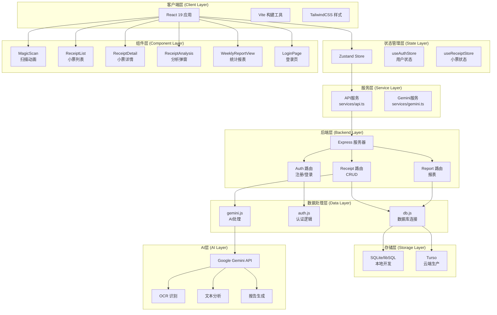
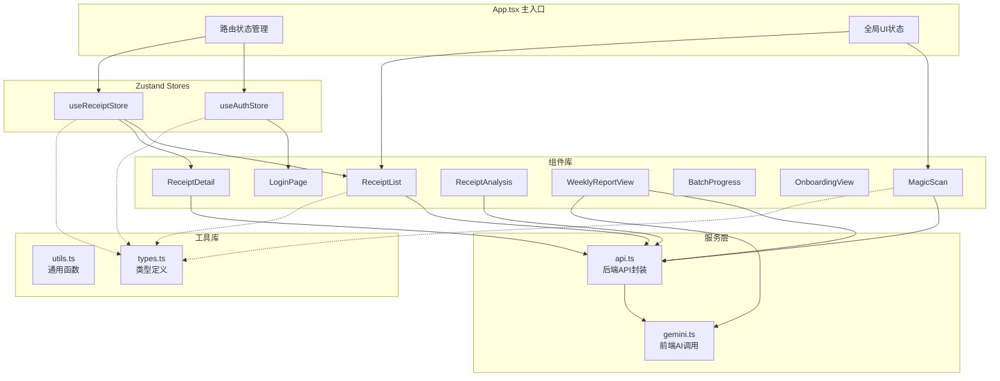
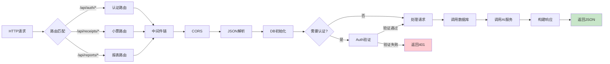
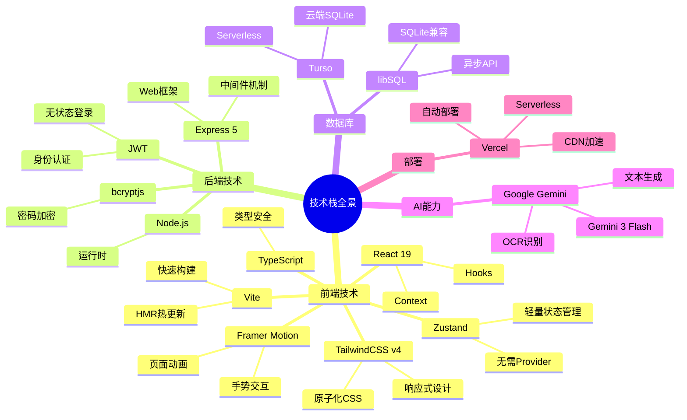
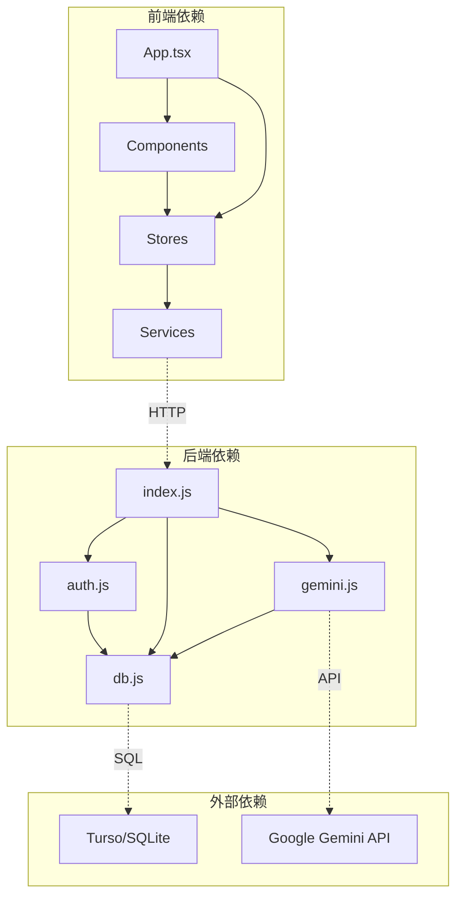
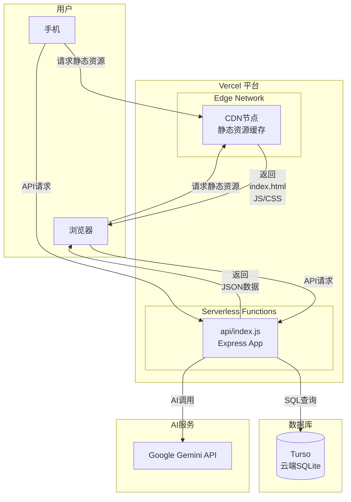

# 模块架构图

## 系统整体架构



> **图注**：系统采用经典的分层架构。前端使用 React + Zustand 管理状态，通过服务层与后端通信。后端使用 Express 提供 REST API，数据处理层封装数据库和 AI 调用逻辑。存储层根据环境自动切换，AI 层统一调用 Google Gemini。

---

## 前端模块架构



> **图注**：前端采用组件化架构，按功能拆分组件。状态管理使用 Zustand，分为用户状态和小票状态两个 Store。服务层封装所有 API 调用，组件通过服务层与后端通信。工具库提供类型定义和通用函数。

---

## 后端模块架构

```mermaid
flowchart TB
    subgraph Server["server/index.js 主入口"]
        A1[Express App]
        A2[中间件注册]
        A3[路由注册]
    end
    
    subgraph Routes["API 路由"]
        B1[/api/auth/*<br/>认证路由]
        B2[/api/receipts/*<br/>小票路由]
        B3[/api/reports/*<br/>报表路由]
    end
    
    subgraph Middleware["中间件"]
        C1[CORS 跨域]
        C2[JSON 解析]
        C3[DB 初始化]
        C4[Auth 验证]
    end
    
    subgraph Modules["功能模块"]
        D1[auth.js<br/>密码+JWT]
        D2[db.js<br/>数据库连接]
        D3[gemini.js<br/>AI封装]
    end
    
    subgraph Database["数据库"]
        E1[SQLite 本地]
        E2[Turso 云端]
    end
    
    A1 --> A2
    A1 --> A3
    
    A2 --> C1
    A2 --> C2
    A2 --> C3
    
    A3 --> B1
    A3 --> B2
    A3 --> B3
    
    B1 --> C4
    B2 --> C4
    B3 --> C4
    
    B1 --> D1
    B2 --> D2
    B2 --> D3
    B3 --> D2
    
    D2 --> E1
    D2 --> E2
    
    D3 --> AI[Google Gemini API]
```

> **图注**：后端采用 Express 框架，按路由、中间件、功能模块分层。认证路由处理注册登录，小票路由处理核心业务流程，报表路由处理统计功能。中间件统一处理跨域、解析、初始化和认证。功能模块封装具体业务逻辑。

---

## 请求处理链路



> **图注**：请求处理遵循 Express 标准的中间件模式。所有请求先经过 CORS、JSON解析、DB初始化，然后根据路由决定是否需要认证，最后执行业务逻辑。错误处理在中间件链中统一捕获。

---

## 技术栈全景图



> **图注**：技术栈选择遵循"现代化、轻量级、高效能"原则。前端使用 React 19 + TypeScript，构建工具用 Vite；后端使用 Express 5；数据库采用 libSQL/SQLite 保持轻量；AI 使用 Google Gemini；部署在 Vercel 实现 Serverless 架构。

---

## 模块依赖关系



> **图注**：依赖关系遵循单向原则。前端内部：App 依赖组件和状态，组件依赖状态，状态依赖服务。后端内部：入口依赖各模块，auth 和 gemini 都依赖 db。前后端通过 HTTP 通信，后端通过 API 调用外部服务。

---

## 部署架构



> **图注**：部署采用 Vercel 的 Serverless 架构。前端静态资源通过 CDN 全球分发，API 请求路由到 Serverless Function。数据库使用 Turso 云端 SQLite，AI 调用 Google Gemini API。整个架构无服务器运维，自动扩缩容。

---

## 环境配置策略

```mermaid
flowchart LR
    subgraph 开发环境["本地开发"]
        A1[Vite Dev Server]
        A2[Express Server<br/>localhost:3001]
        A3[SQLite 文件<br/>data/receipts.db]
        A4[uploads 目录<br/>本地存储图片]
    end
    
    subgraph 生产环境["Vercel 生产"]
        B1[Vercel CDN]
        B2[Serverless Function]
        B3[Turso 数据库]
        B4[Base64 存数据库]
    end
    
    subgraph 环境变量["环境变量控制"]
        C1[.env 本地配置]
        C2[Vercel 环境变量]
    end
    
    subgraph 自动切换["自动适配逻辑"]
        D1{检查<br/>TURSO_DATABASE_URL}
        D2|存在| 生产模式
        D3|不存在| 开发模式
    end
    
    A1 --> A2
    A2 --> A3
    A2 --> A4
    
    B1 --> B2
    B2 --> B3
    B2 --> B4
    
    C1 --> A2
    C2 --> B2
    
    B2 --> D1
    A2 --> D1
```

> **图注**：环境配置通过环境变量自动切换。开发环境使用本地 SQLite 和文件系统存储图片；生产环境使用 Turso 云端数据库，图片以 Base64 存入数据库。代码层面通过判断 TURSO_DATABASE_URL 是否存在来自动适配。
