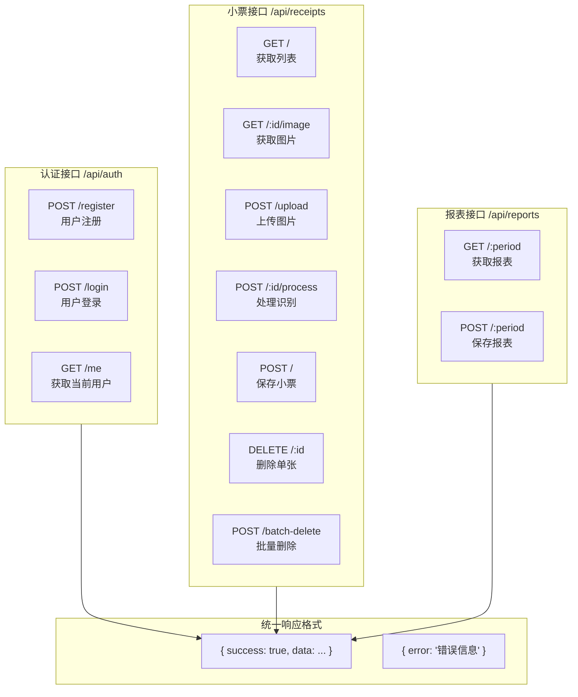
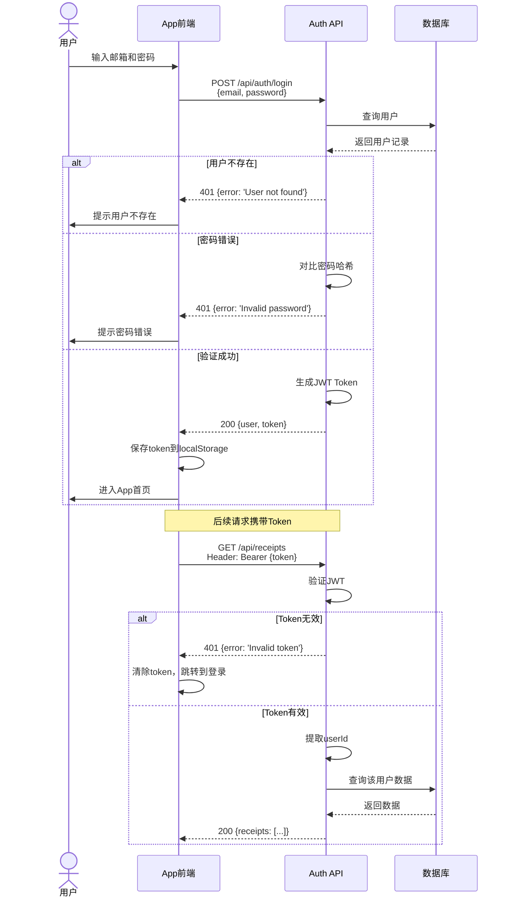
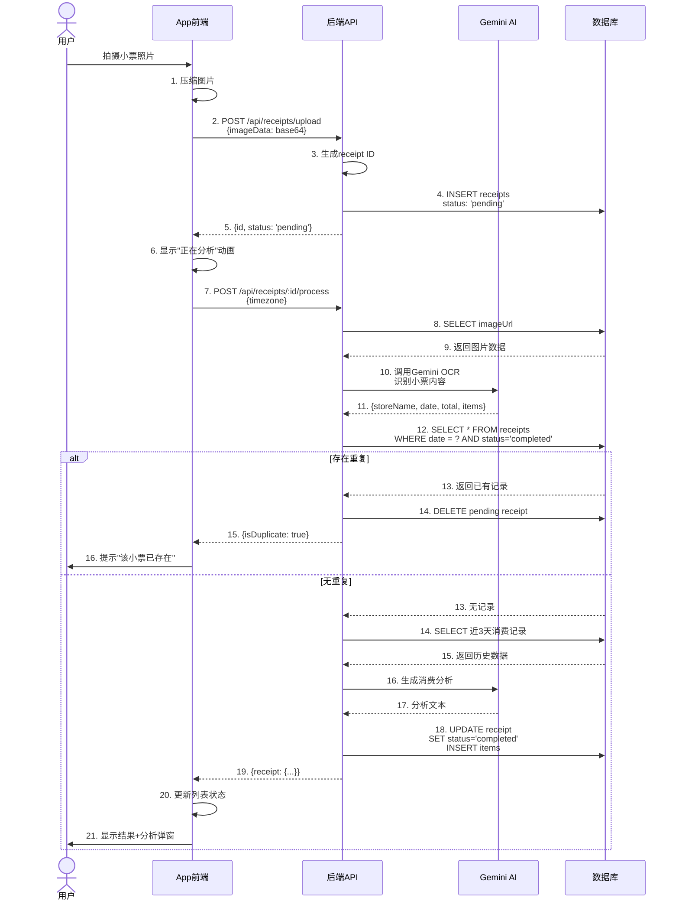
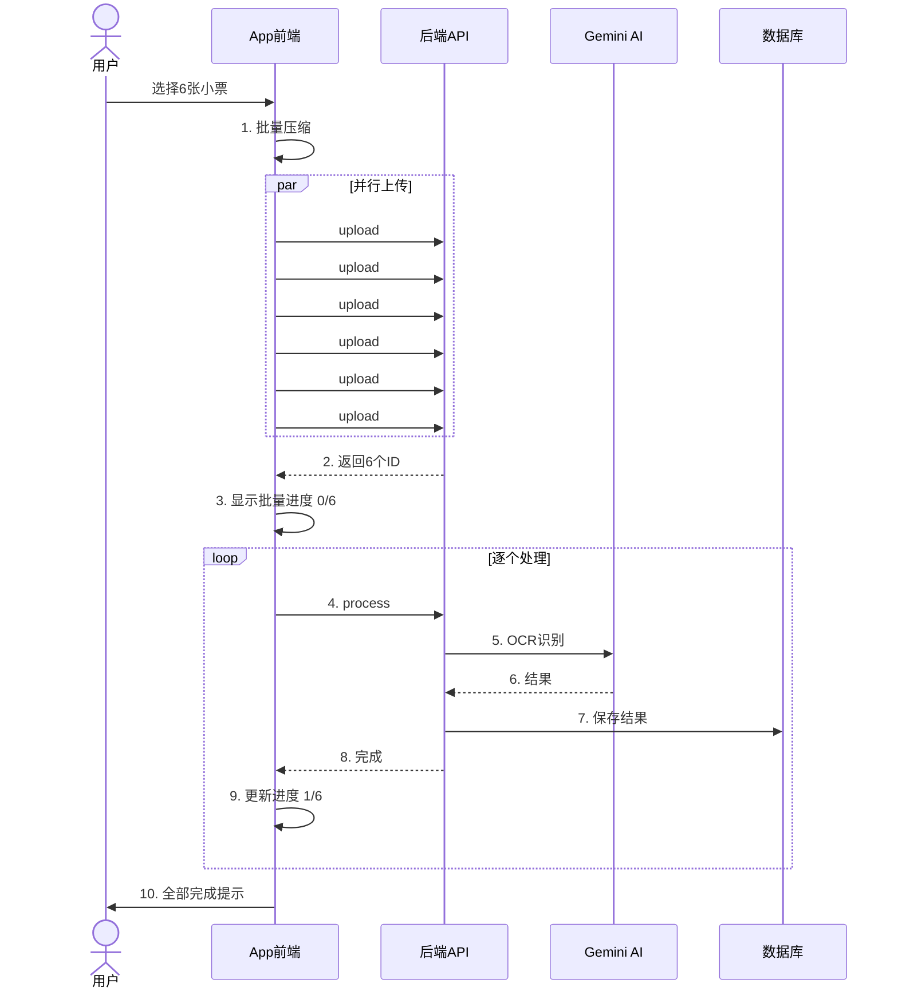
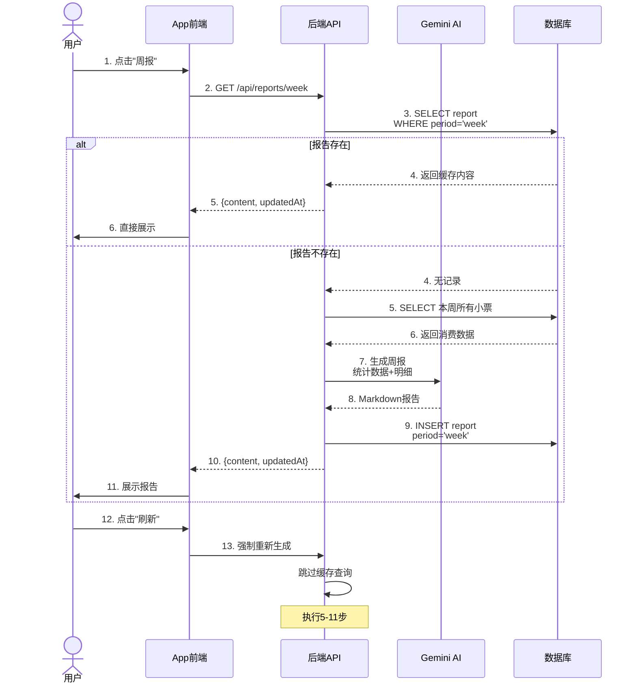
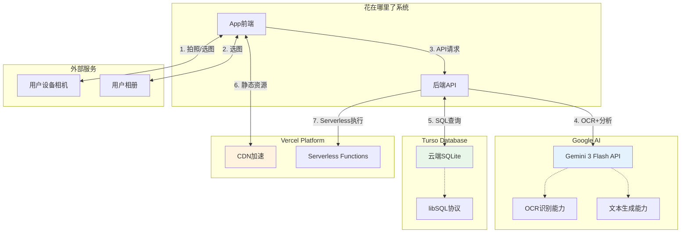
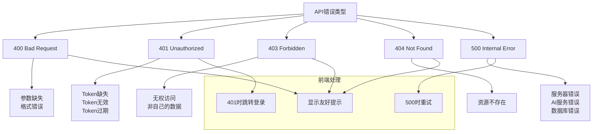

# 接口与集成图

## API 接口总览



> **图注**：系统共提供12个REST API接口，分为认证、小票、报表三大类。除了注册和登录，其他接口都需要在 Header 中携带 `Authorization: Bearer {token}` 进行身份验证。

---

## 认证授权流程



> **图注**：认证采用 JWT（JSON Web Token）方案。登录成功后服务端返回 Token，前端保存在 localStorage。后续所有请求在 Header 中携带 Token，服务端验证通过后提取 userId 进行数据查询。Token 失效时前端自动跳转登录页。

---

## 典型 API 调用时序

### 1. 单张小票识别完整流程



> **图注**：单张小票识别涉及 21 个步骤，前后端通信 3 次，AI 调用 2 次。关键节点包括：上传图片获取ID、AI识别内容、重复检测、对比历史生成分析。整个流程约需 3-5 秒。

### 2. 批量处理流程



> **图注**：批量处理采用"并行上传 + 串行处理"策略。上传阶段并行可以最大化利用带宽，处理阶段串行避免 AI API 限流。用户通过进度条实时了解处理进度。

### 3. 报表生成流程



> **图注**：报表采用缓存优先策略。首次生成后保存到数据库，下次直接读取。用户手动刷新时跳过缓存重新生成。这种设计既保证了加载速度，又允许用户获取最新数据。

---

## 第三方服务集成地图



> **图注**：系统集成3个外部服务：Google Gemini 提供 AI 能力（OCR+文本生成），Turso 提供云端数据库存储，Vercel 提供部署和 CDN 服务。设备相机和相册通过浏览器/系统 API 本地调用。

---

## API 详细规范

### 认证接口

#### POST /api/auth/register

**请求：**
```json
{
  "email": "user@example.com",
  "password": "123456"
}
```

**成功响应 (200)：**
```json
{
  "user": {
    "id": "usr_xxx",
    "email": "user@example.com",
    "createdAt": "2024-01-15T08:30:00Z"
  },
  "token": "eyJhbGciOiJIUzI1NiIs..."
}
```

**错误响应 (400/500)：**
```json
{
  "error": "Email already registered"
}
```

---

#### POST /api/auth/login

**请求：**
```json
{
  "email": "user@example.com",
  "password": "123456"
}
```

**成功响应 (200)：**
```json
{
  "user": {
    "id": "usr_xxx",
    "email": "user@example.com",
    "createdAt": "2024-01-15T08:30:00Z"
  },
  "token": "eyJhbGciOiJIUzI1NiIs..."
}
```

---

### 小票接口

#### POST /api/receipts/upload

**请求头：**
```
Authorization: Bearer {token}
Content-Type: application/json
```

**请求体：**
```json
{
  "imageData": "data:image/webp;base64,UklGRiIAAABXRUJQVlA4IBYAAAAwAQCdASoBAAEADsD+JaQAA3AAAAAA..."
}
```

**成功响应 (200)：**
```json
{
  "id": "rcp_xxx",
  "status": "pending"
}
```

---

#### POST /api/receipts/:id/process

**请求头：**
```
Authorization: Bearer {token}
Content-Type: application/json
```

**请求体：**
```json
{
  "timezone": "Asia/Tokyo"
}
```

**成功响应 - 正常情况 (200)：**
```json
{
  "receipt": {
    "id": "rcp_xxx",
    "storeName": "7-Eleven",
    "date": "2024-01-15",
    "total": 28.5,
    "currency": "¥",
    "items": [
      {
        "id": "itm_xxx",
        "name": "照烧鸡肉饭",
        "price": 25.0,
        "nutrition": "热量: 650kcal"
      }
    ],
    "status": "completed",
    "analysis": "## 消费分析\n\n### 营养健康评估..."
  },
  "isDuplicate": false
}
```

**成功响应 - 重复情况 (200)：**
```json
{
  "receipt": null,
  "isDuplicate": true,
  "duplicateStore": "7-Eleven",
  "duplicateDate": "2024-01-15"
}
```

---

#### GET /api/receipts

**请求头：**
```
Authorization: Bearer {token}
```

**成功响应 (200)：**
```json
[
  {
    "id": "rcp_xxx",
    "storeName": "7-Eleven",
    "date": "2024-01-15",
    "total": 28.5,
    "currency": "¥",
    "status": "completed",
    "items": [...],
    "analysis": "..."
  }
]
```

---

### 报表接口

#### GET /api/reports/:period

**路径参数：**
- `period`: `week` | `month` | `all`

**请求头：**
```
Authorization: Bearer {token}
```

**成功响应 - 有缓存 (200)：**
```json
{
  "content": "# 本周消费报告...",
  "updatedAt": "2024-01-21T18:00:00Z"
}
```

**成功响应 - 无缓存 (200)：**
```json
{
  "content": null,
  "updatedAt": null
}
```

---

#### POST /api/reports/:period

**路径参数：**
- `period`: `week` | `month` | `all`

**请求头：**
```
Authorization: Bearer {token}
Content-Type: application/json
```

**请求体：**
```json
{
  "content": "# 本周消费报告\n\n## 消费概览..."
}
```

**成功响应 (200)：**
```json
{
  "success": true,
  "updatedAt": "2024-01-21T18:00:00Z"
}
```

---

## 错误处理规范



> **图注**：错误处理遵循 HTTP 状态码规范。401 专门处理认证问题，触发前端跳转登录页；400/403/404 显示具体错误信息；500 提供重试机制。所有错误响应都包含 `error` 字段说明原因。
