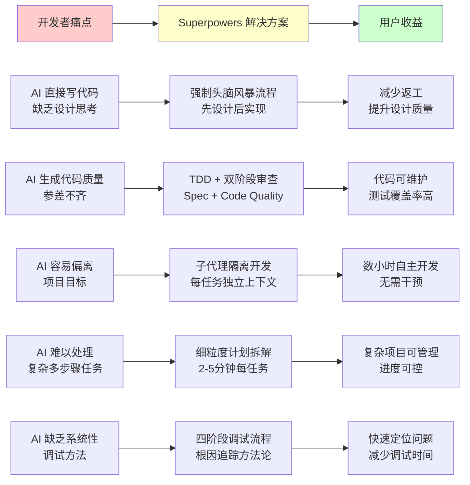
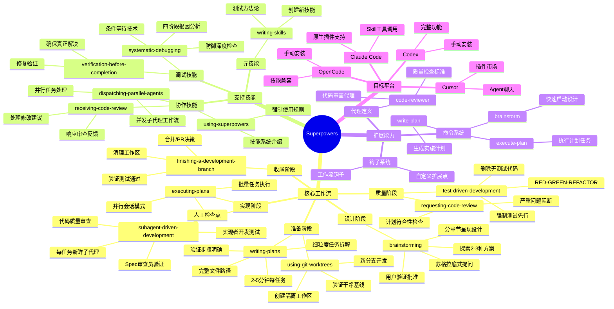
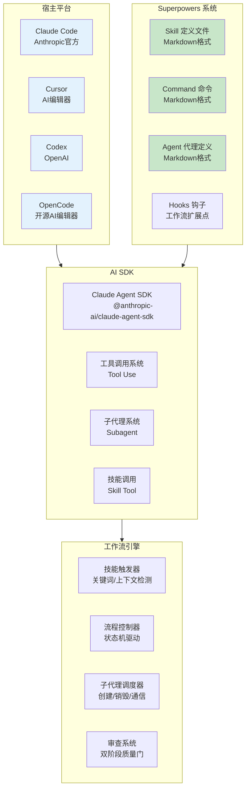
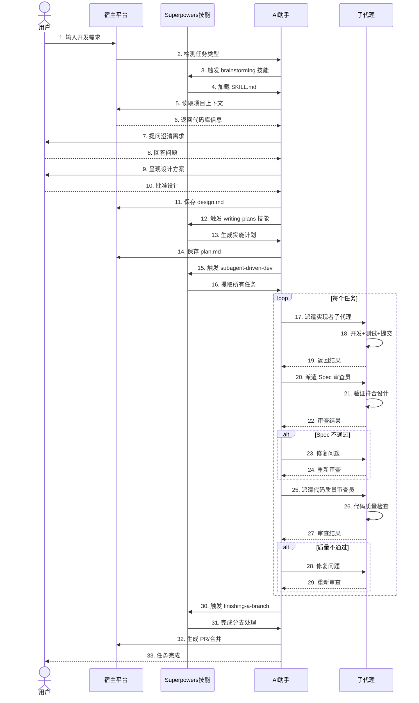

# 项目全景鸟瞰

## 一句话介绍

**Superpowers** 是一套为 Claude Code 和其他 AI 编程助手设计的软件开发工作流系统，通过 14+ 个可组合的技能模块，强制执行规范的开发流程：从设计头脑风暴到 TDD 实现，再到子代理代码审查，确保 AI 在独立开发数小时时仍能保持一致性和代码质量。

---

## 核心价值主张

> **图注**：上图展示了 AI 辅助编程中的核心痛点如何通过 Superpowers 的工作流得到系统性解决。核心价值在于通过强制流程约束，让 AI 的自主开发能力达到" enthusiastic junior engineer "的水平，可以独立工作数小时而不偏离目标。

---

## 产品功能全景图

> **图注**：思维导图展示了 Superpowers 的完整技能体系。核心是一个 7 步的标准软件开发工作流（设计→准备→实现→质量→收尾），辅以调试、协作、元技能三类支持技能。所有技能通过命令、代理、钩子系统扩展，支持 Claude Code、Cursor、Codex、OpenCode 四大平台。

---

## 适合人群与使用场景

### 目标用户画像

| 用户类型 | 特征 | 使用场景 | 核心价值 |
|---------|------|---------|---------|
| **AI 原生开发者** | 主要使用 AI 编程助手写代码 | 让 Claude 独立开发新功能 2-4 小时 | AI 自主开发质量可控 |
| **技术团队 Lead** | 管理使用 AI 的团队成员 | 统一团队 AI 开发规范 | 标准化 AI 输出质量 |
| **独立开发者** | 个人项目，追求高效率 | 快速原型到生产代码 | 减少返工，一次做对 |
| **开源项目维护者** | 处理大量 PR 和 Issue | 系统化修复 Bug 和实现功能 | 保持代码库质量一致性 |
| **AI 工具开发者** | 构建 AI 编程工具 | 参考工作流设计方法论 | 最佳实践参考 |

### 典型使用场景

**场景一：从零构建新功能（完整工作流）**

> 小李是一个使用 Claude Code 的全栈开发者。他需要为 SaaS 产品添加一个"团队协作"功能。他输入："帮我实现团队协作功能，支持邀请成员、权限管理、活动日志"。

> **brainstorming** 技能激活：
> - Claude 先检查了项目现有架构和代码库
> - 通过 5 轮苏格拉底式提问，澄清了权限模型、邀请流程、日志保留策略
> - 提出了 3 种方案：简单邀请码、邮件邀请+确认、SSO 集成
> - 小李选择了邮件邀请方案
> - 生成了设计文档：数据库 schema、API 设计、UI 流程

> **writing-plans** 技能激活：
> - 将设计拆解为 23 个细粒度任务
> - 每个任务 2-5 分钟：写测试→运行失败→实现→运行通过→提交
> - 明确了每个任务的文件路径和代码示例

> **subagent-driven-development** 技能激活：
> - 在独立 git worktree 中开始开发
> - 每个任务派遣新鲜子代理：
>   - 实现者：编写代码和测试
>   - Spec 审查员：验证符合设计文档
>   - 代码质量审查员：检查代码风格和最佳实践
> - 4 小时后，23 个任务全部完成

> **finishing-a-development-branch** 技能激活：
> - 验证所有测试通过
> - 生成 PR 描述
> - 清理工作区

> 小李只花了 30 分钟参与（回答问题、批准设计），AI 独立完成了 4 小时的开发工作，代码质量符合团队标准。

**场景二：系统性 Bug 修复**

> 小王的项目出现了一个难以复现的竞态条件 Bug。他输入："用户报告偶尔数据丢失，怀疑是并发问题"。

> **systematic-debugging** 技能激活：
> - **阶段1：信息收集** - 检查日志、复现步骤、环境信息
> - **阶段2：根因假设** - 提出 3 个可能原因：数据库连接池、缓存失效、事务边界
> - **阶段3：实验验证** - 设计实验逐一排除
> - **阶段4：修复验证** - 确定是事务边界问题，编写修复

> **test-driven-development** 技能激活：
> - 先写测试复现竞态条件
> - 运行测试确认失败
> - 实现修复
> - 运行测试确认通过
> - 运行 100 次测试验证稳定性

> Bug 在 1 小时内系统性地解决，而不是凭直觉尝试各种方案。

---

## 技术栈概览

> **图注**：架构图展示了三层结构。Superpowers 作为技能定义层，通过 AI SDK（Claude Agent SDK）与宿主平台集成。工作流引擎负责技能触发、流程控制和子代理调度。所有技能以 Markdown 格式定义，便于版本控制和社区贡献。

---

## 核心数据流转

> **图注**：时序图展示了完整工作流的数据流转。关键是每个阶段都触发对应的技能，子代理驱动的开发阶段使用"实现-审查-修复"的循环确保质量。每个子代理都有独立的上下文，避免上下文污染。

---

## 产品差异化优势

与直接使用 AI 编程助手相比，Superpowers 的独特价值：

| 维度 | 直接使用 AI | Superpowers |
|------|-----------|-------------|
| **设计阶段** | AI 直接开始写代码 | 强制头脑风暴，先设计后实现 |
| **测试策略** | 事后补测试 | 强制 TDD，测试先行 |
| **代码审查** | 无或人工审查 | 双阶段自动审查（Spec + Quality） |
| **任务拆解** | AI 自行决定步骤 | 细粒度计划，2-5分钟每任务 |
| **复杂任务** | 容易偏离或卡住 | 子代理隔离，每任务独立 |
| **调试方法** | 凭直觉尝试 | 系统化四阶段调试 |
| **工作流** | 随意 | 标准化、可重复、可扩展 |
| **自主时长** | 10-20 分钟需要干预 | 2-4 小时独立工作 |

---

## 下一步阅读建议

- 📖 **[01-用户旅程地图](01-user-journey.md)** — 了解开发者如何使用 Superpowers 完成项目
- 📖 **[02-核心功能详解](02-core-features.md)** — 深入了解每个技能的运作机制
- 📖 **[03-数据关系图](03-data-model.md)** — 查看技能定义和工作流数据结构
- 📖 **[04-模块架构图](04-module-architecture.md)** — 了解系统技术架构
- 📖 **[05-API交互与集成](05-api-interactions.md)** — 查看与 AI 平台的集成方式
