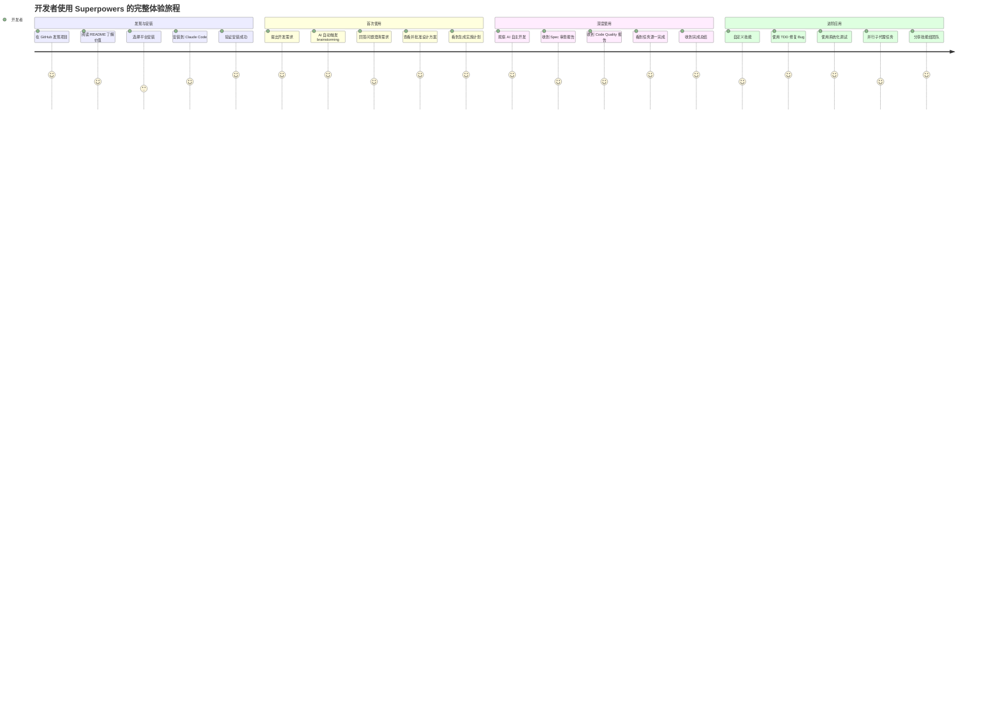
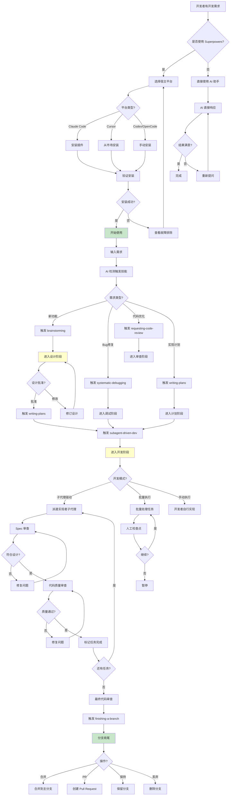
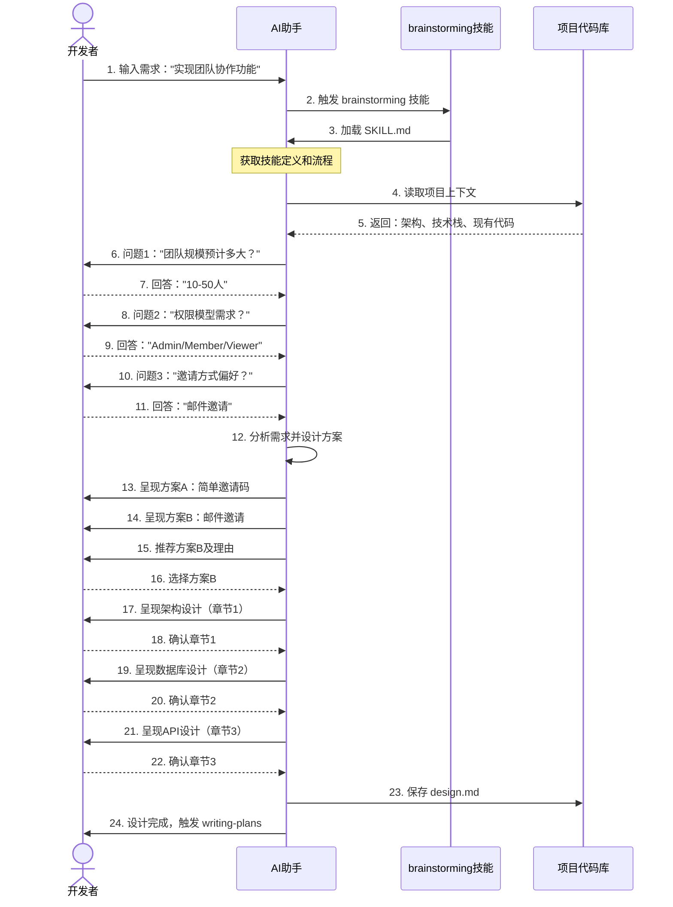
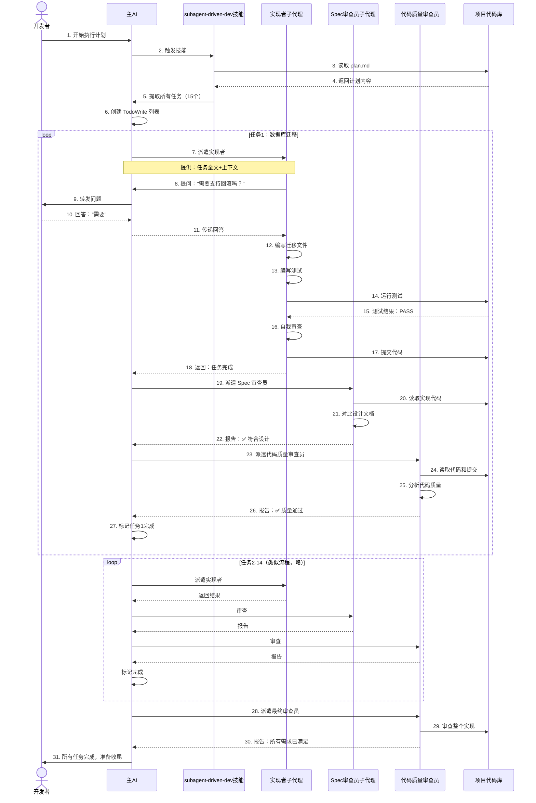
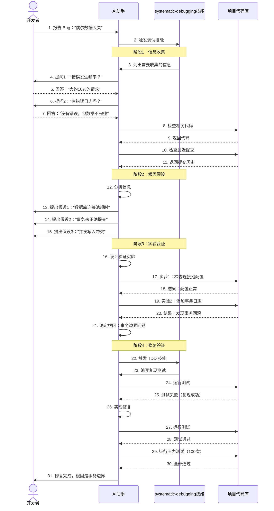
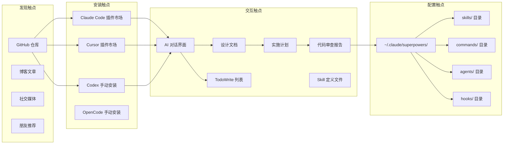

# 用户旅程地图

## 主用户角色：AI 原生开发者



> **图注**：用户旅程图展示了开发者从发现到深度使用的过程。评分显示在"深度使用"阶段体验最好（AI 自主开发），而安装和自定义技能阶段有一定门槛。核心惊喜点在于看到 AI 能够独立高质量地工作数小时。

---

## 用户决策流程



> **图注**：决策树展示了开发者使用 Superpowers 的完整路径。核心分支在于需求类型（触发不同技能）和开发模式（子代理驱动/批量执行/手动）。每个关键节点都有明确的质量检查点，确保流程的严谨性。

---

## 关键操作的前后端交互

### 1. brainstorming 技能完整流程



> **图注**：brainstorming 流程通过 5-8 轮对话逐步澄清需求，提出 2-3 种方案供选择，然后分章节呈现详细设计，每章都需要用户确认。这种渐进式验证确保最终设计符合用户预期。

### 2. subagent-driven-development 流程



> **图注**：子代理驱动开发是 Superpowers 的核心创新。每个任务经历"实现→Spec审查→质量审查"三重检查，审查不通过会循环修复。实现者可以提问获取上下文，确保理解正确。这种"fresh context per task"模式避免了上下文污染，让 AI 能持续高质量工作数小时。

### 3. systematic-debugging 流程



> **图注**：系统化调试采用科学方法（信息收集→假设→验证→修复），避免凭直觉尝试。四阶段流程确保找到的根因是正确的，并通过测试验证修复确实有效。这比随机尝试节省大量时间。

---

## 用户情绪曲线

```mermaid
xychart-beta
    title "开发者情绪值变化曲线"
    x-axis [发现项目, 安装配置, 首次提问, 设计对话, 批准设计, AI自主开发, 收到审查报告, 看到完成, 自定义技能]
    y-axis "情绪值" 0 --> 10
    line [8, 6, 8, 7, 8, 9, 7, 10, 7]
```

**情绪节点解读：**

| 阶段 | 情绪值 | 原因 | 优化方向 |
|------|--------|------|---------|
| 发现项目 | 8 | 被"AI 数小时自主开发"吸引 | - |
| 安装配置 | 6 | 不同平台安装方式不同，Codex/OpenCode 较复杂 | 统一安装体验 |
| 首次提问 | 8 | AI 没有立即写代码，而是提问，感觉专业 | - |
| 设计对话 | 7 | 需要回答多个问题，有些繁琐 | 优化提问质量 |
| 批准设计 | 8 | 看到完整设计方案，心里有底 | - |
| AI 自主开发 | 9 | 看到 AI 独立工作，自己喝咖啡即可 | - |
| 收到审查报告 | 7 | 报告较技术化，可读性一般 | 优化报告格式 |
| 看到完成 | 10 | 代码质量高，测试完善，惊喜 | - |
| 自定义技能 | 7 | 需要学习技能编写规范 | 提供更简单的模板 |

---

## 用户触点清单



> **图注**：触点地图展示了开发者与 Superpowers 交互的所有接触点。核心交互在 AI 对话界面完成，设计文档、计划、审查报告是主要的文档触点。高级用户可以通过修改 skills、commands、agents、hooks 目录来自定义工作流。

---

## 典型用户故事

### 故事一：全栈开发者小李的复杂功能实现

**背景**：小李是独立开发者，使用 Claude Code + Superpowers 开发 SaaS 产品。

**需求**：需要实现一个实时协作编辑功能，类似 Google Docs 的多人同时编辑。

**周一上午** - *启动项目*

小李打开终端，启动 Claude Code：

```
小李：我想实现实时协作编辑功能，支持多人同时编辑文档，需要冲突解决和光标同步。
```

Claude 没有立即写代码，而是触发了 **brainstorming** 技能：

```
Claude：我来帮你设计这个功能。首先让我了解一下项目现状...
[检查项目架构]

Claude：我看到你使用的是 Node.js + Express + MongoDB。对于实时协作，我有几个问题：

1. 预计最大并发用户数是多少？（10人/100人/1000人？）
小李：10-50人

2. 冲突解决策略偏好？（最后写入获胜/操作转换/状态转换）
小李：操作转换（OT）

3. 需要支持离线编辑后同步吗？
小李：第一期不需要
```

经过 6 轮问答，Claude 提出了 3 种方案，小李选择了基于 Socket.io + OT.js 的方案。

**周一下午** - *设计阶段*

Claude 分章节呈现了详细设计：
- 章节1：架构设计（WebSocket 连接管理、OT 算法集成）
- 章节2：数据模型（Document、Operation、Cursor 集合）
- 章节3：API 设计（REST + WebSocket 事件）
- 章节4：冲突解决算法

小李逐章确认后，Claude 保存了 `docs/plans/2024-01-15-collaborative-editing-design.md`。

**周二** - *计划阶段*

Claude 触发 **writing-plans** 技能，生成了 28 个细粒度任务：
- Task 1: 安装 socket.io 依赖
- Task 2: 创建 OT 算法模块
- Task 3: 编写 OT 算法测试
- ...
- Task 28: 集成测试

每个任务都包含：文件路径、代码示例、测试命令、验证步骤。

**周三-周四** - *开发阶段*

Claude 触发 **subagent-driven-development** 技能，开始自主开发。

小李看着终端滚动：
```
[Task 1/28] 派遣实现者子代理...
[Task 1/28] 实现者完成：安装依赖
[Task 1/28] Spec 审查员：✅ 符合设计
[Task 1/28] 代码质量审查员：✅ 质量通过
[Task 1/28] 完成 ✓

[Task 2/28] 派遣实现者子代理...
...
```

每隔 30 分钟，小李看一眼进度。期间有 3 个任务审查发现问题，子代理自动修复并重新审查。

**周四下午** - *完成*

28 个任务全部完成。Claude 生成了总结报告：
- 总耗时：4 小时 20 分钟
- 代码行数：2,400 行
- 测试覆盖率：94%
- 提交次数：56 次

小李运行了测试套件，全部通过。他合并了分支，功能上线。

**反思**："以前我自己做这个功能估计要 3-4 天，现在用 Superpowers，我只花了 1 小时参与问答和确认，AI 做了 4 小时高质量工作。关键是代码质量比我自己写的还好，测试覆盖全面。"

---

### 故事二：技术 Lead 小王的标准化推广

**背景**：小王是 10 人技术团队的 Lead，团队成员都在使用 AI 编程助手，但输出质量参差不齐。

**问题**：
- 有的成员用 AI 生成的代码没有测试
- 有的成员代码风格不统一
- 有的成员在复杂任务上容易走偏
- Code Review 时发现大量基础问题

**解决方案**：小王在团队推广 Superpowers。

**实施过程**：

1. **第1周**：小王自己试用 Superpowers 完成 2 个功能，验证效果
2. **第2周**：在团队会议演示完整工作流，展示代码质量差异
3. **第3周**：团队成员逐个安装，小王提供安装支持
4. **第4周**：制定团队规范：
   - 所有新功能必须使用 brainstorming → writing-plans → subagent-driven-dev 流程
   - Bug 修复必须使用 systematic-debugging
   - 代码审查使用 requesting-code-review 技能

**效果**：

| 指标 | 推广前 | 推广后（3个月） |
|------|--------|----------------|
| 测试覆盖率 | 45% | 89% |
| Code Review 往返次数 | 平均 3.2 次 | 平均 1.1 次 |
| Bug 回归率 | 28% | 7% |
| 功能开发周期 | 2 周 | 1 周 |
| 重构频率 | 每月 2 次 | 每季度 1 次 |

**小王反馈**："Superpowers 最大的价值不是让 AI 写得更快，而是让 AI 写得更规范。它像是一个严格执行代码规范的资深工程师，盯着 AI 的每一步工作。"
