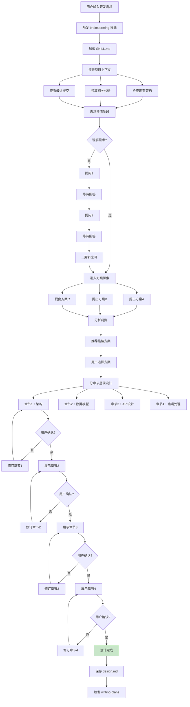
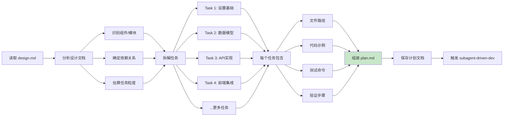
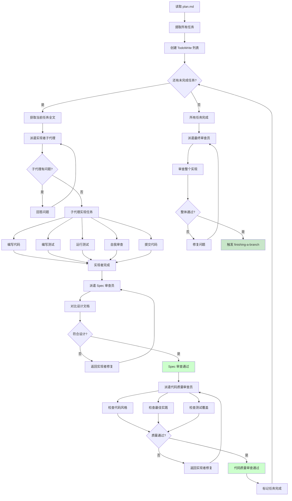
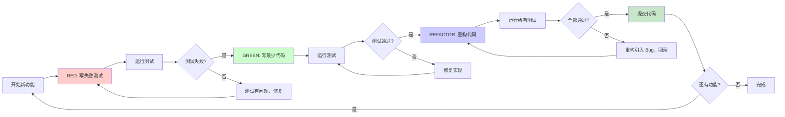

# 核心功能详解

## 功能一：brainstorming（头脑风暴设计）

### 功能概述

brainstorming 是 Superpowers 工作流的起点，强制在任何创造性工作之前执行。它通过苏格拉底式提问澄清需求，探索多种方案，分章节呈现设计，确保用户批准后才进入实现阶段。

### 工作流程



> **图注**：流程图展示了 brainstorming 的完整流程。核心特点是"渐进式验证"——通过多轮提问澄清需求，提出多方案供选择，分章节展示设计，每章都需要用户确认。这种设计避免了"我以为你理解错了"的问题。

### 关键原则

| 原则 | 说明 | 示例 |
|------|------|------|
| **One question at a time** | 一次只问一个问题 | 不连续问"用MySQL还是PostgreSQL？需要读写分离吗？"
| **Multiple choice preferred** | 偏好选择题 | "选择数据库：A) MySQL B) PostgreSQL C) MongoDB" |
| **YAGNI ruthlessly** | 严格遵循 YAGNI | 主动建议去掉用户未明确要求的功能 |
| **Explore alternatives** | 探索多种方案 | 总是提供 2-3 种方案，不只有一种 |
| **Incremental validation** | 增量验证 | 每章节都问"这样对吗？" |

### 反模式："太简单不需要设计"

```markdown
<HARD-GATE>
Do NOT invoke any implementation skill, write any code, scaffold any project, 
or take any implementation action until you have presented a design and 
the user has approved it. This applies to EVERY project regardless of 
perceived simplicity.
</HARD-GATE>

## Anti-Pattern: "This Is Too Simple To Need A Design"

Every project goes through this process. A todo list, a single-function utility, 
a config change — all of them. "Simple" projects are where unexamined assumptions 
cause the most wasted work.
```

### 举例说明

**场景：实现用户登录功能**

> 开发者："实现用户登录功能"
>
> ❌ **不使用 brainstorming 的 AI**：
> "好的，我来实现。首先安装 passport.js..."（直接开始写代码）
>
> ✅ **使用 brainstorming 的 AI**：
> "让我先了解需求。我看到这是一个 Node.js + Express 项目。
> 
> 问题1：需要支持哪些登录方式？A) 用户名密码 B) 社交登录 C) 两者都要
> 开发者：C) 两者都要
> 
> 问题2：会话管理策略？A) JWT B) Session Cookie C) 两者都支持
> 开发者：A) JWT
> 
> 问题3：密码存储方式？A) bcrypt B) Argon2 C) 其他
> 开发者：A) bcrypt
> 
> 基于您的回答，我提出 3 种方案：
> - 方案A：简单实现，本地存储（适合原型）
> - 方案B：使用 Auth0 服务（快速但依赖第三方）
> - 方案C：自建认证系统（推荐，更灵活）
> 
> 推荐方案C，理由：...
> 
> [开发者选择方案C]
> 
> 章节1：架构设计
> 使用 Passport.js + JWT，包含...
> 
> 这样对吗？
> [开发者：对]
> 
> 章节2：数据模型
> User 表包含 email, passwordHash...
> 
> 这样对吗？
> [开发者：对，但加 lastLogin 字段]
> 
> [修订并继续...]"

**结果对比**：
- 不使用：AI 自己选择了 Session Cookie，与现有 JWT 架构冲突，返工 2 小时
- 使用：5 分钟问答确认，实现完全符合架构，一次通过

---

## 功能二：writing-plans（编写实施计划）

### 功能概述

writing-plans 将批准的设计文档转化为详细的实施计划。计划拆解为细粒度任务（2-5分钟每个），包含完整文件路径、代码示例、测试命令、验证步骤，让实现者（可以是 AI 子代理或人类）无需思考如何执行，只需按步骤操作。

### 工作流程



### 任务粒度标准

```markdown
## Bite-Sized Task Granularity

**Each step is one action (2-5 minutes):**
- "Write the failing test" - step
- "Run it to make sure it fails" - step  
- "Implement the minimal code to make the test pass" - step
- "Run the tests and make sure they pass" - step
- "Commit" - step

**Bad (too big):**
- "Implement user authentication" (hours)
- "Add tests" (vague)

**Good (bite-sized):**
- "Create User model with email and password_hash fields"
- "Write test: user can register with valid email"
- "Run test to verify it fails"
- "Implement register() function"
- "Run test to verify it passes"
```

### 计划文档结构

```markdown
# Feature Name Implementation Plan

> **For Claude:** REQUIRED SUB-SKILL: Use superpowers:executing-plans to implement

**Goal:** One sentence describing what this builds

**Architecture:** 2-3 sentences about approach

**Tech Stack:** Key technologies/libraries

---

### Task 1: Component Name

**Files:**
- Create: `exact/path/to/file.py`
- Modify: `exact/path/to/existing.py:123-145`
- Test: `tests/exact/path/to/test.py`

**Step 1: Write the failing test**

```python
def test_specific_behavior():
    result = function(input)
    assert result == expected
```

**Step 2: Run test to verify it fails**

Run: `pytest tests/path/test.py::test_name -v`
Expected: FAIL with "function not defined"

**Step 3: Write minimal implementation**

```python
def function(input):
    return expected
```

**Step 4: Run test to verify it passes**

Run: `pytest tests/path/test.py::test_name -v`
Expected: PASS

**Step 5: Commit**

```bash
git add .
git commit -m "Add function for specific behavior"
```

---

[Task 2, 3, 4...]
```

### 举例说明

**场景：实现购物车功能**

> **不使用 writing-plans**：
> "好的，我来实现购物车。首先创建 Cart 类..."
> [2小时后]
> "完成了，包括添加商品、删除商品、计算总价、应用优惠券、保存到数据库..."
> 问题：没有测试，代码臃肿，一次提交 500 行
>
> **使用 writing-plans**：
> "我来为你制定实施计划。基于设计文档，拆解为 12 个任务："
>
> Task 1: 创建 Cart 模型（5分钟）
> - 文件：models/cart.py
> - 步骤：写测试→运行失败→实现→运行通过→提交
>
> Task 2: 实现添加商品（5分钟）
> - 文件：models/cart.py
> - 步骤：...
>
> Task 3: 实现删除商品（5分钟）
> ...
>
> Task 12: 集成优惠券（5分钟）
>
> 总用时：60分钟，12个提交，每个都有测试

---

## 功能三：subagent-driven-development（子代理驱动开发）

### 功能概述

subagent-driven-development 是 Superpowers 的核心执行引擎。它为每个任务派遣新鲜的子代理，每个子代理有独立的上下文。任务完成后，派遣 Spec 审查员和代码质量审查员进行双阶段审查，确保实现符合设计且代码质量达标。

### 工作流程



### 子代理类型

| 子代理 | 职责 | 触发时机 | 审查标准 |
|--------|------|---------|---------|
| **实现者** | 编写代码和测试 | 每个任务开始 | 自我审查 |
| **Spec 审查员** | 验证符合设计 | 实现者完成后 | 符合设计文档，无多余功能 |
| **代码质量审查员** | 检查代码质量 | Spec 通过后 | 代码风格、最佳实践、测试覆盖 |
| **最终审查员** | 整体质量把关 | 所有任务完成后 | 整体架构、集成测试 |

### 审查标准示例

**Spec 审查检查清单**：
```markdown
## Spec Compliance Review

Check against design document:
- [ ] All required functionality implemented
- [ ] No functionality NOT in design (YAGNI check)
- [ ] Correct file locations
- [ ] Correct function signatures
- [ ] Correct data models
- [ ] Error handling as specified

Severity:
- 🔴 Critical: Blocks functionality, must fix
- 🟡 Important: Should fix, can proceed with note
- 🟢 Minor: Style/nitpick, document for later
```

**代码质量审查检查清单**：
```markdown
## Code Quality Review

Strengths (what's good):
- Clean separation of concerns
- Good test coverage
- Clear variable names

Issues:
- 🔴 Critical: Security vulnerability, data loss risk
- 🟡 Important: Performance issue, maintainability
- 🟢 Minor: Style, documentation

Recommendations:
- Consider extracting helper function
- Add docstring to public method
```

### 举例说明

**场景：Task 5 - 实现用户注册 API**

```
[主AI] 派遣实现者子代理

实现者子代理：
"让我实现用户注册 API。

先写测试：
```python
def test_register_user():
    response = client.post('/api/register', json={
        'email': 'test@example.com',
        'password': 'password123'
    })
    assert response.status_code == 201
    assert response.json()['id'] is not None
```

运行测试... 失败（预期：User 模型不存在）

实现 User 模型和注册端点：
```python
@app.post('/api/register')
def register(email: str, password: str):
    user = User.create(email=email, password=hash(password))
    return {'id': user.id}
```

运行测试... 通过！

自我审查：
- ✅ 测试覆盖正常流程
- ⚠️ 缺少重复注册的错误处理（设计文档要求）

添加错误处理：
```python
if User.exists(email=email):
    raise HTTPException(400, 'Email already registered')
```

运行测试... 通过！
提交代码：git commit -m "Add user registration API"

[返回主AI：Task 5 完成]"

---

[主AI] 派遣 Spec 审查员

Spec 审查员：
"对比设计文档：

✅ 符合设计：
- POST /api/register 端点正确
- 返回用户 ID
- 检查重复邮箱

🔴 严重问题：
- 设计文档要求密码强度检查（8位+大小写+数字），未实现

请修复。"

---

[主AI] 返回实现者修复

实现者子代理：
"添加密码强度检查：
```python
if len(password) < 8 or not re.search('[A-Z]', password):
    raise HTTPException(400, 'Password too weak')
```

添加测试... 通过！
重新提交。"

---

[主AI] 重新派遣 Spec 审查员

Spec 审查员：
"✅ 现在完全符合设计。"

---

[主AI] 派遣代码质量审查员

代码质量审查员：
"审查报告：

优点：
- 清晰的错误处理
- 测试覆盖正常和错误场景
- RESTful API 设计

🟡 建议改进：
- 密码哈希使用 bcrypt 而非自定义
- 添加输入验证（email 格式）

不阻碍，但建议后续优化。"

---

[主AI] 标记 Task 5 完成 ✓
```

---

## 功能四：test-driven-development（测试驱动开发）

### 功能概述

TDD 技能强制实施红-绿-重构循环：先写测试（红），写最少代码通过测试（绿），然后重构。如果写了代码但没写测试，必须删除代码重新开始。这是 Superpowers 的铁律。

### 工作流程



### 铁律

```markdown
## The Iron Law

```
NO PRODUCTION CODE WITHOUT A FAILING TEST FIRST
```

Write code before the test? Delete it. Start over.

**No exceptions:**
- Don't keep it as "reference"
- Don't "adapt" it while writing tests
- Don't look at it
- Delete means delete

Implement fresh from tests. Period.
```

### 举例说明

**场景：实现计算折扣功能**

> ❌ **违反 TDD**：
> 开发者先写了实现：
> ```python
> def calculate_discount(price, coupon):
>     if coupon == 'SAVE20':
>         return price * 0.8
>     elif coupon == 'HALF':
>         return price * 0.5
>     return price
> ```
> 
> 然后补测试：
> ```python
> def test_calculate_discount():
>     assert calculate_discount(100, 'SAVE20') == 80
>     assert calculate_discount(100, 'HALF') == 50
> ```
> 
> 问题：测试只覆盖了已实现的分支，遗漏了边界情况。
>
> ✅ **遵循 TDD**：
> 1. **RED** - 写测试（考虑所有场景）：
> ```python
> def test_valid_coupon_save20():
>     assert calculate_discount(100, 'SAVE20') == 80
>
> def test_valid_coupon_half():
>     assert calculate_discount(100, 'HALF') == 50
>
> def test_invalid_coupon():
>     assert calculate_discount(100, 'INVALID') == 100
>
> def test_expired_coupon():
>     assert calculate_discount(100, 'EXPIRED') == 100
> ```
> 运行测试... 全部失败（函数未定义）✅
> 
> 2. **GREEN** - 写最少代码：
> ```python
> def calculate_discount(price, coupon):
>     if coupon == 'SAVE20':
>         return price * 0.8
>     elif coupon == 'HALF':
>         return price * 0.5
>     return price
> ```
> 运行测试... 通过 ✅
> 
> 3. **REFACTOR** - 重构：
> ```python
> COUPONS = {
>     'SAVE20': 0.8,
>     'HALF': 0.5
> }
>
> def calculate_discount(price, coupon):
>     return price * COUPONS.get(coupon, 1.0)
> ```
> 运行测试... 仍然通过 ✅
> 提交！

**结果对比**：
- 违反 TDD：遗漏了 invalid coupon 的处理，上线后用户投诉
- 遵循 TDD：所有场景都有测试覆盖，重构时安全，代码质量高
