# 数据关系图

## 实体关系图（ER图）

```mermaid
erDiagram
    SKILL ||--o{ SKILL_TRIGGER : has
    SKILL ||--o{ SKILL_CHECKLIST : contains
    SKILL ||--o{ SKILL_PROMPT : includes
    
    SKILL {
        string name PK "技能名称"
        string description "触发条件描述"
        string content "技能文档内容"
        string type "类型: rigid/flexible"
        boolean autoTrigger "是否自动触发"
    }
    
    SKILL_TRIGGER {
        string id PK "触发器ID"
        string skillName FK "所属技能"
        string triggerType "触发类型"
        string pattern "匹配模式"
        number priority "优先级"
    }
    
    SKILL_CHECKLIST {
        string id PK "检查项ID"
        string skillName FK "所属技能"
        number order "顺序"
        string description "检查项描述"
        boolean required "是否必需"
    }
    
    COMMAND ||--o{ COMMAND_ARGUMENT : has
    
    COMMAND {
        string name PK "命令名称"
        string description "命令描述"
        string content "提示词内容"
        string trigger "触发符"
    }
    
    COMMAND_ARGUMENT {
        string id PK "参数ID"
        string commandName FK "所属命令"
        string name "参数名"
        string type "参数类型"
        boolean required "是否必需"
        string placeholder "占位符"
    }
    
    AGENT {
        string name PK "代理名称"
        string prompt "系统提示词"
        string model "使用模型"
        array allowedTools "允许的工具"
        string description "代理描述"
    }
    
    WORKFLOW ||--o{ WORKFLOW_STEP : contains
    WORKFLOW ||--o{ WORKFLOW_HOOK : has
    
    WORKFLOW {
        string id PK "工作流ID"
        string name "工作流名称"
        string description "工作流描述"
        string startingSkill "起始技能"
        string status "状态"
    }
    
    WORKFLOW_STEP {
        string id PK "步骤ID"
        string workflowId FK "所属工作流"
        number order "步骤顺序"
        string skillName "使用的技能"
        string condition "进入条件"
        string nextStep "下一步"
    }
    
    HOOK {
        string name PK "钩子名称"
        string event "事件类型"
        string script "脚本内容"
        string description "钩子描述"
    }
    
    SESSION ||--o{ SESSION_TASK : contains
    SESSION ||--o{ SESSION_REVIEW : has
    
    SESSION {
        string id PK "会话ID"
        string workflowId FK "工作流ID"
        string status "会话状态"
        string currentStep "当前步骤"
        timestamp startedAt "开始时间"
        timestamp completedAt "完成时间"
    }
    
    SESSION_TASK {
        string id PK "任务ID"
        string sessionId FK "所属会话"
        string name "任务名称"
        string status "状态"
        string assignee "执行者"
        timestamp startedAt "开始时间"
        timestamp completedAt "完成时间"
    }
```



> **图注**：ER图展示了 Superpowers 的数据实体。Skill 是核心实体，包含触发器、检查清单、提示词。Command、Agent、Hook 是可扩展组件。Workflow 定义工作流模板，Session 记录实际执行实例。

---

## 类图设计


> **图注**：类图展示了 Superpowers 的核心类结构。SkillRegistry 管理所有技能，WorkflowEngine 驱动工作流执行。Subagent 是基类，ImplementerSubagent 和 ReviewerSubagent 是具体实现。Session 记录执行状态，Plan 解析实施计划生成 Task。

---

## 技能定义数据结构

### Skill 文件格式 (SKILL.md)

```yaml
---
name: skill-name                    # 技能唯一标识
description: "Trigger condition"   # 触发条件描述，AI 据此判断何时使用
type: rigid | flexible              # rigid=严格执行, flexible=可适应
autoTrigger: true | false           # 是否自动触发
---

# Skill 文档内容 (Markdown)

## Overview
技能概述和目标

## When to Use
使用场景和条件

## Checklist
- [ ] Step 1
- [ ] Step 2
- [ ] Step 3

## Process Flow
流程图 (Graphviz dot 格式)

## Examples
示例代码和用例

## Red Flags
常见错误和警告
```

### 实际示例：writing-plans

```yaml
---
name: writing-plans
description: "Use when you have a spec or requirements for a multi-step task, before touching code"
type: rigid
autoTrigger: true
---

# Writing Plans

## Overview
Write comprehensive implementation plans assuming the engineer has zero context...

## Checklist

1. **Parse design doc** — extract components, dependencies
2. **Break down tasks** — 2-5 minutes each
3. **Write plan doc** — save to docs/plans/YYYY-MM-DD-*.md
4. **Validate completeness** — all design requirements covered

## Bite-Sized Task Granularity

**Each step is one action (2-5 minutes):**
- "Write the failing test" - step
- "Run it to make sure it fails" - step
- "Implement the minimal code to make the test pass" - step
- "Run the tests and make sure they pass" - step
- "Commit" - step
```

---

## 数据流向图

### 技能触发与执行流程

```mermaid
flowchart TB
    subgraph Input["用户输入"]
        A1[自然语言请求]
        A2[@提及引用]
        A3[/命令触发]
    end
    
    subgraph Detection["技能检测层"]
        B1[SkillRegistry]
        B2[Pattern Matching]
        B3[Context Analysis]
        B4[Priority Scoring]
    end
    
    subgraph Selection["技能选择"]
        C1[候选技能列表]
        C2{Process skills first?}
        C3[排序: process > implementation]
        C4[选择最高优先级]
    end
    
    subgraph Execution["技能执行"]
        D1[Load SKILL.md]
        D2[Parse Checklist]
        D3[Create TodoWrite]
        D4[Execute Steps]
        D5[Validate Completion]
    end
    
    subgraph Output["输出结果"]
        E1[AI 响应]
        E2[生成的文档]
        E3[触发下一技能]
    end
    
    A1 --> B1
    A2 --> B1
    A3 --> B1
    
    B1 --> B2
    B2 --> B3
    B3 --> B4
    
    B4 --> C1
    C1 --> C2
    C2 -->|Yes| C3
    C3 --> C4
    C2 -->|No| C4
    
    C4 --> D1
    D1 --> D2
    D2 --> D3
    D3 --> D4
    D4 --> D5
    
    D5 --> E1
    D5 --> E2
    D5 --> E3
```

> **图注**：数据流展示了从用户输入到技能执行的完整流程。技能检测层通过模式匹配和上下文分析找出候选技能，然后根据优先级（Process > Implementation）选择最合适的技能执行。

### 子代理调度数据流


> **图注**：子代理调度采用"隔离执行"模式。每个子代理有独立的上下文，只接收控制器传递的任务描述和必要的资源引用。子代理之间不直接通信，通过控制器协调。这种设计避免了上下文污染。

---

## 文件存储结构

```
superpowers/
├── skills/                          # 技能定义
│   ├── brainstorming/
│   │   └── SKILL.md
│   ├── writing-plans/
│   │   └── SKILL.md
│   ├── subagent-driven-development/
│   │   ├── SKILL.md
│   │   ├── implementer-prompt.md
│   │   ├── spec-reviewer-prompt.md
│   │   └── code-quality-reviewer-prompt.md
│   ├── test-driven-development/
│   │   ├── SKILL.md
│   │   └── testing-anti-patterns.md
│   └── ... (11 more skills)
│
├── commands/                        # 快捷命令
│   ├── brainstorm.md
│   ├── write-plan.md
│   └── execute-plan.md
│
├── agents/                          # 代理定义
│   └── code-reviewer.md
│
├── hooks/                           # 工作流钩子
│   └── ...
│
├── docs/                           # 文档
│   ├── plans/                      # 生成的计划
│   │   ├── 2024-01-15-feature-design.md
│   │   └── 2024-01-15-feature-plan.md
│   ├── README.codex.md
│   └── README.opencode.md
│
├── tests/                          # 测试
│   └── subagent-driven-dev/
│       ├── svelte-todo/
│       │   ├── design.md
│       │   └── plan.md
│       └── go-fractals/
│           ├── design.md
│           └── plan.md
│
├── .claude-plugin/                 # Claude Code 插件配置
├── .cursor-plugin/                 # Cursor 插件配置
├── .codex/                         # Codex 配置
└── .opencode/                      # OpenCode 配置
```

---

## 会话状态管理


> **图注**：状态机展示了 Superpowers 会话的生命周期。核心状态转换包括：技能触发→执行→子代理派遣→审查→任务完成。错误处理和恢复机制确保工作流健壮性。
