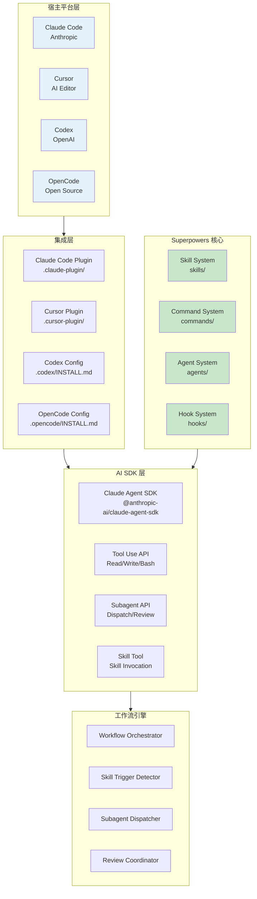
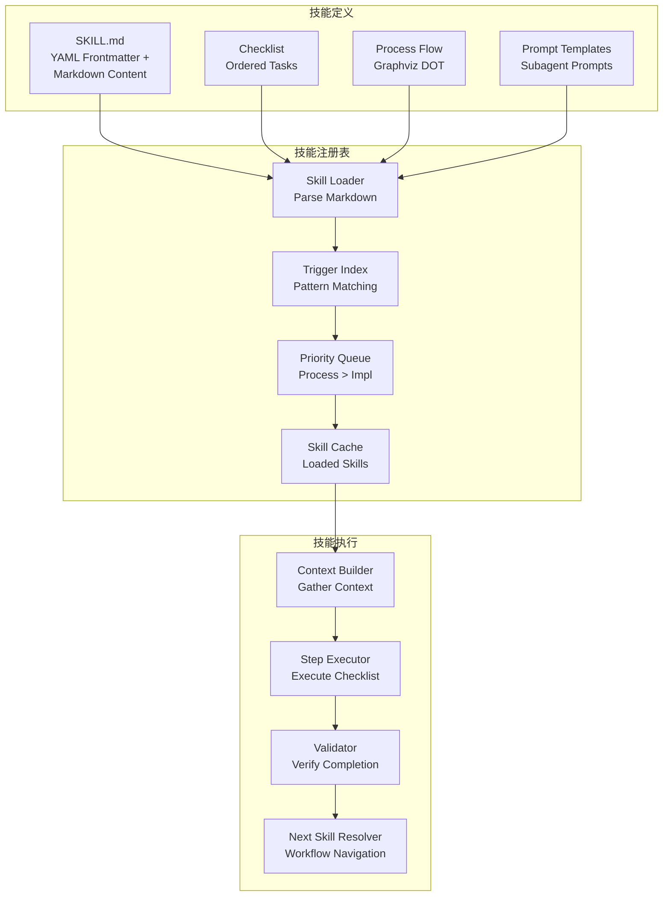
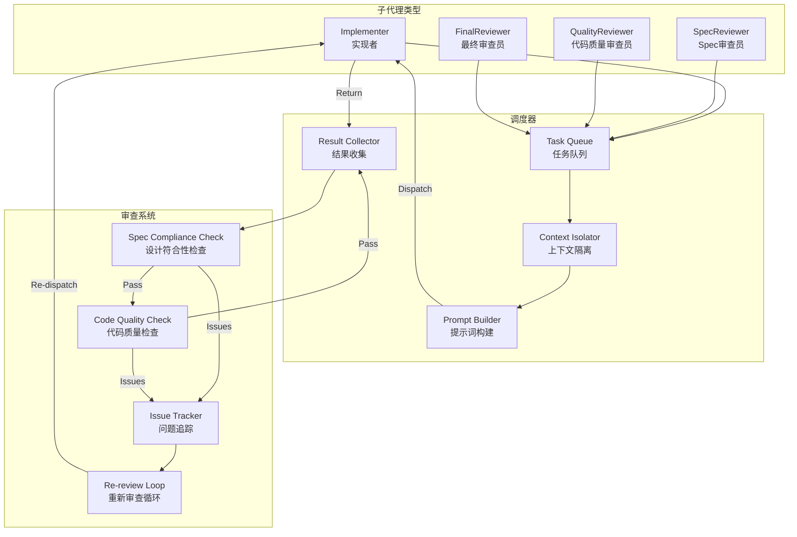
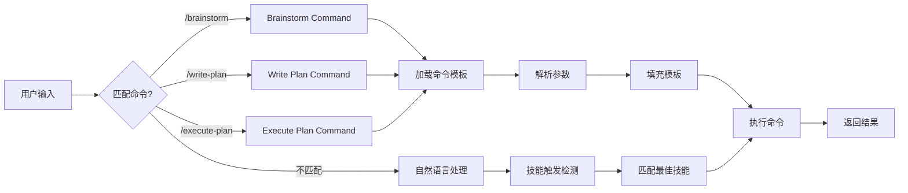
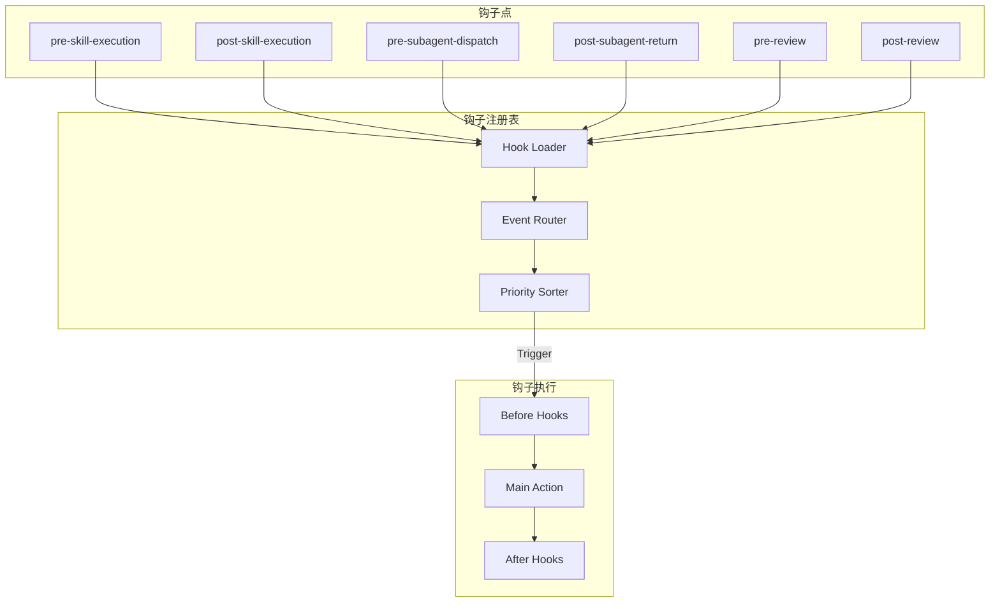
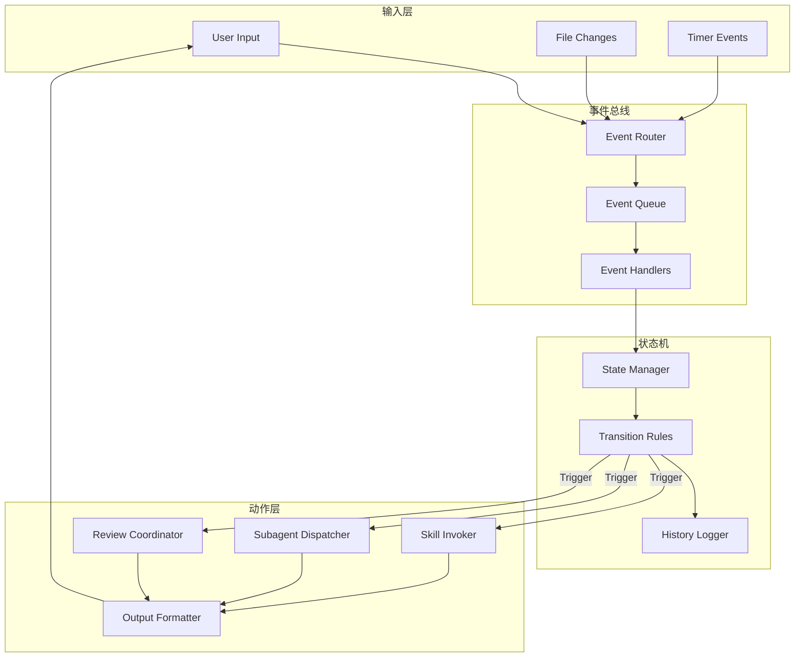
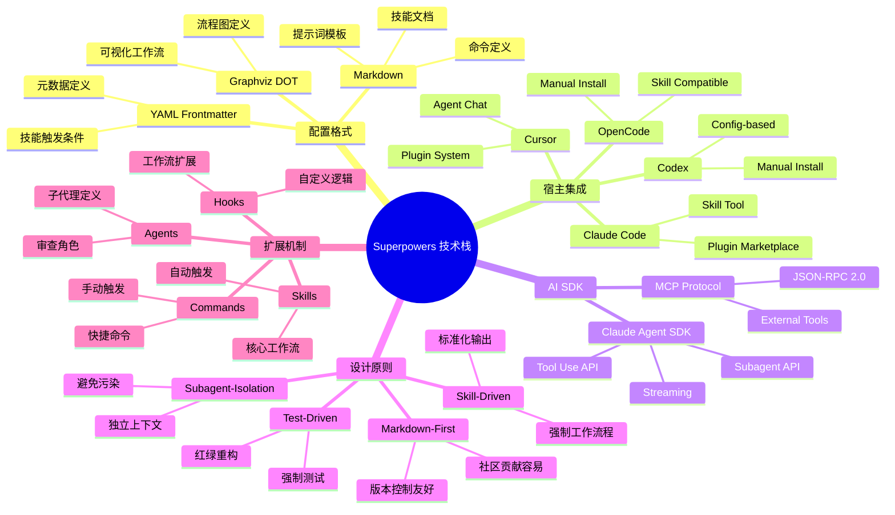
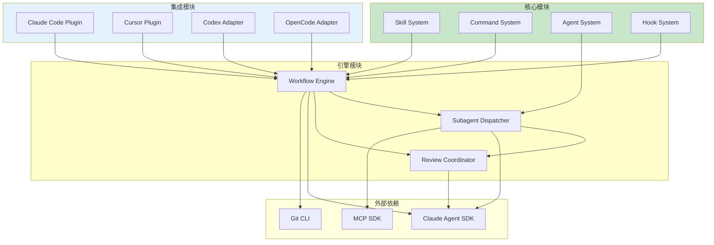
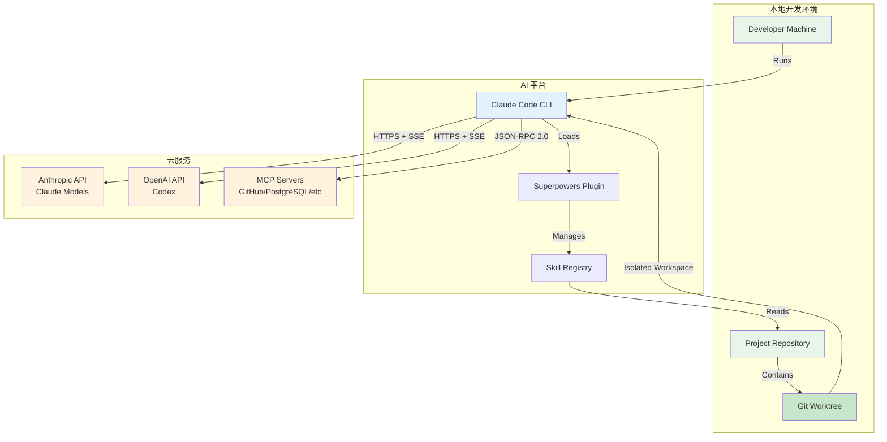

# 模块架构图

## 系统整体架构

> **图注**：架构图展示了四层结构。宿主平台层是 AI 编程助手，集成层提供平台特定的配置，核心系统包含所有技能定义，AI SDK 层提供工具调用和子代理能力，工作流引擎协调整个流程。

---

## 核心模块架构

### 技能系统 (Skill System)

> **图注**：技能系统采用"定义-注册-执行"三层架构。技能以 Markdown 文件定义，包含元数据、检查清单、流程图。技能注册表负责加载和索引，执行引擎按检查清单逐步执行。

### 子代理系统 (Subagent System)

> **图注**：子代理系统采用"派遣-执行-审查-修复"的循环模式。关键是上下文隔离——每个子代理只获得完成任务所需的最小上下文，避免信息过载和上下文污染。

### 命令系统 (Command System)

### 钩子系统 (Hook System)

---

## 工作流引擎架构

> **图注**：工作流引擎采用事件驱动架构。输入层接收各种事件，事件总线路由到对应处理器，状态机管理工作流状态，动作层执行具体的技能和子代理操作。

---

## 技术栈全景

> **图注**：Superpowers 的技术栈以 Markdown 为核心，确保可读性和版本控制友好。所有定义都是声明式的，技能系统自动处理执行逻辑。子代理隔离和测试驱动是架构设计的核心原则。

---

## 模块依赖关系

> **图注**：依赖关系遵循"核心→引擎→集成→外部"的分层原则。核心模块（技能、命令、代理、钩子）是基础定义，引擎模块负责执行，集成模块适配不同平台，外部依赖提供 AI 和工具能力。

---

## 部署架构

> **图注**：Superpowers 是纯本地系统，所有代码和配置都在开发者本地。AI 平台（Claude Code/Cursor）在本地运行，通过 HTTPS/SSE 连接到云端的 AI 模型 API。MCP 服务器可以本地或远程运行。
