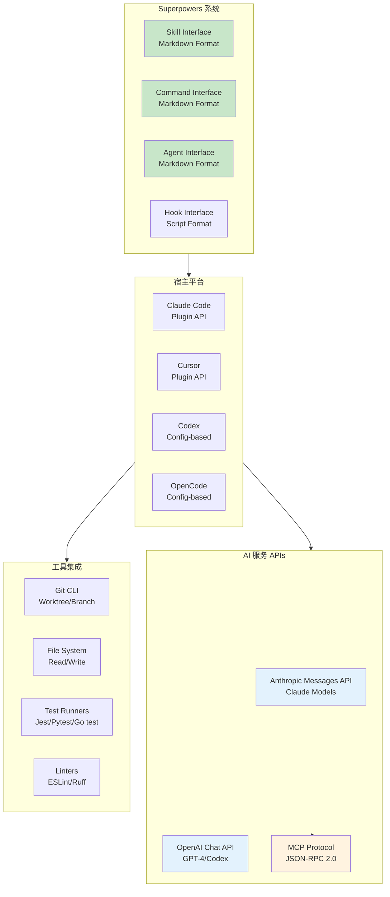
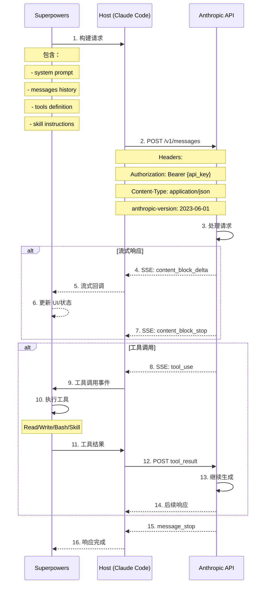
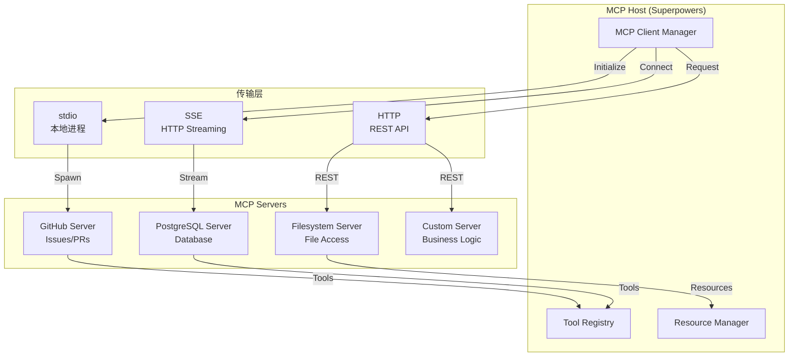
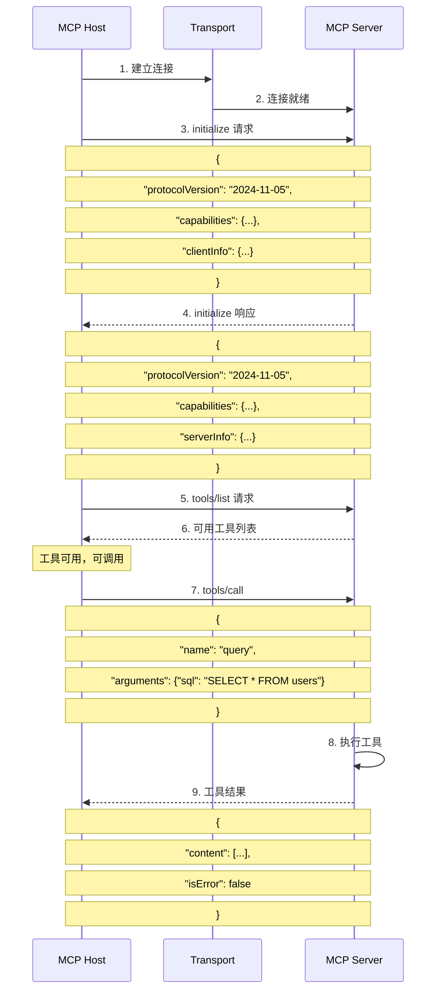
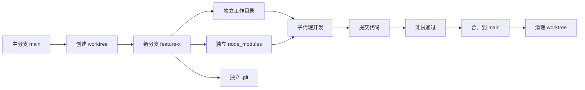
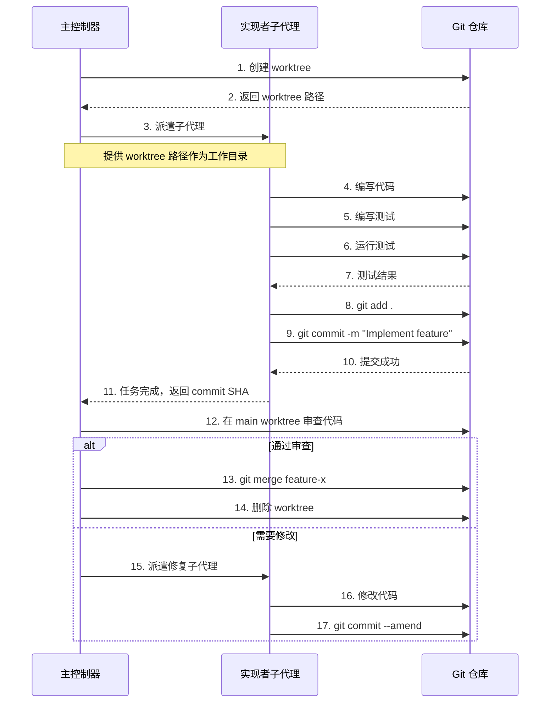
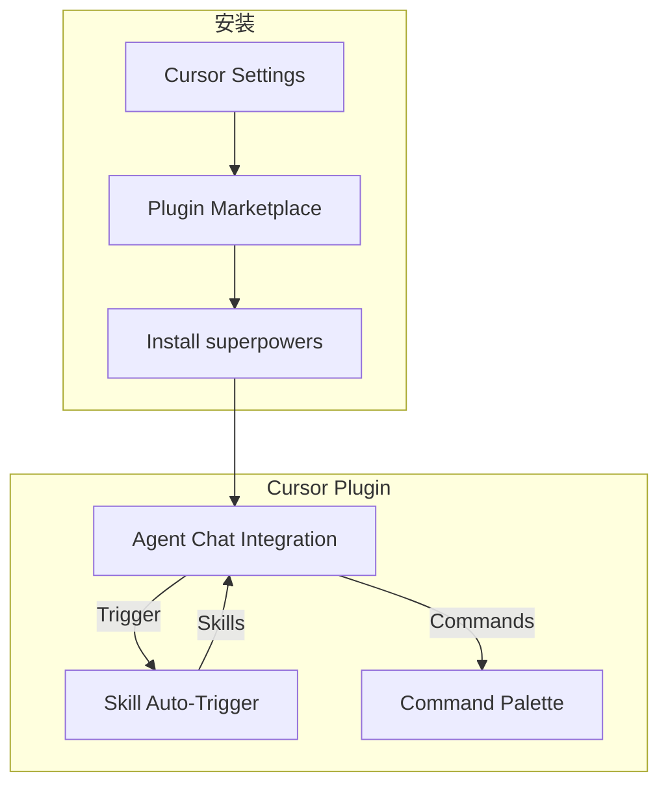
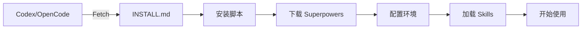
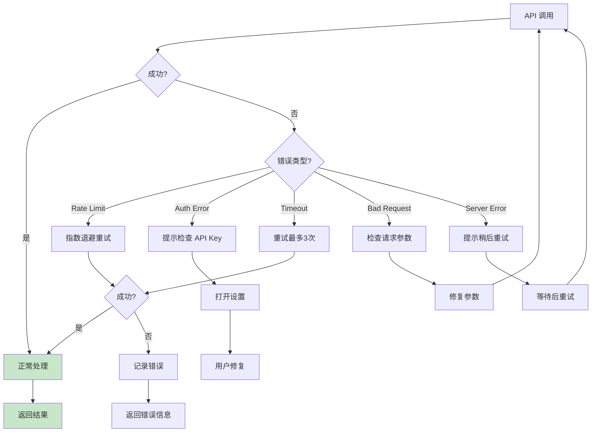

# 接口与集成图

## 外部接口总览



> **图注**：Superpowers 通过宿主平台与外部服务集成。技能/命令/代理以 Markdown 格式定义，宿主平台加载并执行。AI 服务提供模型能力，工具集成提供开发环境操作。

---

## Anthropic Claude API 集成

### Messages API 调用



### 请求体格式

```json
{
  "model": "claude-3-5-sonnet-20241022",
  "max_tokens": 8192,
  "system": "You are a software engineering assistant...",
  "messages": [
    {
      "role": "user",
      "content": "Implement user authentication"
    },
    {
      "role": "assistant",
      "content": "I'll help you implement user authentication..."
    }
  ],
  "tools": [
    {
      "name": "Read",
      "description": "Read a file from the filesystem",
      "input_schema": {
        "type": "object",
        "properties": {
          "file_path": {"type": "string"}
        },
        "required": ["file_path"]
      }
    },
    {
      "name": "Skill",
      "description": "Invoke a Superpowers skill",
      "input_schema": {
        "type": "object",
        "properties": {
          "skill_name": {"type": "string"},
          "context": {"type": "object"}
        },
        "required": ["skill_name"]
      }
    }
  ],
  "stream": true
}
```

### 工具定义

| 工具 | 用途 | 输入 | 输出 |
|------|------|------|------|
| **Read** | 读取文件 | `file_path: string` | 文件内容 |
| **Write** | 写入文件 | `file_path: string, content: string` | 成功/失败 |
| **Bash** | 执行命令 | `command: string, timeout?: number` | stdout/stderr |
| **Skill** | 调用技能 | `skill_name: string, context: object` | 技能执行结果 |
| **Subagent** | 派遣子代理 | `agent_type: string, task: string, context: object` | 子代理输出 |

---

## MCP (Model Context Protocol) 集成

### MCP 架构



### MCP 协议流程



### MCP 配置示例

```json
{
  "mcpServers": {
    "github": {
      "command": "npx",
      "args": ["-y", "@modelcontextprotocol/server-github"],
      "env": {
        "GITHUB_PERSONAL_ACCESS_TOKEN": "ghp_xxx"
      },
      "transport": "stdio"
    },
    "postgres": {
      "url": "http://localhost:3001/sse",
      "transport": "sse"
    },
    "filesystem": {
      "command": "npx",
      "args": ["-y", "@modelcontextprotocol/server-filesystem", "/home/user/projects"],
      "transport": "stdio"
    }
  }
}
```

---

## Git 集成

### Git Worktree 操作



### Git 命令集成

| 操作 | 命令 | 用途 |
|------|------|------|
| **创建 Worktree** | `git worktree add -b feature-x ../feature-x` | 隔离开发环境 |
| **切换分支** | `git checkout -b feature-x` | 在新分支工作 |
| **提交代码** | `git add . && git commit -m "msg"` | 保存进度 |
| **查看状态** | `git status` | 检查变更 |
| **合并分支** | `git merge feature-x` | 完成功能 |
| **清理 Worktree** | `git worktree remove feature-x` | 清理环境 |

### 子代理 Git 工作流



---

## 平台集成详情

### Claude Code 集成

```mermaid
flowchart TB
    subgraph Plugin["Claude Code Plugin"]
        A1[Plugin Manifest
           manifest.json]
        A2[Plugin Entry
           index.js]
        A3[Skill Loader
           loadSkills()]
    end
    
    subgraph Marketplace["Marketplace"]
        B1[obra/superpowers-marketplace]
        B2[Plugin Registry]
        B3[Auto Update]
    end
    
    subgraph Commands["新增命令"]
        C1[/plugin install]
        C2[/plugin update]
        C3[/skill]
        C4[/brainstorm]
        C5[/write-plan]
    end
    
    A1 --> A2
    A2 --> A3
    
    B1 -->|Register| B2
    B2 -->|Install| A2
    B3 -->|Update| A2
    
    A2 -->|Add| C1
    A2 -->|Add| C2
    A2 -->|Add| C3
    A2 -->|Add| C4
    A2 -->|Add| C5
```

**安装命令**：
```bash
# 注册市场
/plugin marketplace add obra/superpowers-marketplace

# 安装插件
/plugin install superpowers@superpowers-marketplace

# 更新插件
/plugin update superpowers
```

### Cursor 集成



**安装命令**：
```
/plugin-add superpowers
```

### Codex / OpenCode 集成



**安装指令**：
```
Fetch and follow instructions from 
https://raw.githubusercontent.com/obra/superpowers/refs/heads/main/.codex/INSTALL.md
```

---

## 自定义扩展接口

### 创建新 Skill

```yaml
# skills/my-skill/SKILL.md
---
name: my-skill
description: "Use when [trigger condition]"
type: flexible
autoTrigger: true
---

# My Skill

## Overview
技能概述

## When to Use
使用场景

## Checklist
1. **Step 1** - Do something
2. **Step 2** - Do another thing
3. **Step 3** - Complete

## Examples
示例代码
```

### 创建新 Command

```markdown
# commands/my-command.md
---
name: my-command
trigger: "/mycommand"
description: "Does something useful"
---

# My Command

## Usage
/mycommand [argument]

## What it does
描述功能

## Prompt Template
执行命令时使用的提示词
```

### 创建新 Agent

```markdown
# agents/my-agent.md
---
name: MyAgent
description: "Specialized agent for X"
model: claude-3-haiku-20240307
allowedTools:
  - Read
  - Write
  - Bash
---

# My Agent

你是一个专门做 X 的代理。

## Responsibilities
- 责任1
- 责任2

## Guidelines
指导原则
```

---

## 错误处理与恢复



> **图注**：错误处理采用分级策略。网络错误自动重试，认证错误引导用户修复配置，参数错误提供调试信息。所有错误都记录日志，方便排查问题。
