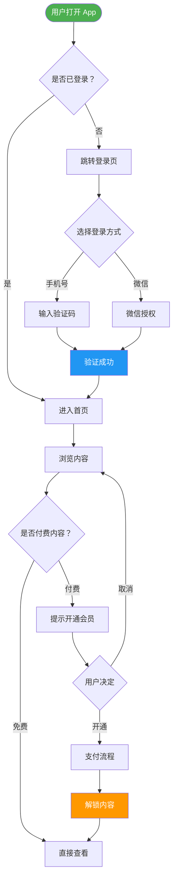
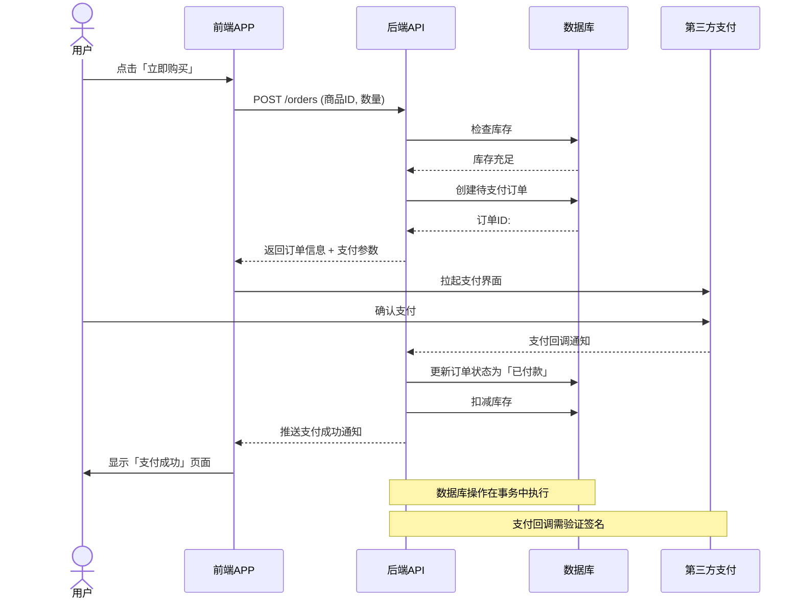
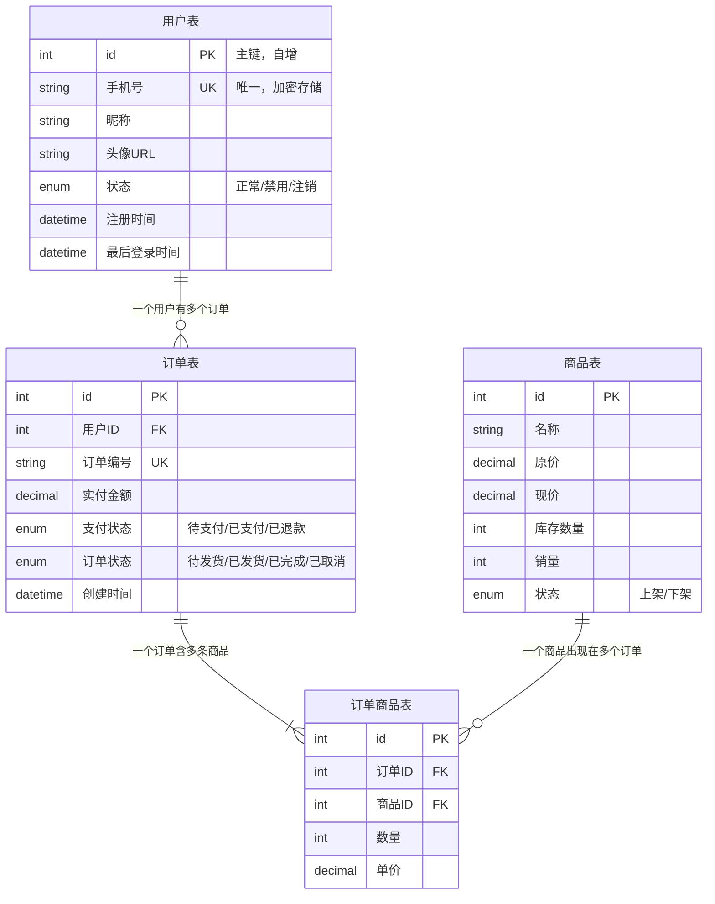
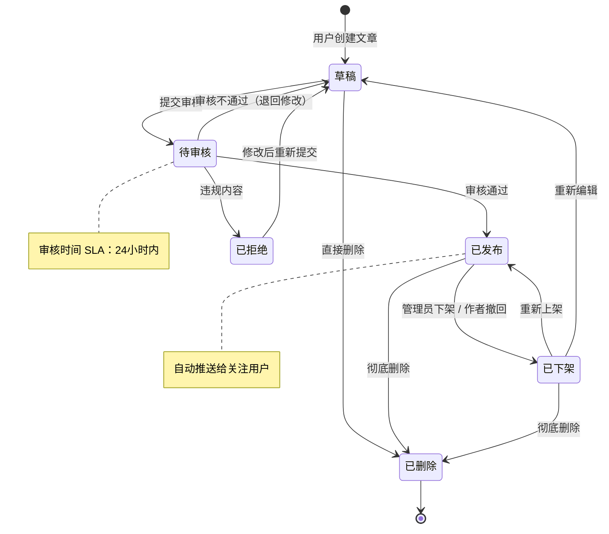
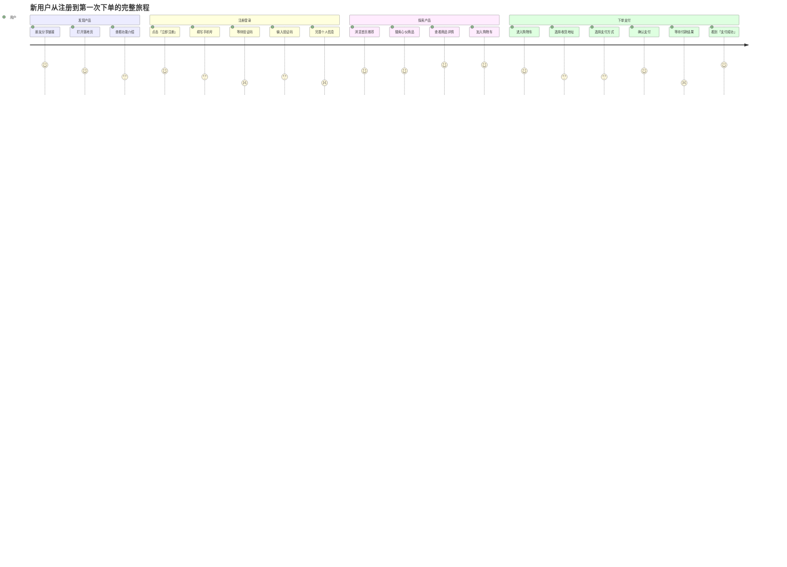
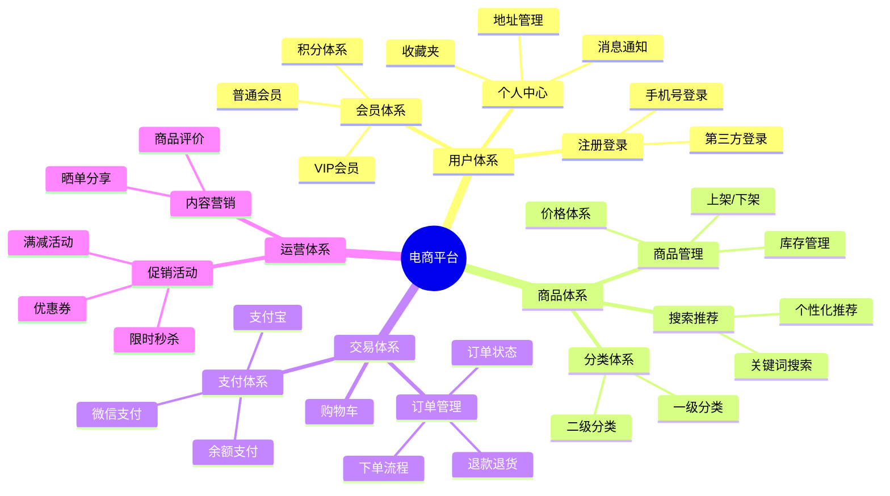
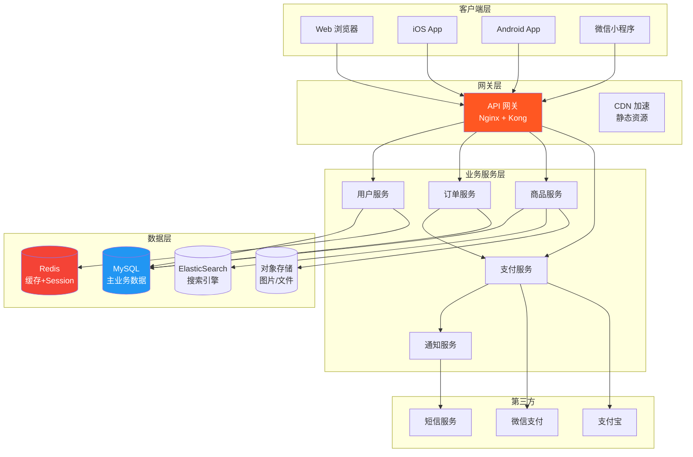

# Mermaid 图表使用指南

## 图表类型速查

| 场景 | 推荐图类型 | 关键词 |
|------|-----------|--------|
| 功能流程、决策判断 | `flowchart TD` / `flowchart LR` | if/else、步骤、决策 |
| 前后端通信、时序 | `sequenceDiagram` | 请求、响应、调用链 |
| 数据库表关系 | `erDiagram` | 表、字段、外键 |
| 对象结构、继承 | `classDiagram` | 类、属性、方法 |
| 订单/任务状态流转 | `stateDiagram-v2` | 状态、转换、触发 |
| 用户体验旅程 | `journey` | 用户感受、满意度 |
| 模块/概念层级 | `mindmap` | 知识树、功能树 |
| 模块依赖、系统架构 | `graph LR` | 依赖、调用、组件 |

---

## 1. flowchart — 流程图

**适合**：业务流程、功能逻辑、决策树



**写作规范**：
- 开始/结束节点用 `([文字])` 圆角矩形
- 决策节点用 `{文字}` 菱形
- 普通步骤用 `[文字]` 方形
- 重要节点加颜色 `style 节点ID fill:#颜色`
- 箭头标签用 `-- 说明文字 -->`

---

## 2. sequenceDiagram — 时序图

**适合**：前后端交互、API 调用、用户操作链路



**写作规范**：
- `->>` 表示实线请求，`-->>` 表示虚线响应
- `actor` 表示真实用户，`participant` 表示系统组件
- `Note over A,B:` 添加说明注释
- `loop` / `alt` / `opt` 表示循环/条件/可选分支

---

## 3. erDiagram — 数据库关系图

**适合**：数据模型、表结构、实体关系



**写作规范**：
- `PK` 主键，`FK` 外键，`UK` 唯一键
- 关系符号：`||--||` 一对一，`||--o{` 一对多，`}o--o{` 多对多
- 字段后加引号写业务说明

---

## 4. stateDiagram-v2 — 状态机图

**适合**：订单状态、用户状态、审批流程、任务状态



**写作规范**：
- `[*]` 表示开始和结束
- 箭头上写触发条件（事件）
- `note right of 状态名` 添加补充说明

---

## 5. journey — 用户旅程图

**适合**：用户体验地图、用户满意度分析



**写作规范**：
- 分数 1-5，代表用户情绪（1=沮丧，5=开心）
- `section` 表示阶段，每个阶段包含多个步骤
- 最后一列写角色名称

---

## 6. mindmap — 思维导图

**适合**：功能全景图、技术栈概览、概念梳理



---

## 7. graph — 架构依赖图

**适合**：模块依赖、系统架构、技术组件关系



---

## 通用写作技巧

### 颜色规范
```
重要节点/开始：fill:#4CAF50,color:#fff（绿色）
关键决策：fill:#FF9800,color:#fff（橙色）
用户操作：fill:#2196F3,color:#fff（蓝色）
错误/警告：fill:#F44336,color:#fff（红色）
第三方服务：fill:#9C27B0,color:#fff（紫色）
```

### 中文友好写法
- 节点 ID 用英文（`A`, `userLogin`, `orderCreate`）
- 显示文字用中文（`[用户点击登录]`）
- 避免节点 ID 包含特殊字符

### 大图优化
- 超过 20 个节点时，考虑拆分成多个子图
- 用 `subgraph` 分组相关节点
- 关键路径用粗线：`A ==> B`（双箭头）
